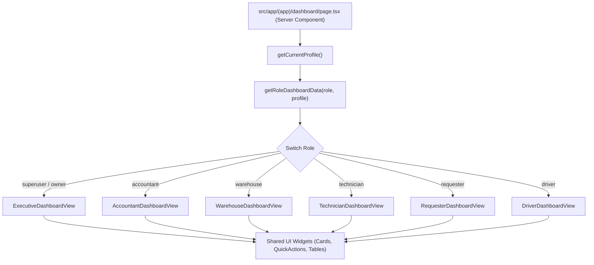

# 📊 ĐẶC TẢ THIẾT KẾ: DASHBOARD CHUYÊN BIỆT THEO VAI TRÒ NGƯỜI DÙNG (ROLE-TAILORED DASHBOARD)

**Mã tài liệu:** `SPEC-2026-09-20-ROLE-TAILORED-DASHBOARD`  
**Ngày ban hành:** 2026-09-20  
**Tác giả:** Antigravity Engineering Team  
**Trạng thái:** Sẵn sàng phê duyệt (Ready for Review)  

---

## 1. TỔNG QUAN & BỐI CẢNH (EXECUTIVE SUMMARY)

### 1.1 Bối cảnh hiện tại
Hệ thống quản lý vật tư & chuỗi cung ứng **Minh Tân Phát Supply** hiện phục vụ 7 nhóm vai trò vận hành khác nhau trong trang trại gia cầm công nghiệp. Tuy nhiên, trang chủ (`/dashboard`) hiện tại hiển thị chung một bố cục cho toàn bộ người dùng:
* Thống kê 4 số liệu chung: Tổng vật tư, Phiếu đang chờ, Đã cấp chưa nhận, Phiếu nhập đã ghi.
* Bảng danh sách phiếu yêu cầu chung và Lịch sử hoạt động (Audit Logs).

### 1.2 Vấn đề tồn tại
1. **Lệch trọng tâm nghiệp vụ**:
   * **Tài xế (`driver`)**: Chỉ cần quét QR đổ dầu nhanh và xem lịch sử tiếp nhiên liệu, nhưng lại thấy danh sách phiếu vật tư chuồng trại không liên quan.
   * **Công nhân chuồng (`requester`)**: Cần phím tắt tạo phiếu xin cấp đồ, mượn dụng cụ, chụp ảnh báo hỏng và danh sách phiếu của cá nhân mình cần nhận, nhưng lại thấy toàn bộ phiếu chờ duyệt của cả trại.
   * **Kỹ thuật trưởng (`technician`)**: Cần duyệt cấp 1 phiếu của khu vực mình, theo dõi thiết bị gửi quấn motor/sửa chữa và đổi 1-1 khẩn cấp.
   * **Thủ kho (`warehouse`)**: Cần hàng đợi xuất kho (phiếu đã duyệt), cảnh báo hết hàng/tồn kho tối thiểu, dụng cụ mượn quá hạn.
   * **Kế toán (`accountant`)**: Cần theo dõi phiếu nhập thiếu hóa đơn VAT, phiếu thanh lý chờ kiểm tra, các phiên kiểm kê cần cân bằng số liệu kế toán.
   * **Chủ trại / Superuser (`owner`, `superuser`)**: Cần bức tranh điều hành toàn cảnh: giá trị kho, chi phí tháng, các phê duyệt cấp cao (thanh lý tài sản, cân bằng kiểm kê), tiêu thụ dầu bất thường.
2. **Trải nghiệm di động chưa tối ưu**: Các vai trò hiện trường (công nhân, tài xế) thao tác bằng smartphone ngoài chuồng cần nút bấm to, thao tác 1 chạm (One-tap actions), không cần bảng dữ liệu dạng table rườm rà.

### 1.3 Mục tiêu thiết kế
* Tự động điều hướng và kết xuất giao diện Dashboard chuyên biệt (Role-Tailored View) dựa trên `profile.role`.
* Tối ưu hóa truy vấn dữ liệu từ Supabase: Chỉ truy vấn đúng dữ liệu cần thiết cho vai trò đó, tránh over-fetching.
* Thiết kế Mobile-First trực quan, hỗ trợ chế độ xem nhanh và các phím tắt tác vụ cốt lõi (Quick Actions).

---

## 2. KIẾN TRÚC HỆ THỐNG & PHÂN CHIA COMPONENT (ARCHITECTURE)

### 2.1 Sơ đồ điều hướng Component (Component Tree)



### 2.2 Cấu trúc thư mục mã nguồn mới

```text
src/
├── app/(app)/dashboard/
│   ├── page.tsx                           # Server Component tải dữ liệu & phân phối view
│   └── loading.tsx                        # Skeleton loading theo chuẩn responsive
├── components/dashboard/
│   ├── views/
│   │   ├── executive-dashboard-view.tsx    # Giao diện Chủ trại & Superuser
│   │   ├── accountant-dashboard-view.tsx   # Giao diện Kế toán
│   │   ├── warehouse-dashboard-view.tsx    # Giao diện Quản kho / Thủ kho
│   │   ├── technician-dashboard-view.tsx   # Giao diện Kỹ thuật trưởng
│   │   ├── requester-dashboard-view.tsx    # Giao diện Công nhân chuồng (Mobile-first)
│   │   └── driver-dashboard-view.tsx       # Giao diện Tài xế xe (Mobile-first)
│   ├── shared/
│   │   ├── dashboard-quick-actions.tsx     # Thanh phím tắt thao tác nhanh
│   │   ├── dashboard-metric-card.tsx       # Thẻ KPI/Metric hiển thị số liệu nổi bật
│   │   ├── pending-tasks-card.tsx          # Thẻ danh sách việc cần xử lý (Actionable items)
│   │   ├── low-stock-alert-card.tsx        # Thẻ cảnh báo tồn kho tối thiểu / hết hàng
│   │   ├── recent-activity-card.tsx        # Thẻ lịch sử hoạt động phân quyền
│   │   └── stat-detail-dialog.tsx          # Modal chi tiết chứng từ khi bấm vào thẻ
└── features/dashboard/
    └── server/
        ├── get-executive-data.ts          # Truy vấn số liệu cho Chủ trại/Admin
        ├── get-accountant-data.ts         # Truy vấn số liệu cho Kế toán
        ├── get-warehouse-data.ts          # Truy vấn số liệu cho Thủ kho
        ├── get-technician-data.ts         # Truy vấn số liệu cho Kỹ thuật
        ├── get-requester-data.ts          # Truy vấn số liệu cho Công nhân
        └── get-driver-data.ts             # Truy vấn số liệu cho Tài xế
```

---

## 3. ĐẶC TẢ CHI TIẾT 6 KHUNG NHÌN VAI TRÒ (ROLE-TAILORED VIEWS)

---

### 👑 3.1 Giao diện Chủ Trang Trại & Quản Trị Hệ Thống (`owner`, `superuser`)
**Mục tiêu**: Cung cấp bức tranh điều hành toàn diện, giám sát rủi ro tài chính - kho hàng và phê duyệt các chứng từ trọng yếu.

#### A. Thẻ chỉ số tổng quan (Executive Metric Cards)
1. **Tổng giá trị kho (VNĐ)**: Tính từ tồn kho thực tế của các SKU nhân đơn giá vốn mới nhất (kèm so sánh với tháng trước).
2. **Phê duyệt chờ xử lý**: Tổng số phiếu thanh lý tài sản (`liquidation_notes.status = 'pending'`) + Phiếu kiểm kê chờ cân bằng (`stocktake_sessions.status = 'pending_approval'`).
3. **Chi phí vật tư tháng này**: Tổng giá trị vật tư đã xuất kho tiêu hao (`issues`) trong tháng hiện tại.
4. **Tiêu thụ dầu tuần này**: Tổng số lít dầu DO đã cấp phát cho xe cơ giới (`fuel_dispenses`) trong 7 ngày gần nhất.

#### B. Phím tắt thao tác nhanh (Quick Actions)
* 📈 **Báo cáo tài chính & kho**: Chuyển đến `/reports`
* 🏷️ **Duyệt phiếu thanh lý**: Chuyển đến `/liquidations`
* 📋 **Duyệt cân bằng kiểm kê**: Chuyển đến `/stocktake`
* 👥 **Quản lý người dùng & phân quyền**: Chuyển đến `/admin/users` (cho superuser)

#### C. Khối nội dung chính
1. **Hàng đợi phê duyệt cấp cao (Pending High-Level Approvals)**:
   * Danh sách phiếu thanh lý bán phế liệu ve chai đang chờ chủ trại duyệt.
   * Các đợt kiểm kê kho có sai lệch số lượng chờ duyệt cân bằng sổ cái.
2. **Cảnh báo bất thường (Operational Anomalies)**:
   * Danh sách vật tư dưới định mức an toàn (`stock_balances < min_stock_alert`).
   * Xe có mức tiêu hao nhiên liệu vượt định mức chuẩn > 15%.
3. **Nhật ký hoạt động toàn trại (Audit History)**: Toàn bộ biến động tạo/sửa/xóa/ký duyệt chứng từ.

---

### 📊 3.2 Giao diện Kế Toán Kho & Nội Bộ (`accountant`)
**Mục tiêu**: Kiểm soát tính chính xác của hóa đơn, giá vốn, công nợ và sổ sách kho.

#### A. Thẻ chỉ số kế toán (Accountant Metrics)
1. **Phiếu nhập chưa có hóa đơn đỏ / Chờ ghi sổ**: Số lượng phiếu nhập kho (`receipts`) ở trạng thái `draft` hoặc chưa đính kèm ảnh hóa đơn VAT.
2. **Tổng giá trị nhập kho tháng này**: Tổng tiền hàng đã nhập từ nhà cung cấp.
3. **Chi phí xuất kho theo khu vực**: Tổng giá trị xuất kho chuồng trại trong tháng.
4. **Kiểm kê chờ xử lý chênh lệch**: Số phiên kiểm kê cần kế toán xác nhận số liệu chênh lệch.

#### B. Phím tắt thao tác nhanh (Quick Actions)
* 📥 **Ghi sổ phiếu nhập kho**: Chuyển đến `/receipts`
* 📑 **Xuất sổ kho & Excel kế toán**: Mở hộp thoại xuất báo cáo nhanh
* 🏢 **Quản lý Nhà cung cấp & Khách hàng**: Chuyển đến `/admin/suppliers`
* 📊 **Báo cáo chi phí theo khu/dãy chuồng**: Chuyển đến `/reports`

#### C. Khối nội dung chính
1. **Hàng đợi chứng từ kế toán cần rà soát**:
   * Danh sách các phiếu nhập kho mới lập cần kiểm tra đơn giá, số lượng và hóa đơn.
   * Danh sách phiếu xuất bán thương phẩm cho khách hàng bên ngoài.
2. **Bảng phân bổ chi phí vật tư theo từng Khu/Dãy chuồng gần nhất**.

---

### 📦 3.3 Giao diện Quản Kho Tổng / Thủ Kho (`warehouse`)
**Mục tiêu**: Tối ưu tốc độ xuất, nhập, soạn hàng và kiểm soát kho an toàn.

#### A. Thẻ chỉ số thủ kho (Warehouse Metrics)
1. **Phiếu yêu cầu chờ xuất kho**: Số phiếu yêu cầu đã được Kỹ thuật trưởng duyệt (`status = 'approved'`), thủ kho cần soạn hàng.
2. **Phiếu nhập hàng chờ xử lý**: Phiếu nhập mới tạo (`status = 'draft'`).
3. **Phiếu đổi 1-1 chờ giao**: Phiếu đổi vật tư hỏng đã xác nhận cần phát hàng mới.
4. **Cảnh báo sắp hết hàng**: Số SKU có tồn kho chạm hoặc dưới ngưỡng an toàn.

#### B. Phím tắt thao tác nhanh (Quick Actions)
* 📦 **Tạo phiếu Nhập kho mới**: `/receipts/new`
* 📤 **Tạo phiếu Xuất kho trực tiếp**: `/issues/new`
* 🔄 **Đổi 1-1 cấp tốc**: `/defects`
* ⛽ **Nhập bồn dầu Petrolimex**: `/fuel`
* 📋 **Mở đợt kiểm kê kho**: `/stocktake`

#### C. Khối nội dung chính
1. **Hàng đợi xuất kho (Fulfillment Queue)**:
   * Danh sách phiếu yêu cầu đã duyệt cấp 1 từ các khu, bấm vào để mở modal xuất kho hoặc in phiếu giao hàng.
2. **Cảnh báo tồn kho tối thiểu (Low Stock Alerts)**:
   * Danh sách SKU hết hàng hoặc sắp hết kèm vị trí kệ hàng để lên kế hoạch đặt thêm.
3. **Dụng cụ mượn quá hạn**: Danh sách công nhân mượn dụng cụ đồ nghề chưa trả quá ngày hẹn.

---

### 🔧 3.4 Giao diện Kỹ Thuật Trưởng / Quản Lý Khu Chuồng (`technician`)
**Mục tiêu**: Duyệt nhanh đề xuất của thợ/công nhân, quản lý sửa chữa bảo trì thiết bị và kiểm soát chi phí khu vực mình phụ trách.

#### A. Thẻ chỉ số kỹ thuật (Technician Metrics)
1. **Phiếu xin cấp chờ duyệt Cấp 1**: Số phiếu yêu cầu từ công nhân trong khu vực đang ở trạng thái `pending`.
2. **Thiết bị đang gửi sửa chữa (quấn motor)**: Số đơn sửa chữa (`repair_orders`) đang ở xưởng ngoài (`status = 'in_repair'`).
3. **Phiếu đổi mới đã cấp chờ nhận**: Phiếu đổi 1-1 đã phát hàng, chờ xác nhận bàn giao.
4. **Đồ nghề đội kỹ thuật đang mượn**: Số lượng công cụ dụng cụ đang mượn từ kho.

#### B. Phím tắt thao tác nhanh (Quick Actions)
* ⚡ **Duyệt phiếu yêu cầu**: Chuyển đến danh sách phiếu chờ duyệt
* 🔁 **Đổi 1-1 thiết bị hỏng**: Tạo phiếu đổi mới nhanh
* 🛠️ **Tạo đơn gửi xưởng sửa chữa**: `/repairs`
* 🚨 **Báo hỏng thiết bị chuồng trại**: `/defects/new`

#### C. Khối nội dung chính
1. **Danh sách phiếu yêu cầu chờ duyệt Cấp 1**:
   * Hiển thị rõ: Người yêu cầu, Dãy chuồng/Khu vực, Danh sách món và mức độ ưu tiên (Bình thường / Khẩn cấp).
   * Hỗ trợ nút **"Duyệt nhanh"** hoặc mở xem chi tiết.
2. **Theo dõi thiết bị gửi sửa chữa ngoại**:
   * Danh sách motor, quạt thông gió, máy bơm đang gửi xưởng quấn kèm ngày hẹn trả.

---

### 📋 3.5 Giao diện Người Yêu Cầu / Công Nhân Chuồng (`requester`)
**Mục tiêu**: Giao diện Mobile-first cực kỳ đơn giản, trực quan, hỗ trợ 1 chạm cho công nhân chuồng.

#### A. Thanh thao tác nhanh nổi bật (Big Action Buttons)
* 🛒 **Xin cấp vật tư mới**: Mở nhanh danh mục chọn hàng `/products` (hỗ trợ giỏ hàng)
* 🔧 **Mượn dụng cụ đồ nghề**: Mở nhanh màn hình mượn dụng cụ `/tools`
* 📸 **Chụp ảnh báo hỏng thiết bị**: Mở camera chụp ngay thiết bị hỏng gửi kỹ thuật `/defects/new`

#### B. Thẻ trạng thái cá nhân (My Status Cards)
1. **Phiếu của tôi đang chờ duyệt**: Số phiếu yêu cầu vừa gửi đang đợi kỹ thuật duyệt.
2. **Hàng đã sẵn sàng nhận**: Phiếu đã được thủ kho xuất (`status = 'issued'`) -> **Nút bấm xác nhận "Đã nhận đủ hàng"**.
3. **Dụng cụ tôi đang mượn**: Số món đồ nghề đang giữ.

#### C. Khối nội dung chính
1. **Phiếu đã xuất - Chờ nhận hàng (Action Required)**:
   * Danh sách các phiếu kho đã chuẩn bị xong, hiển thị nút bấm lớn **"Xác nhận đã nhận hàng"** (One-tap confirm).
2. **Lịch sử yêu cầu gần đây của tôi**:
   * 5 phiếu yêu cầu gần nhất kèm trạng thái trực quan (Đang chờ -> Đã duyệt -> Đang giao -> Đã nhận).

---

### 🚛 3.6 Giao diện Tài Xế Xe Cơ Giới (`driver`)
**Mục tiêu**: Chuyên biệt hóa 100% cho việc tiếp nhiên liệu xe ben, xe xúc, máy phát điện bằng camera quét mã QR.

#### A. Khối hành động chính (Hero QR Action)
* **Nút bấm khổng lồ trung tâm**: 📷 **"QUÉT MÃ QR BƠM DẦU"** -> Mở trực tiếp camera quét mã QR dán trên đầu xe cơ giới để kích hoạt flow bơm dầu nhanh trong 10 giây.

#### B. Thông tin xe & Lần đổ dầu gần nhất
* **Xe phụ trách / Xe thường lái**: Biển số, Loại xe, Định mức tiêu hao chuẩn ($L/100km$ hoặc $L/giờ$).
* **Lần bơm dầu gần nhất**: Số lít đã đổ, Ngày giờ, Số đồng hồ ODO / Giờ máy ghi nhận.

#### C. Khối nội dung chính
* **Lịch sử 10 lần đổ dầu gần nhất của tài xế**: Bảng nhật ký trực quan kèm cảnh báo nếu có chênh lệch bất thường.

---

## 4. CHI TIẾT KỸ THUẬT & TRUY VẤN DỮ LIỆU (DATA LOADING IMPLEMENTATION)

### 4.1 Server Loader Phân Quyền (`src/features/dashboard/server/...`)
Để đảm bảo tốc độ phản hồi < 200ms và không tải thừa dữ liệu, máy chủ chỉ gọi hàm query tương ứng với vai trò đăng nhập:

```typescript
// src/app/(app)/dashboard/page.tsx
export default async function DashboardPage() {
  const profile = await requireProfile();
  
  // Tải dữ liệu theo role cụ thể
  switch (profile.role) {
    case "driver": {
      const data = await getDriverDashboardData(profile);
      return <DriverDashboardView profile={profile} data={data} />;
    }
    case "requester": {
      const data = await getRequesterDashboardData(profile);
      return <RequesterDashboardView profile={profile} data={data} />;
    }
    case "technician": {
      const data = await getTechnicianDashboardData(profile);
      return <TechnicianDashboardView profile={profile} data={data} />;
    }
    case "warehouse": {
      const data = await getWarehouseDashboardData(profile);
      return <WarehouseDashboardView profile={profile} data={data} />;
    }
    case "accountant": {
      const data = await getAccountantDashboardData(profile);
      return <AccountantDashboardView profile={profile} data={data} />;
    }
    case "owner":
    case "superuser":
    default: {
      const data = await getExecutiveDashboardData(profile);
      return <ExecutiveDashboardView profile={profile} data={data} />;
    }
  }
}
```

### 4.2 Chi tiết Query Data cho từng nhóm

| Loader | Bảng Supabase truy vấn | Bộ lọc & Tối ưu hóa |
|---|---|---|
| `getDriverDashboardData` | `fuel_dispenses`, `vehicles` | `dispensed_by = profile.id`, limit 10 |
| `getRequesterDashboardData` | `requisitions`, `tool_borrowings`, `defect_notes` | `requester_id = profile.id` hoặc `borrower_id = profile.id` |
| `getTechnicianDashboardData` | `requisitions`, `repair_orders`, `defect_notes`, `exchange_notes` | `zone_id = profile.zone_id` (nếu có), `status in ('pending', 'in_repair', 'staging')` |
| `getWarehouseDashboardData` | `requisitions`, `receipts`, `exchange_notes`, `stock_balances`, `tool_borrowings` | `status = 'approved'` (cần xuất), `status = 'draft'` (chờ nhập), `balances < min_stock` |
| `getAccountantData` | `receipts`, `issues`, `liquidation_notes`, `stocktake_sessions` | `status in ('draft', 'posted', 'pending_approval')`, tính tổng tiền theo tháng |
| `getExecutiveData` | Toàn bộ các bảng trên + `audit_logs` | Tổng hợp số liệu toàn trại, tính giá trị tồn kho & chi phí tháng |

---

## 5. KẾ HOẠCH KIỂM THỬ & TIÊU CHÍ NGHIỆM THU (VERIFICATION & ACCEPTANCE)

### 5.1 Tiêu chí nghiệm thu (Acceptance Criteria)
1. **Tính chính xác theo vai trò (Role Correctness)**:
   * Khi đăng nhập với tài khoản `driver`, dashboard hiển thị nút bấm quét QR bồn dầu, thông tin xe và lịch sử cá nhân.
   * Khi đăng nhập với tài khoản `requester`, dashboard hiển thị 3 phím bấm lớn (Xin cấp / Mượn đồ / Báo hỏng) và phiếu của chính mình.
   * Khi đăng nhập với tài khoản `warehouse`, hiển thị hàng đợi phiếu chờ xuất, cảnh báo hết hàng, phím tắt nhập xuất.
   * Khi đăng nhập với tài khoản `technician`, hiển thị phiếu chờ duyệt khu vực và thiết bị gửi sửa.
   * Khi đăng nhập với tài khoản `accountant`, hiển thị phiếu nhập thiếu hóa đơn và báo cáo chi phí.
   * Khi đăng nhập với tài khoản `owner` / `superuser`, hiển thị tổng giá trị kho, chi phí tháng và hàng đợi duyệt cấp cao.
2. **Trải nghiệm Responsive & Tương tác**:
   * Trên Mobile (màn hình < 640px): Các phím bấm Quick Action có kích thước tối thiểu 48px, danh sách dạng thẻ dọc không bị vỡ bố cục.
   * Trên Desktop: Bố cục Grid 3 hoặc 4 cột cân đối, hiển thị bảng dữ liệu tối ưu không gian.
3. **Hiệu năng & Bảo mật**:
   * Thời gian nạp dữ liệu máy chủ < 250ms.
   * RLS và bộ lọc dữ liệu đảm bảo vai trò `requester`, `driver` chỉ thấy dữ liệu cá nhân theo đúng chính sách bảo mật.

### 5.2 Kế hoạch Unit Test & Component Test
* Tạo test suite `src/components/dashboard/dashboard-role-views.test.tsx` kiểm thử render của cả 6 View tương ứng với dữ liệu mẫu (mock data).
* Kiểm tra hành vi click vào các thẻ thống kê mở đúng modal `StatDetailDialog` hoặc điều hướng đúng đường dẫn URL.

---

## 6. PHỤ LỤC: WORKING DRAFTS & ALIGNMENT

```text
TaskIntentDraft:
- Outcome: Dashboard cá nhân hóa theo 7 vai trò, hiển thị đúng dữ liệu trọng tâm và phím tắt nhanh
- Scope: Dashboard page, 6 Role Views, Shared Widget Components, 6 Server Data Loaders, Unit Tests
- Non-goals: Không thay đổi logic xử lý phiếu ở các trang chi tiết nghiệp vụ khác

BaselineReadSetHint:
- docs/architecture/rbac-and-roles.md
- docs/architecture/database-schema.md
- src/lib/types.ts
- src/lib/nav.ts

ImpactStatementDraft:
- Affected layers: Frontend Dashboard UI, Dashboard Server Loaders
- Zero regression: Các trang nghiệp vụ khác giữ nguyên 100%
```
