# 🗄️ MÔ HÌNH CƠ SỞ DỮ LIỆU & LƯỢC ĐỒ QUAN HỆ (DATABASE SCHEMA & ERD)

> Tài liệu giải thích cấu trúc cơ sở dữ liệu PostgreSQL 17, sơ đồ thực thể quan hệ (ERD), nguyên tắc toàn vẹn dữ liệu, hệ thống chỉ mục (Indexes) và các chính sách bảo mật cấp hàng (RLS) của **Minh Tân Phát Supply**.

---

## 1. SƠ ĐỒ QUAN HỆ THỰC THỂ TỔNG THỂ (COMPREHENSIVE ERD)

```mermaid
erDiagram
    ZONES ||--o{ SUB_ZONES : contains
    ZONES ||--o{ PROFILES : assigned_to
    ZONES ||--o{ ISSUES : destined_for
    SUB_ZONES ||--o{ ISSUES : specific_dest
    ZONES ||--o{ REQUISITIONS : requested_for
    SUB_ZONES ||--o{ REQUISITIONS : specific_sub_dest

    CATEGORIES ||--o{ PRODUCTS : categorizes
    PRODUCTS ||--o{ SKUS : has_variants
    SKUS ||--o{ SKU_BOM_LINES : kit_parts
    SKUS ||--o{ STOCK_BALANCES : balances
    STOCK_LOCATIONS ||--o{ STOCK_BALANCES : holds
    SKUS ||--o{ STOCK_MOVEMENTS : movements
    STOCK_LOCATIONS ||--o{ STOCK_MOVEMENTS : location_moves

    SUPPLIERS ||--o{ RECEIPTS : supplies
    RECEIPTS ||--o{ RECEIPT_ITEMS : contains
    SKUS ||--o{ RECEIPT_ITEMS : received_sku

    CUSTOMERS ||--o{ ISSUES : buys
    ISSUES ||--o{ ISSUE_ITEMS : contains
    SKUS ||--o{ ISSUE_ITEMS : issued_sku

    PROFILES ||--o{ REQUISITIONS : created_by
    REQUISITIONS ||--o{ REQUISITION_ITEMS : contains
    SKUS ||--o{ REQUISITION_ITEMS : requested_sku
    REQUISITIONS ||--o{ REQUISITION_RETURNS : returns_surplus
    REQUISITION_RETURNS ||--o{ REQUISITION_RETURN_ITEMS : contains

    PROFILES ||--o{ DEFECT_NOTES : reported_by
    DEFECT_NOTES ||--o{ DEFECT_NOTE_ITEMS : contains
    SKUS ||--o{ DEFECT_NOTE_ITEMS : broken_sku
    DEFECT_NOTES ||--o{ EXCHANGE_NOTES : triggers_exchange
    DEFECT_NOTE_ITEMS ||--o{ REPAIR_ORDER_ITEMS : sent_to_repair
    REPAIR_ORDERS ||--o{ REPAIR_ORDER_ITEMS : contains
    DEFECT_NOTE_ITEMS ||--o{ LIQUIDATION_ITEMS : scrapped
    LIQUIDATION_NOTES ||--o{ LIQUIDATION_ITEMS : contains

    PROFILES ||--o{ TOOL_BORROWINGS : borrows
    TOOL_BORROWINGS ||--o{ TOOL_BORROWING_ITEMS : contains
    SKUS ||--o{ TOOL_BORROWING_ITEMS : borrowed_tool_sku

    VEHICLES ||--o{ FUEL_DISPENSES : refuels
    FUEL_TYPES ||--o{ FUEL_DISPENSES : fuel_type
    FUEL_TYPES ||--o{ FUEL_RECEIPTS : bulk_in
    FUEL_TYPES ||--o{ FUEL_MOVEMENTS : movements

    STOCK_LOCATIONS ||--o{ STOCKTAKE_SESSIONS : location
    STOCKTAKE_SESSIONS ||--o{ STOCKTAKE_ITEMS : counts
    SKUS ||--o{ STOCKTAKE_ITEMS : counted_sku

    PROFILES ||--o{ NOTIFICATIONS : notifies
    PROFILES ||--o{ AUDIT_LOGS : acts
```

---

## 2. PHÂN NHÓM CÁC BẢNG CƠ SỞ DỮ LIỆU (DATABASE GROUPS)

### A. Tổ Chức Không Gian & Nhân Sự (Organization & Auth)
1. **`zones`**: Khu vực địa lý lớn của trang trại (Khu A, Khu B, Cơ sở 1, Xưởng Cơ Điện, Trạm Bồn Dầu...).
2. **`sub_zones`**: Dãy chuồng nuôi hoặc phân xưởng chi tiết (Chuồng A1, Chuồng A2, Dãy B1, Kho cám...).
3. **`profiles`**: Hồ sơ người dùng mở rộng từ Supabase Auth (`id`, `name`, `username`, `email`, `role`, `zone_id`, `is_active`, `is_protected`).
4. **`audit_logs`**: Sổ kiểm toán lưu vết 100% mọi hành động tạo, sửa, xóa, khóa tài khoản (`actor_id`, `action`, `entity_type`, `entity_id`, `before`, `after`).
5. **`notifications`**: Hàng đợi thông báo chuông tức thì theo người dùng (`user_id`, `title`, `message`, `type`, `link`, `is_read`).

### B. Danh Mục Hàng Hóa & Đa Quy Cách (Catalog & Packaging)
6. **`categories`**: Danh mục phân loại vật tư (Cơ điện, Nước & Chuồng trại, Thuốc thú y, Bao bì...).
7. **`products`**: Sản phẩm gốc (`code`, `name`, `category_id`, `base_unit`, `manage_type`, `min_stock_alert`).
8. **`skus`**: Dòng hàng SKU chi tiết. Thay thế bảng variants cũ, là đối tượng chính để quản lý tồn kho và biến động (Stock Ledger).
9. **`sku_bom_lines`**: Định mức linh kiện cho vật tư dạng Bộ (Composite Kits).
10. **`suppliers`**: Danh bạ Nhà Cung Cấp thiết bị, điện, thuốc, dầu (`code`, `name`, `phone`, `address`).
11. **`customers`**: Danh bạ Khách hàng / Thương lái thu mua phân, vỉ trứng, phế liệu.

### C. Kho Hàng, Tồn Kho & Sổ Cái Biến Động (Inventory & Ledgers)
12. **`stock_locations`**: Vị trí kho vật lý (`code`, `name`, `type`: `main` - Kho chính, `defect` - Kho hỏng, `repair` - Kho đang sửa, `other`).
13. **`stock_balances`**: Tồn kho khả dụng thời gian thực (`location_id`, `sku_id`, `quantity`).
14. **`stock_movements`**: Sổ cái ghi nhận 100% biến động tăng giảm kho (`location_id`, `sku_id`, `quantity_change`, `movement_type`, `reference_type`, `reference_id`, `balance_after`, `created_by`).

### D. Chứng Từ Nhập Kho & Xuất Cấp Phát (Receipts & Issues)
15. **`receipts`**: Phiếu nhập kho từ Nhà cung cấp (`code`, `supplier_id`, `location_id`, `status`: `draft`/`posted`/`cancelled`, `total_amount`, `invoice_images`, `invoice_no`).
16. **`receipt_items`**: Chi tiết hàng nhập (`receipt_id`, `sku_id`, `quantity`, `unit_cost`, `lot_number`, `expiry_date`).
17. **`issues`**: Phiếu xuất kho (`code`, `destination_type`: `zone`/`customer`, `zone_id`, `sub_zone_id`, `customer_id`, `location_id`, `status`, `notes`, `invoice_images`).
18. **`issue_items`**: Chi tiết hàng xuất (`issue_id`, `sku_id`, `quantity`, `unit_price`).

### E. Yêu Cầu Vật Tư & Trả Lại Hàng Thừa (Requisitions & Returns)
19. **`requisitions`**: Phiếu xin cấp vật tư từ chuồng trại (`code`, `requester_id`, `zone_id`, `sub_zone_id`, `priority`, `status`: `draft`/`pending`/`approved`/`issued`/`received`/`rejected`/`cancelled`, `approved_by`, `issued_by`, `received_by`).
20. **`requisition_items`**: Chi tiết vật tư yêu cầu (`requisition_id`, `sku_id`, `quantity_requested`, `quantity_issued`).
21. **`requisition_returns`**: Phiếu công nhân trả lại vật tư dùng thừa về kho (`code`, `requisition_id`, `returned_by`, `location_id`, `status`).
22. **`requisition_return_items`**: Chi tiết vật tư trả lại (`return_id`, `sku_id`, `quantity`).

### F. Báo Hỏng, Đổi 1-1, Sửa Chữa & Thanh Lý (Defects, Repairs & Liquidations)
23. **`defect_notes`**: Phiếu báo hỏng thiết bị (`code`, `zone_id`, `sub_zone_id`, `reporter_id`, `status`: `staging`/`collected`/`cancelled`).
24. **`defect_note_items`**: Chi tiết thiết bị hỏng (`defect_note_id`, `sku_id`, `quantity`, `damage_type`, `severity`, `images`, `resolution`: `repaired`/`liquidated`).
25. **`exchange_notes`**: Phiếu đổi 1-1 cấp tốc (`code`, `defect_note_id`, `source_location_id`, `defect_location_id`, `status`: `pending`/`approved`/`rejected`/`cancelled`).
26. **`exchange_note_items`**: Chi tiết thiết bị đổi 1-1.
27. **`repair_orders`**: Đơn gửi thiết bị đi xưởng quấn motor/sửa chữa (`code`, `vendor_name`, `status`: `in_repair`/`returned`/`cancelled`, `cost`, `notes`).
28. **`repair_order_items`**: Chi tiết món gửi sửa (`repair_order_id`, `defect_note_item_id`, `outcome`: `returned_to_stock`/`liquidation`).
29. **`liquidation_notes`**: Phiếu thanh lý bán phế liệu ve chai (`code`, `buyer_name`, `total_revenue`, `status`: `pending`/`approved`/`rejected`/`cancelled`).
30. **`liquidation_items`**: Chi tiết món thanh lý (`liquidation_id`, `defect_note_item_id`, `quantity`, `revenue`).

### G. Dụng Cụ Đồ Nghề & Trạm Bồn Dầu Xe Cơ Giới (Tools & Fuel)
31. **`tool_borrowings`**: Lượt mượn dụng cụ đồ nghề (`code`, `borrower_id`, `zone_id`, `due_date`, `status`: `borrowed`/`returned`/`cancelled`, `returned_at`).
32. **`tool_borrowing_items`**: Chi tiết dụng cụ mượn (`borrowing_id`, `sku_id`, `quantity`, `returned_quantity`).
33. **`vehicles`**: Danh mục xe ben, xe xúc, máy phát điện (`code`, `name`, `type`, `license_plate`, `calc_unit`: `km`/`hours`, `standard_rate`, `last_meter`, `qr_text`).
34. **`fuel_types`**: Loại nhiên liệu (`code`, `name`, `unit`: Lít).
35. **`fuel_receipts`**: Phiếu xe bồn Petrolimex vào nhập bồn dầu tổng (`code`, `fuel_type_id`, `quantity`, `unit_cost`, `supplier_name`, `invoice_no`).
36. **`fuel_dispenses`**: Lịch sử bơm dầu cho xe cơ giới (`code`, `vehicle_id`, `fuel_type_id`, `dispensed_liters`, `current_meter`, `prev_meter`, `distance_or_hours`, `consumption_rate`, `dispensed_by`, `status`).
37. **`fuel_movements`**: Sổ cái biến động bồn dầu.

### H. Kiểm Kê Kho (Stocktake)
38. **`stocktake_sessions`**: Phiên kiểm kê kho (`code`, `location_id`, `status`: `draft`/`posted`/`cancelled`, `conducted_by`, `approved_by`, `notes`).
39. **`stocktake_items`**: Chi tiết đếm kiểm kê (`session_id`, `sku_id`, `system_qty`, `actual_qty`, `difference`, `reason`).

---

## 3. CHIẾN LƯỢC CHỈ MỤC HIỆU NĂNG (PERFORMANCE INDEXING)

Hệ thống trang bị 38 Composite & B-Tree Indexes phục vụ các truy vấn tức thời (~200ms):
* **Tra cứu tồn kho:** `idx_stock_balances_loc_sku` (`location_id, sku_id`).
* **Sổ cái thời gian thực:** `idx_stock_movements_sku_time` (`sku_id, created_at DESC`).
* **Truy vết chứng từ:** `idx_receipt_items_receipt`, `idx_issue_items_issue`, `idx_requisition_items_req`.
* **Định mức xe:** `idx_fuel_dispenses_vehicle_time` (`vehicle_id, created_at DESC`).
* **Phân quyền & Định danh:** `idx_profiles_username_active` (`username, is_active`).