# 🗄️ MÔ HÌNH CƠ SỞ DỮ LIỆU & LƯỢC ĐỒ QUAN HỆ (DATABASE SCHEMA & ERD)

> Tài liệu giải thích cấu trúc cơ sở dữ liệu PostgreSQL 17 (101 migrations), sơ đồ thực thể quan hệ (ERD), nguyên tắc toàn vẹn dữ liệu, các view phân tích Metabase BI, hệ thống chỉ mục (Indexes) và các chính sách bảo mật cấp hàng (RLS) của **Minh Tân Phát Supply**.

---

## 1. SƠ ĐỒ QUAN HỆ THỰC THỂ TỔNG THỂ (COMPREHENSIVE ERD)

```mermaid
erDiagram
    ZONES ||--o{ SUB_ZONES : contains
    ZONES ||--o{ PROFILES : assigned_to
    ZONES ||--o{ ISSUES : destined_for
    SUB_ZONES ||--o{ ISSUES : specific_sub_dest
    ZONES ||--o{ REQUISITIONS : requested_for
    SUB_ZONES ||--o{ REQUISITIONS : specific_sub_dest

    CATEGORIES ||--o{ PRODUCTS : categorizes
    PRODUCTS ||--o{ SKUS : has_skus
    SKUS ||--o{ SKU_TRANSACTION_UNITS : has_conversions
    SKUS ||--o{ BOM_HEADERS : bom_parent
    BOM_HEADERS ||--o{ BOM_VERSIONS : versions
    BOM_VERSIONS ||--o{ BOM_ITEMS : components
    SKUS ||--o{ STOCK_BALANCES : balances
    STOCK_LOCATIONS ||--o{ STOCK_BALANCES : holds
    SKUS ||--o{ STOCK_MOVEMENTS : movements
    STOCK_LOCATIONS ||--o{ STOCK_MOVEMENTS : location_moves

    SUPPLIERS ||--o{ RECEIPTS : supplies
    RECEIPTS ||--o{ RECEIPT_ITEMS : contains
    SKUS ||--o{ RECEIPT_ITEMS : received_sku

    CUSTOMERS ||--o{ ISSUES : buys
    ISSUES ||--o{ ISSUE_ITEMS : contains
    SKUS ||--o{ ISSUE_ITEMS : issued_sku

    PROFILES ||--o{ REQUISITIONS : created_by
    REQUISITIONS ||--o{ REQUISITION_ITEMS : contains
    SKUS ||--o{ REQUISITION_ITEMS : requested_sku
    REQUISITIONS ||--o{ REQUISITION_RETURNS : returns_surplus
    REQUISITION_RETURNS ||--o{ REQUISITION_RETURN_ITEMS : contains

    PROFILES ||--o{ DEFECT_NOTES : reported_by
    DEFECT_NOTES ||--o{ DEFECT_NOTE_ITEMS : contains
    SKUS ||--o{ DEFECT_NOTE_ITEMS : broken_sku
    DEFECT_NOTES ||--o{ EXCHANGE_NOTES : triggers_exchange
    DEFECT_NOTE_ITEMS ||--o{ REPAIR_ORDER_ITEMS : sent_to_repair
    REPAIR_ORDERS ||--o{ REPAIR_ORDER_ITEMS : contains
    DEFECT_NOTE_ITEMS ||--o{ LIQUIDATION_ITEMS : scrapped
    LIQUIDATION_NOTES ||--o{ LIQUIDATION_ITEMS : contains

    PROFILES ||--o{ TOOL_BORROWINGS : borrows
    TOOL_BORROWINGS ||--o{ TOOL_BORROWING_ITEMS : contains
    SKUS ||--o{ TOOL_BORROWING_ITEMS : borrowed_tool_sku

    VEHICLES ||--o{ FUEL_DISPENSES : refuels
    ZONES ||--o{ FUEL_DISPENSES : zone_dispense
    SUB_ZONES ||--o{ FUEL_DISPENSES : subzone_dispense
    FUEL_TYPES ||--o{ FUEL_DISPENSES : fuel_type
    FUEL_TYPES ||--o{ FUEL_RECEIPTS : bulk_in
    FUEL_TYPES ||--o{ FUEL_MOVEMENTS : movements

    STOCK_LOCATIONS ||--o{ STOCKTAKE_SESSIONS : location
    STOCKTAKE_SESSIONS ||--o{ STOCKTAKE_ITEMS : counts
    SKUS ||--o{ STOCKTAKE_ITEMS : counted_sku

    PROFILES ||--o{ NOTIFICATIONS : notifies
    PROFILES ||--o{ NOTIFICATION_PREFERENCES : configures
    PROFILES ||--o{ AUDIT_LOGS : acts
    AI_KNOWLEDGE_DOCUMENTS ||--o{ AI_KNOWLEDGE_CHUNKS : chunks
    AI_CONVERSATIONS ||--o{ AI_MESSAGES : contains
```

---

## 2. PHÂN NHÓM CÁC BẢNG CƠ SỞ DỮ LIỆU (DATABASE GROUPS)

### A. Tổ Chức Không Gian, Nhân Sự & Cấu Hình Thông Báo (Organization & Auth)
1. **`zones`**: Khu vực địa lý lớn của trang trại (Khu A, Khu B, Cơ sở 1, Xưởng Cơ Điện, Trạm Bồn Dầu...).
2. **`sub_zones`**: Dãy trại nuôi hoặc phân xưởng chi tiết thuộc Khu (Trại A1, Trại A2, Dãy B1, Kho cám...).
3. **`profiles`**: Hồ sơ người dùng mở rộng từ Supabase Auth (`id`, `name`, `username`, `email`, `role`, `zone_id`, `is_active`, `is_protected`).
4. **`audit_logs`**: Sổ kiểm toán lưu vết 100% mọi hành động tạo, sửa, xóa, khóa tài khoản (`actor_id`, `action`, `entity_type`, `entity_id`, `before`, `after`).
5. **`notifications`**: Hàng đợi thông báo chuông tức thì theo người dùng (`user_id`, `title`, `message`, `type`, `link`, `is_read`).
6. **`notification_preferences`**: Cấu hình nhận thông báo email theo vai trò và kênh (`profile_id`, `email_enabled`, `instant_alerts`, `daily_digest`, `low_stock_alerts`).
7. **`email_delivery_attempts`** / **`notification_logs`**: Lịch sử gửi mail thông báo nền qua SMTP (`recipient`, `subject`, `status`, `error_message`, `attempt_count`).

### B. Danh Mục Hàng Hóa & Đa Quy Cách (Catalog & Packaging)
8. **`categories`**: Danh mục phân loại vật tư (Cơ điện, Nước & Trang trại, Thuốc thú y, Bao bì...).
9. **`products`**: Sản phẩm gốc làm danh tính chung (`code`, `name`, `category_id`, `base_unit`, `manage_type`, `is_active`).
10. **`skus`**: Dòng hàng SKU chi tiết duy nhất giữ tồn kho (`sku_code`, `product_id`, `name`, `base_unit_id`, `kit_type`, `cost_price`, `selling_price`, `min_stock`, `max_stock`).
11. **`units`**: Danh mục đơn vị tính chuẩn (`code`, `name`, `symbol`).
12. **`sku_transaction_units`**: Đơn vị giao dịch quy đổi (Thùng, Can, Bao) với hệ số quy đổi `conversion_factor` về Base UOM.
13. **`attribute_definitions`**: Định nghĩa thuộc tính kỹ thuật có kiểu dữ liệu (Hãng, Điện áp, Công suất, Kích cỡ).
14. **`sku_attribute_values`**: Giá trị thuộc tính gán cho từng SKU.
15. **`bom_headers`**, **`bom_versions`**, **`bom_items`**: Quản lý cấu trúc định mức linh kiện (Bill of Materials) cho Virtual Kit và Assembled Kit.
16. **`suppliers`**: Danh bạ Nhà Cung Cấp thiết bị, điện, thuốc, dầu (`code`, `name`, `phone`, `address`, `tax_code`).
17. **`customers`**: Danh bạ Khách hàng / Thương lái thu mua phân, vỉ trứng, phế liệu.

### C. Kho Hàng, Tồn Kho & Sổ Cái Biến Động (Inventory & Ledgers)
18. **`stock_locations`**: Vị trí kho vật lý (`code`, `name`, `type`: `main` - Kho chính, `defect` - Kho hỏng, `repair` - Kho sửa, `fuel` - Trạm dầu).
19. **`stock_balances`**: Tồn kho khả dụng thời gian thực (`location_id`, `sku_id`, `quantity`).
20. **`stock_movements`**: Sổ cái ghi nhận 100% biến động tăng giảm kho (Append-Only) (`location_id`, `sku_id`, `quantity_change`, `movement_type`, `reference_type`, `reference_id`, `balance_after`, `created_by`).
21. **`inventory_lots`** & **`lot_stock_balances`**: Quản lý số lô và hạn sử dụng (hóa chất, thuốc sát trùng, vắc-xin).

### D. Chứng Từ Nhập Kho & Xuất Cấp Phát (Receipts & Issues)
22. **`receipts`**: Phiếu nhập kho từ Nhà cung cấp (`code`, `supplier_id`, `location_id`, `status`: `draft`/`posted`/`cancelled`, `total_amount`, `invoice_images`, `invoice_no`, `linked_requisition_ids`).
23. **`receipt_items`**: Chi tiết hàng nhập (`receipt_id`, `sku_id`, `quantity`, `unit_cost`, `lot_number`, `expiry_date`).
24. **`issues`**: Phiếu xuất kho (`code`, `destination_type`: `zone`/`customer`, `zone_id`, `sub_zone_id`, `customer_id`, `location_id`, `status`, `notes`, `requisition_id`).
25. **`issue_items`**: Chi tiết hàng xuất (`issue_id`, `sku_id`, `quantity`, `unit_price`).

### E. Yêu Cầu Vật Tư & Trả Lại Hàng Thừa (Requisitions & Returns)
26. **`requisitions`**: Phiếu xin cấp vật tư từ trang trại (`code`, `requester_id`, `zone_id`, `sub_zone_id`, `priority`, `status`: `draft`/`pending`/`approved`/`ordered`/`issued`/`received`/`rejected`/`cancelled`, `approved_by`, `issued_by`, `received_by`, `invoice_images`, `auto_fulfilled_by_receipt_id`).
27. **`requisition_items`**: Chi tiết vật tư yêu cầu (`requisition_id`, `sku_id`, `quantity_requested`, `quantity_issued`).
28. **`requisition_returns`**: Phiếu công nhân trả lại vật tư dùng thừa về kho (`code`, `requisition_id`, `returned_by`, `location_id`, `status`).
29. **`requisition_return_items`**: Chi tiết vật tư trả lại (`return_id`, `sku_id`, `quantity`).

### F. Báo Hỏng, Đổi 1-1, Sửa Chữa & Thanh Lý (Defects, Repairs & Liquidations)
30. **`defect_notes`**: Phiếu báo hỏng thiết bị (`code`, `zone_id`, `sub_zone_id`, `reporter_id`, `status`: `staging`/`collected`/`cancelled`).
31. **`defect_note_items`**: Chi tiết thiết bị hỏng (`defect_note_id`, `sku_id`, `quantity`, `damage_type`, `severity`, `images`, `resolution`: `repaired`/`liquidated`).
32. **`exchange_notes`**: Phiếu đổi 1-1 cấp tốc (`code`, `defect_note_id`, `source_location_id`, `defect_location_id`, `status`: `pending`/`approved`/`rejected`/`cancelled`).
33. **`exchange_note_items`**: Chi tiết thiết bị đổi 1-1.
34. **`repair_orders`**: Đơn gửi thiết bị đi xưởng quấn motor/sửa chữa (`code`, `vendor_name`, `status`: `in_repair`/`returned`/`cancelled`, `cost`, `notes`).
35. **`repair_order_items`**: Chi tiết món gửi sửa (`repair_order_id`, `defect_note_item_id`, `outcome`: `returned_to_stock`/`liquidation`).
36. **`liquidation_notes`**: Phiếu thanh lý bán phế liệu ve chai (`code`, `buyer_name`, `total_revenue`, `status`: `pending`/`approved`/`rejected`/`cancelled`).
37. **`liquidation_items`**: Chi tiết món thanh lý (`liquidation_id`, `defect_note_item_id`, `quantity`, `revenue`).

### G. Dụng Cụ Đồ Nghề & Trạm Bồn Dầu Xe Cơ Giới (Tools & Fuel)
38. **`tool_borrowings`**: Lượt mượn dụng cụ đồ nghề (`code`, `borrower_id`, `zone_id`, `due_date`, `status`: `borrowed`/`returned`/`cancelled`, `returned_at`).
39. **`tool_borrowing_items`**: Chi tiết dụng cụ mượn (`borrowing_id`, `sku_id`, `quantity`, `returned_quantity`).
40. **`tool_reminder_claims`**: Khóa chống gửi lặp email nhắc nợ dụng cụ đồ nghề.
41. **`vehicles`**: Danh mục xe cơ giới (`code`, `name`, `type`, `license_plate`, `odo_unit`: `km`/`hours`, `fuel_norm`, `current_odo`, `qr_token`, `document_images`, `inspection_expiry`).
42. **`fuel_types`**: Loại nhiên liệu (`code`, `name`, `unit`: Lít, `is_active`).
43. **`fuel_receipts`**: Phiếu xe bồn nhập bồn dầu tổng (`code`, `fuel_type_id`, `quantity`, `unit_cost`, `supplier_name`, `invoice_no`).
44. **`fuel_dispenses`**: Lịch sử bơm dầu (`code`, `vehicle_id`, `zone_id`, `sub_zone_id`, `fuel_type_id`, `quantity`, `current_odo`, `consumption_rate`, `dispense_type`: `vehicle`/`zone`, `meter_images`, `status`).
45. **`fuel_movements`**: Sổ cái biến động bồn dầu.

### H. Kiểm Kê Kho (Stocktake)
46. **`stocktake_sessions`**: Phiên kiểm kê kho (`code`, `location_id`, `status`: `draft`/`posted`/`cancelled`, `conducted_by`, `approved_by`, `notes`).
47. **`stocktake_items`**: Chi tiết đếm kiểm kê (`session_id`, `sku_id`, `system_qty`, `actual_qty`, `difference`, `reason`, `image_url`).

### I. AI Copilot & Vector Store (AI Knowledge)
48. **`ai_knowledge_documents`**: Tài liệu tri thức trang trại đã tải lên (`title`, `category`, `source_key`, `content_hash`).
49. **`ai_knowledge_chunks`**: Các đoạn văn bản đã phân mảnh kèm vector embedding (`document_id`, `chunk_index`, `content`, `embedding` vector(1536), `tsv` search vector).
50. **`ai_conversations`** & **`ai_messages`**: Lịch sử các phiên trò chuyện của nhân viên với AI Copilot.
51. **`ai_quick_prompts`**: Các câu hỏi mẫu thông dụng cài sẵn trên giao diện chat.
52. **`ai_rate_limits`**: Theo dõi tần suất gọi API AI chống tràn quota.

---

## 3. CÁC VIEW PHÂN TÍCH METABASE BI (ANALYTICAL VIEWS)

Hệ thống cung cấp 3 Views tối ưu hóa cho công cụ BI (Metabase / PowerBI) được phân quyền cho role `metabase_readonly`:

1. **`v_bi_subzone_cost_breakdown`**:
   * Phân rã chi phí vật tư xuất kho theo Cây không gian (Khu ➔ Dãy trại), danh mục vật tư, tháng/tuần và người lập.
2. **`v_bi_inventory_xnt_summary`**:
   * Tổng hợp tồn kho khả dụng tức thời, sức khỏe kho (Tồn an toàn, Hết hàng, Dưới định mức tối thiểu) và giá trị vốn tồn kho theo vị trí.
3. **`v_bi_fleet_fuel_efficiency`**:
   * Giám sát lịch sử bơm dầu, ODO/giờ máy, tỷ lệ tiêu hao nhiên liệu thực tế so với định mức xe và người lái phụ trách.

---

## 4. CHIẾN LƯỢC CHỈ MỤC HIỆU NĂNG (PERFORMANCE INDEXING)

Hệ thống trang bị các Composite & B-Tree Indexes phục vụ các truy vấn tức thời (~200ms):
* **Tra cứu tồn kho:** `idx_stock_balances_loc_sku` (`location_id, sku_id`).
* **Sổ cái thời gian thực:** `idx_stock_movements_sku_time` (`sku_id, created_at DESC`).
* **Truy vết chứng từ:** `idx_receipt_items_receipt`, `idx_issue_items_issue`, `idx_requisition_items_req`.
* **Cấp dầu & Xe:** `idx_fuel_dispenses_vehicle_time` (`vehicle_id, created_at DESC`), `idx_fuel_dispenses_dispense_type` (`dispense_type`).
* **Phân quyền & Định danh:** `idx_profiles_username_active` (`username, is_active`).
* **Tìm kiếm AI Vector:** Index IVFFLAT / HNSW trên `ai_knowledge_chunks(embedding)`.
