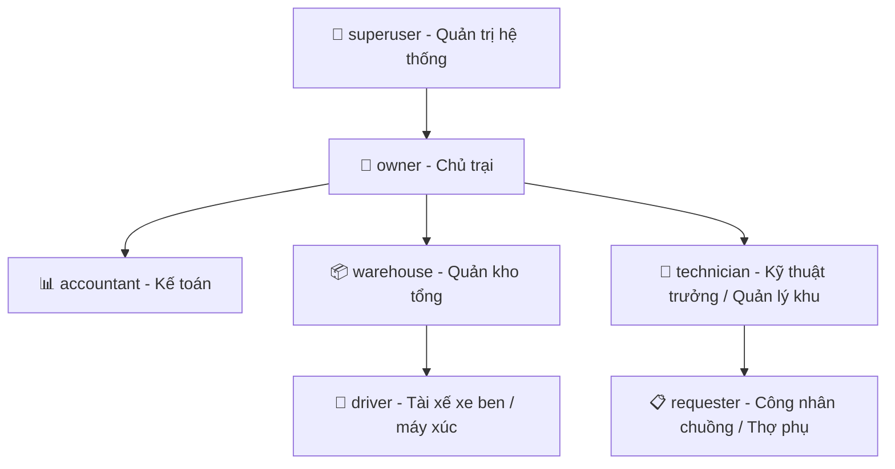

# 🛡️ MA TRẬN PHÂN QUYỀN & VAI TRÒ (RBAC MATRIX)

> Tài liệu đặc tả chi tiết kiến trúc phân quyền 7 vai trò, chính sách Bất biến định danh (Immutable Identity), cơ chế Hybrid Archive & Force Purge và các chính sách bảo mật cấp hàng (Row Level Security) của hệ thống **Minh Tân Phát Supply**.

---

## 1. HỆ THỐNG 7 VAI TRÒ CHUẨN HÓA (7 CANONICAL ROLES)

Hệ thống phân quyền được thiết kế chuẩn mực theo chuỗi quản trị vận hành trang trại gia cầm công nghiệp:

| STT | Mã Vai trò (Role) | Tên vai trò thực tế | Đối tượng đảm nhiệm | Trách nhiệm chính & Giao diện Dashboard |
|:---:|---|---|---|---|
| 1 | `superuser` | **Quản trị hệ thống** | Kỹ sư CNTT / DevOps | Toàn quyền kỹ thuật, phân quyền, cấu hình hệ thống, AI Admin, dọn dẹp dữ liệu test (`admin_purge_user_data`). |
| 2 | `owner` | **Chủ trang trại** | Chủ trại / Ban Giám đốc | Dashboard Executive KPI (tổng tài sản kho, chi phí chuồng), duyệt thanh lý lớn, duyệt cân bằng kiểm kê, quản trị nhân sự. |
| 3 | `accountant` | **Kế toán kho & nội bộ** | Nhân viên kế toán | Dashboard Kế toán (giá mua/bán, chi phí theo khu, hóa đơn đỏ VAT, công nợ NCC/Khách hàng, xuất file Excel kế toán). |
| 4 | `warehouse` | **Quản kho tổng** | Quản lý kho, Thủ kho | Dashboard Kho (phiếu chờ cấp phát, cảnh báo tồn kho thấp, mượn đồ quá hạn, kiểm kê, trạm bồn dầu). |
| 5 | `technician` | **Kỹ thuật trưởng** | Kỹ sư cơ điện, Trưởng khu | Dashboard Kỹ thuật (duyệt Cấp 1 phiếu xin cấp, thiết bị đang gửi sửa ngoài, dụng cụ đang mượn, đổi 1-1 khẩn cấp). |
| 6 | `requester` | **Người yêu cầu** | Công nhân chuồng, thợ phụ | Dashboard Cá nhân (giỏ hàng nhanh, danh sách phiếu đã duyệt chờ nhận, lịch sử trả hàng thừa, báo hỏng thiết bị). |
| 7 | `driver` | **Tài xế** | Lái xe ben, xe xúc, xe tải | Dashboard Xe (xe phụ trách, quét QR bơm dầu trong 5 giây, tra cứu lịch sử tiêu hao L/100km & L/h). |

---

## 2. MA TRẬN PHÂN QUYỀN CHI TIẾT THEO TÁC VỤ (GRANULAR RBAC MATRIX)

| Nhóm chức năng | Tác vụ cụ thể | `superuser` | `owner` | `accountant` | `warehouse` | `technician` | `requester` | `driver` |
|---|---|:---:|:---:|:---:|:---:|:---:|:---:|:---:|
| **Dashboard** | Xem Dashboard KPI tổng thể & giá trị tài sản | ✅ | ✅ | ✅ | ❌ | ❌ | ❌ | ❌ |
| | Xem Dashboard vận hành kho & tồn thấp | ✅ | ✅ | ✅ | ✅ | ❌ | ❌ | ❌ |
| | Xem Dashboard kỹ thuật & thiết bị sửa | ✅ | ✅ | ❌ | ❌ | ✅ | ❌ | ❌ |
| | Xem Dashboard phiếu cá nhân & giỏ hàng | ✅ | ✅ | ✅ | ✅ | ✅ | ✅ | ❌ |
| | Xem Dashboard xe & đổ dầu | ✅ | ✅ | ✅ | ✅ | ❌ | ❌ | ✅ |
| **Danh mục & Vật tư** | Xem danh mục & tra cứu tồn kho SKU | ✅ | ✅ | ✅ | ✅ | ✅ | ✅ | ✅ |
| | Tạo mới / Sửa vật tư, biến thể, quy đổi đơn vị | ✅ | ✅ | ✅ | ✅ | ❌ | ❌ | ❌ |
| | Xem giá mua, giá vốn và tổng giá trị kho | ✅ | ✅ | ✅ | ❌ | ❌ | ❌ | ❌ |
| | In mã QR dán kệ hàng & in thẻ kho | ✅ | ✅ | ✅ | ✅ | ✅ | ❌ | ❌ |
| **Nhập kho & NCC** | Tạo phiếu nhập kho từ Nhà Cung Cấp | ✅ | ✅ | ✅ | ✅ | ❌ | ❌ | ❌ |
| | Upload ảnh hóa đơn đỏ VAT & phiếu giao hàng | ✅ | ✅ | ✅ | ✅ | ❌ | ❌ | ❌ |
| | Hủy phiếu nhập kho (Revert kho) | ✅ | ✅ | ✅ | ✅ | ❌ | ❌ | ❌ |
| **Yêu cầu Cấp phát** | Lập phiếu xin cấp vật tư (Giỏ hàng) | ✅ | ✅ | ✅ | ✅ | ✅ | ✅ | ❌ |
| | Duyệt Cấp 1 phiếu yêu cầu (Trưởng khu) | ✅ | ✅ | ✅ | ✅ | ✅ | ❌ | ❌ |
| | Xuất kho giao hàng theo phiếu yêu cầu | ✅ | ✅ | ✅ | ✅ | ❌ | ❌ | ❌ |
| | Bấm Xác nhận đã nhận đủ hàng | ✅ | ✅ | ✅ | ✅ | ✅ | ✅ | ❌ |
| | Trả lại vật tư thừa về kho (`requisition_returns`) | ✅ | ✅ | ✅ | ✅ | ✅ | ✅ | ❌ |
| **Xuất kho Trực tiếp** | Xuất kho nội bộ theo Khu / Dãy chuồng (`sub_zones`) | ✅ | ✅ | ✅ | ✅ | ❌ | ❌ | ❌ |
| | Xuất bán thương phẩm cho Khách hàng ngoài | ✅ | ✅ | ✅ | ✅ | ❌ | ❌ | ❌ |
| **Đổi 1-1 & Báo hỏng** | Đổi 1-1 cấp tốc trong 30 giây (Lấy đồ mới, nạp đồ hỏng) | ✅ | ✅ | ✅ | ✅ | ✅ | ❌ | ❌ |
| | Chụp ảnh báo hỏng thiết bị chuồng trại | ✅ | ✅ | ✅ | ✅ | ✅ | ✅ | ❌ |
| **Sửa chữa & Thanh lý** | Tạo đợt gửi thiết bị đi xưởng quấn motor | ✅ | ✅ | ✅ | ✅ | ✅ | ❌ | ❌ |
| | Nghiệm thu thiết bị sửa xong về lại Kho Tổng | ✅ | ✅ | ✅ | ✅ | ✅ | ❌ | ❌ |
| | Tạo phiếu thanh lý bán phế liệu ve chai | ✅ | ✅ | ✅ | ✅ | ❌ | ❌ | ❌ |
| | Phê duyệt thanh lý phế liệu (Chủ trại) | ✅ | ✅ | ❌ | ❌ | ❌ | ❌ | ❌ |
| **Dụng cụ Đồ nghề** | Cho mượn đồ nghề & đặt hẹn ngày trả | ✅ | ✅ | ✅ | ✅ | ❌ | ❌ | ❌ |
| | Thu hồi / Nhận lại đồ nghề trả kho | ✅ | ✅ | ✅ | ✅ | ❌ | ❌ | ❌ |
| | Mượn đồ nghề đi làm chuồng | ✅ | ✅ | ✅ | ✅ | ✅ | ✅ | ❌ |
| **Kho Dầu & Xe cộ** | Nhập bồn dầu tổng Petrolimex | ✅ | ✅ | ✅ | ✅ | ❌ | ❌ | ❌ |
| | Quét mã QR xe bơm dầu & nhập số ODO | ✅ | ✅ | ✅ | ✅ | ❌ | ❌ | ✅ |
| | Cấu hình định mức tiêu hao xe ($L/100km$, $L/h$) | ✅ | ✅ | ✅ | ✅ | ❌ | ❌ | ❌ |
| | Upload / Quản lý ảnh cà vẹt, đăng kiểm xe | ✅ | ✅ | ✅ | ✅ | ❌ | ❌ | ❌ |
| **Kiểm kê & Điều chuyển**| Lập phiếu điều chuyển giữa các kho vật lý | ✅ | ✅ | ✅ | ✅ | ❌ | ❌ | ❌ |
| | Mở phiên kiểm kê & quét QR đếm thực tế | ✅ | ✅ | ✅ | ✅ | ❌ | ❌ | ❌ |
| | Phê duyệt cân bằng sai lệch kho (Chủ trại / Kế toán) | ✅ | ✅ | ✅ | ❌ | ❌ | ❌ | ❌ |
| **Báo cáo & Phân tích** | Báo cáo Doanh thu, Chi phí, Tổng hợp tài chính | ✅ | ✅ | ✅ | ❌ | ❌ | ❌ | ❌ |
| | Báo cáo Chi phí vật tư theo từng Dãy chuồng | ✅ | ✅ | ✅ | ✅ | ✅ (khu mình) | ❌ | ❌ |
| | Xuất file Excel báo cáo kho & sổ cái | ✅ | ✅ | ✅ | ✅ | ❌ | ❌ | ❌ |
| **Trợ lý AI Copilot** | Trò chuyện hỏi đáp với AI Copilot RAG | ✅ | ✅ | ✅ | ✅ | ✅ | ✅ | ✅ |
| | Quản trị tài liệu tri thức (`/admin/ai-copilot`) | ✅ | ✅ | ✅ | ❌ | ❌ | ❌ | ❌ |
| **Quản trị Tài khoản** | Tạo mới tài khoản nhân sự & Đổi vai trò | ✅ | ✅ | ✅ | ❌ | ❌ | ❌ | ❌ |
| | Khóa tài khoản / Lưu trữ nhân viên nghỉ việc | ✅ | ✅ | ✅ | ❌ | ❌ | ❌ | ❌ |
| | Kích hoạt lại nhân viên đi làm lại | ✅ | ✅ | ✅ | ❌ | ❌ | ❌ | ❌ |
| | Xóa vĩnh viễn tài khoản (Chưa từng có phiếu) | ✅ | ✅ | ✅ | ❌ | ❌ | ❌ | ❌ |
| | Xóa sạch toàn bộ lịch sử chứng từ (`Force Purge`) | ✅ | ❌ | ❌ | ❌ | ❌ | ❌ | ❌ |

---

## 3. CÁC CƠ CHẾ BẢO VỆ DỮ LIỆU ĐẶC BIỆT

### A. Bất Biến Định Danh (Immutable Identity)
Nhằm ngăn chặn hành vi gian lận mạo danh hoặc sửa tên để thoái thác trách nhiệm ký duyệt:
* **PostgreSQL Trigger:** `trg_profiles_prevent_identity_change` gắn trên bảng `profiles`.
* **Quy tắc:** Cột `name` (Họ và tên) và `username` (Tên đăng nhập) bị khóa cứng sau khi tạo. Bất kỳ câu lệnh `UPDATE` nào cố tình thay đổi 2 cột này đều bị trigger chặn đứng và phát sinh ngoại lệ cơ sở dữ liệu.

### B. Cơ Chế Hybrid Archive (Xóa & Lưu Trữ Thông Minh)
Hệ thống giải quyết triệt để xung đột giữa nhu cầu dọn dẹp danh sách nhân viên và yêu cầu toàn vẹn sổ cái kế toán:
1. **Tài khoản mới tạo nhầm / Chưa có chứng từ:** Cho phép **Xóa vĩnh viễn (Hard Delete)** khỏi Auth và Database.
2. **Tài khoản đã có lịch sử chứng từ (Đã từng nhập/xuất/ký duyệt):**
   * **Kế toán & Chủ trại:** Không được phép xóa cứng (tránh vi phạm khóa ngoại làm gãy báo cáo). Thao tác xóa sẽ tự động chuyển tài khoản sang trạng thái **Lưu trữ / Nghỉ việc (`is_active = false`)**, đưa sang tab *"Đã nghỉ việc / Lưu trữ"* và khóa hoàn toàn quyền đăng nhập.
   * **Kích hoạt lại một chạm:** Khi nhân viên thời vụ quay lại làm việc, quản lý chỉ cần bấm nút *"Kích hoạt lại"* để mở khóa tài khoản ngay lập tức.
   * **Đặc quyền Superuser (`Force Purge`):** Dành riêng cho Quản trị viên hệ thống khi cần dọn dẹp triệt để dữ liệu test thông qua RPC `admin_purge_user_data` (xóa toàn bộ chứng từ liên kết trước khi xóa tài khoản).

### C. Tài Khoản Hệ Thống Được Bảo Vệ (`is_protected = true`)
* Tài khoản quản trị cấp cao gốc được gắn cờ `is_protected = true`.
* Trigger `trg_profiles_protect_system_account` bảo vệ tài khoản này khỏi việc bị khóa, bị xóa hoặc bị hạ quyền bởi bất kỳ tài khoản nào khác.
