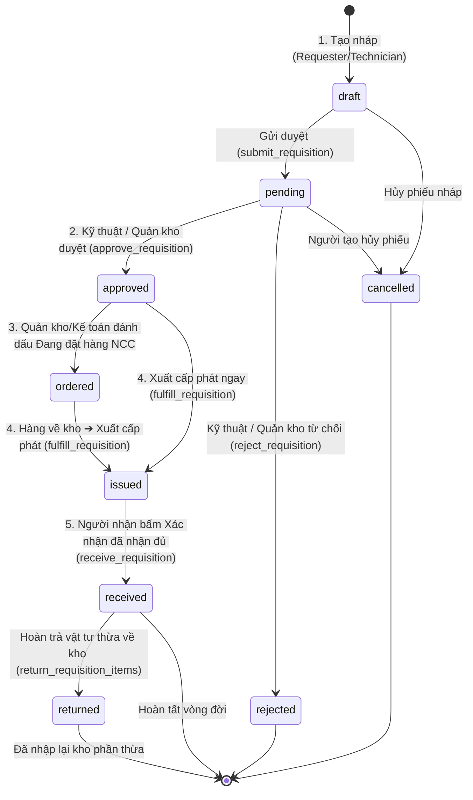
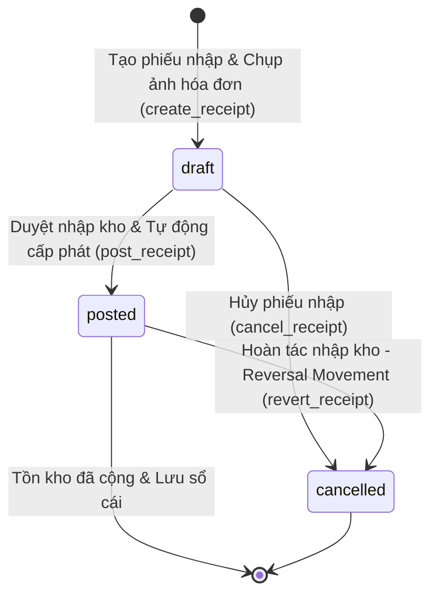
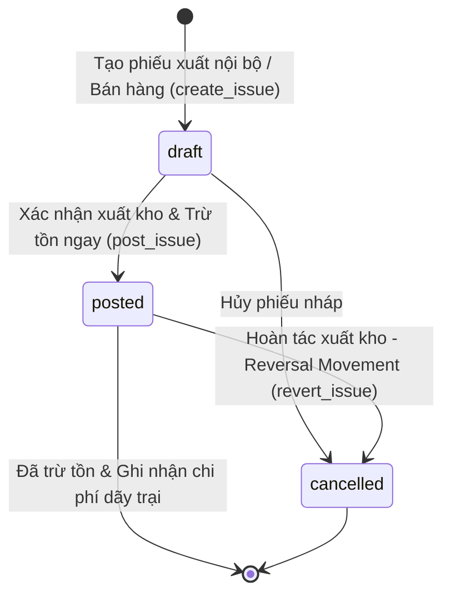
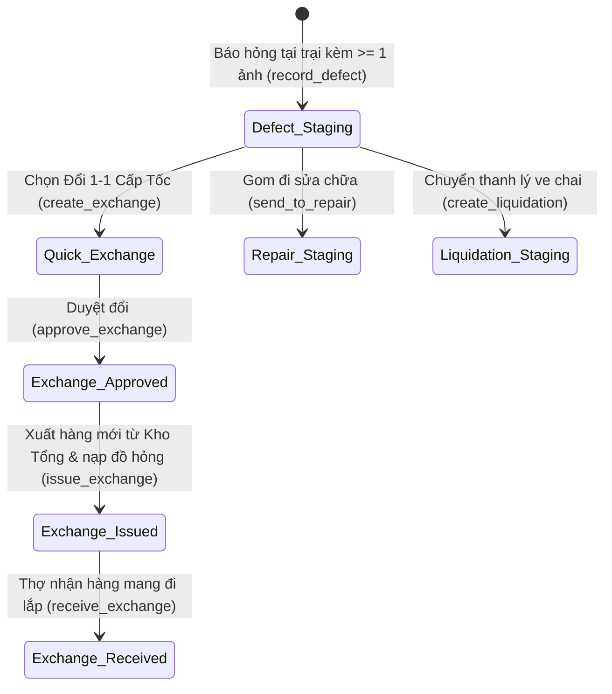
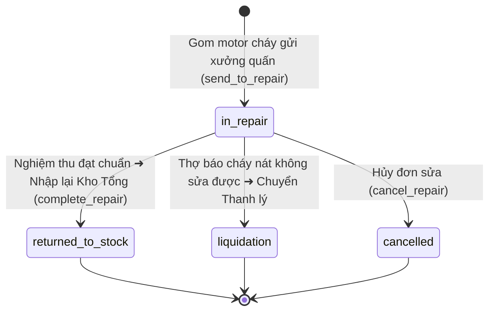
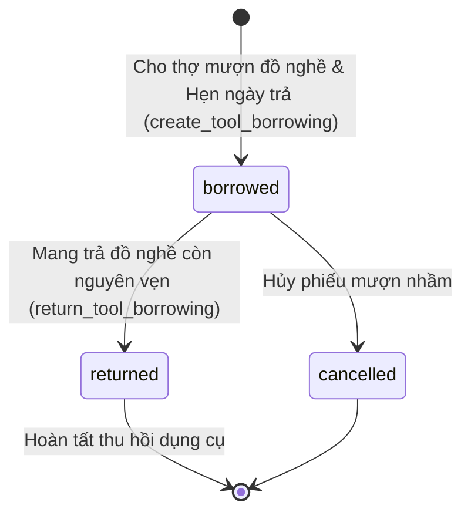
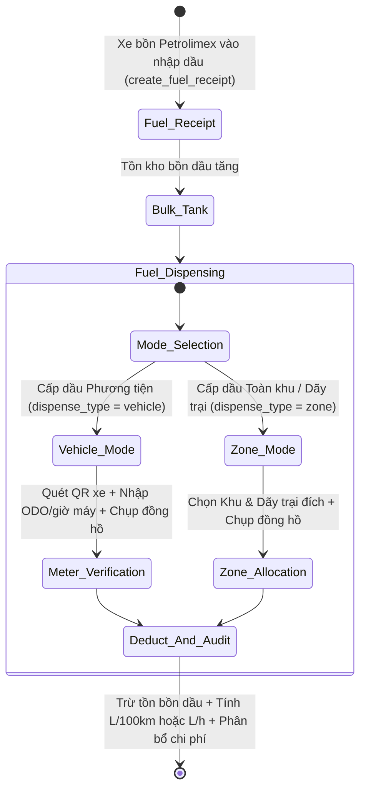
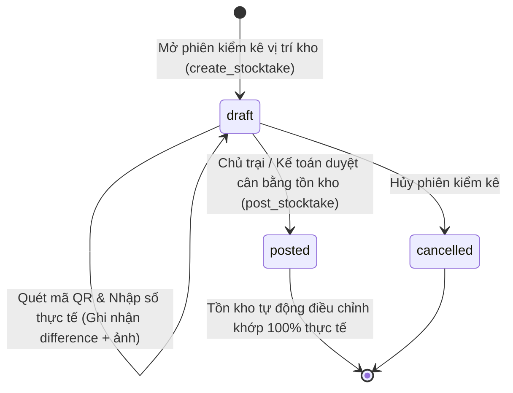
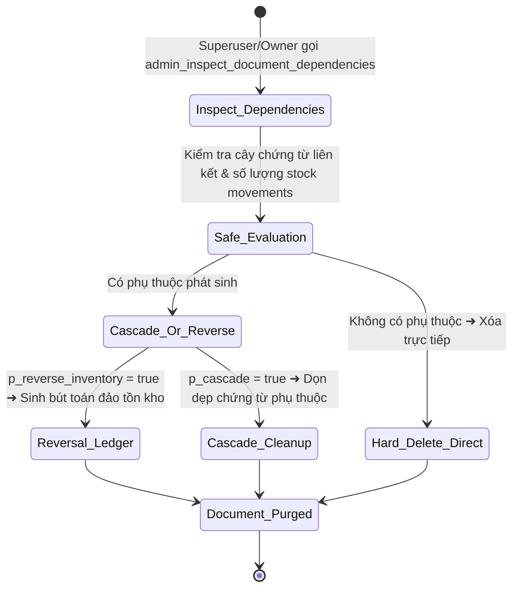

# 🔄 VÒNG ĐỜI CHỨNG TỪ & MÁY TRẠNG THÁI (STATE MACHINES & DOCUMENT LIFECYCLES)

> Tài liệu đặc tả các máy trạng thái (State Machines), điều kiện chuyển đổi (State Transitions), vai trò có thẩm quyền, tiến trình 5 cột mốc và quy tắc khóa dữ liệu (Immutability Rules) của toàn bộ các loại chứng từ trong hệ thống **Minh Tân Phát Supply**.

---

## 1. PHIẾU YÊU CẦU VẬT TƯ (REQUISITIONS 5-STAGE MILESTONE STATE MACHINE)

Phiếu xin cấp vật tư trang trại trải qua tiến trình 5 cột mốc kiểm soát rõ ràng nhằm đảm bảo đúng mục đích sử dụng, theo dõi tình trạng đặt hàng NCC và có xác nhận giao nhận 2 chiều:

### Chi tiết các trạng thái & Cột mốc Requisition:
| Cột mốc / Trạng thái | Tên tiếng Việt | Quyền thao tác | Hành động hệ thống |
|---|---|---|---|
| `draft` | **Bản nháp** | `requester`, `technician` | Chưa trừ kho. Người tạo có thể tự do thêm/bớt vật tư trong giỏ hàng. |
| `pending` | **Chờ phê duyệt** | `technician`, `warehouse`, `owner` | Đã khóa chỉnh sửa nội dung. Đang chờ Kỹ thuật trưởng hoặc Quản lý khu phê duyệt. |
| `approved` | **Đã phê duyệt** | `warehouse`, `accountant` | Đã chấp thuận cấp phát. Phiếu sẵn sàng để Quản kho xuất hàng (hoặc tự động fulfill khi nhập kho mới). |
| `ordered` | **Đang đặt hàng** | `warehouse`, `accountant` | Đánh dấu vật tư đang được đặt từ Nhà cung cấp ngoài (chờ giao hàng về trại). |
| `issued` | **Đã xuất hàng** | `warehouse` (thực hiện) | Tồn kho vật lý trong hệ thống đã bị trừ. Hàng đang trên đường giao về trại. |
| `received` | **Đã nhận đủ** | `requester` (xác nhận) | Người nhận bấm xác nhận 2 chiều trên app. Phiếu đóng lại hoàn tất. |
| `rejected` | **Bị từ chối** | `technician`, `warehouse` | Ghi nhận lý do từ chối (ví dụ: xin vượt định mức), không xuất hàng. |
| `cancelled` | **Đã hủy** | Người tạo phiếu | Người tạo chủ động hủy khi không còn nhu cầu. |

### Quản lý Hóa đơn & Ảnh chứng từ giao nhận:
* Người yêu cầu hoặc Quản kho có thể upload trực tiếp ảnh hóa đơn VAT / phiếu giao hàng (`invoice_images`) từ camera điện thoại.
* Khi phiếu yêu cầu được liên kết với Phiếu nhập kho (`auto_fulfilled_by_receipt_id`), ảnh hóa đơn sẽ được đồng bộ 2 chiều tự động.

---

## 2. PHIẾU NHẬP KHO NHÀ CUNG CẤP (RECEIPTS STATE MACHINE)

### Quy tắc tự động cấp phát khi nhập kho (Auto-Fulfill):
1. Khi Quản kho bấm **Hoàn tất nhập kho (`post_receipt`)**, tồn kho sẽ được cộng ngay lập tức.
2. Hệ thống tự động tìm các Phiếu yêu cầu **ĐÃ ĐƯỢC PHÊ DUYỆT (`approved` hoặc `ordered`)** theo thứ tự thời gian tạo tăng dần (FIFO).
3. Tự động xuất kho (`fulfill_requisition`) cho các phiếu này và lưu vết kết quả bền vững vào bảng audit và `linked_requisition_ids`.
4. *Lưu ý quan trọng:* Các phiếu đang ở trạng thái `pending` (chưa duyệt) sẽ **không** bị tự động xuất hàng để đảm bảo nguyên tắc quản trị.

---

## 3. PHIẾU XUẤT KHO TRỰC TIẾP (ISSUES STATE MACHINE)

---

## 4. QUY TRÌNH BÁO HỎNG & ĐỔI 1-1 CẤP TỐC (DEFECTS & EXCHANGES)

---

## 5. ĐƠN SỬA CHỮA CƠ ĐIỆN (REPAIR ORDERS STATE MACHINE)

---

## 6. MƯỢN TRẢ DỤNG CỤ ĐỒ NGHỀ (TOOL BORROWINGS STATE MACHINE)

* **Cảnh báo quá hạn (Overdue Alert):** Khi `CURRENT_DATE > due_date` và `status = 'borrowed'`, hệ thống tự động gắn huy hiệu màu đỏ cảnh báo trên màn hình Quản kho và gửi email đôn đốc thu hồi.

---

## 7. TRẠM BỒN DẦU DIESEL & CẤP DẦU ĐA PHƯƠNG THỨC (FUEL STATE MACHINE)

---

## 8. PHIÊN KIỂM KÊ KHO (STOCKTAKE SESSIONS STATE MACHINE)

---

## 9. QUẢN TRỊ CHỨNG TỪ CẤP CAO (MASTER DOCUMENT CONTROL LIFECYCLE)

