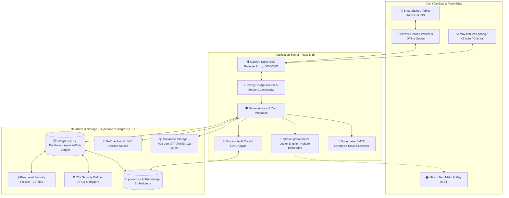
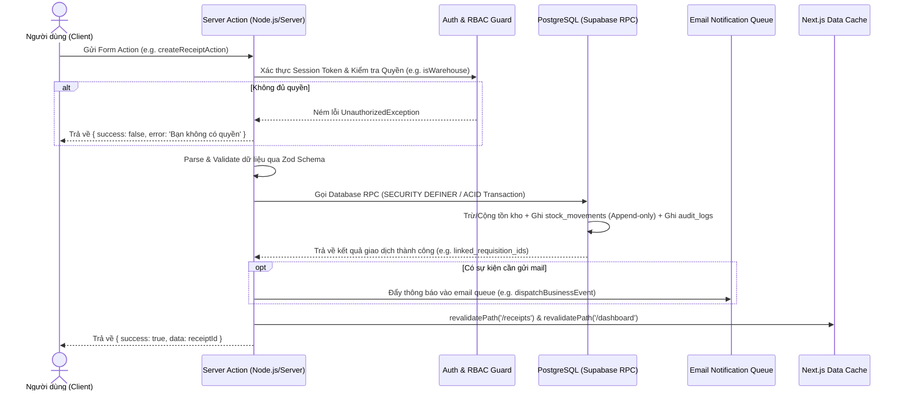

# 🏗️ KIẾN TRÚC TỔNG QUAN HỆ THỐNG — MINH TÂN PHÁT SUPPLY

> Tài liệu kỹ thuật giải thích toàn diện về kiến trúc phần mềm, cấu trúc luồng dữ liệu, các lớp bảo mật, AI Copilot, cơ chế ngoại tuyến PWA và công nghệ in ấn của hệ thống **Minh Tân Phát Supply**.
>
> **Trạng thái schema:** Hệ thống đồng bộ trạng thái deployment từ YAML manifest chính thức. Xem `docs/operations/current-deployment-status.yaml` để biết trạng thái cutover hiện tại.

---

## 1. TỔNG QUAN KIẾN TRÚC (HIGH-LEVEL TOPOLOGY)

Hệ thống được thiết kế theo mô hình **Modern 3-Tier Web Architecture** tối ưu hóa cho môi trường mạng nông thôn & trang trại chăn nuôi công nghiệp:



---

## 2. NGĂN XẾP CÔNG NGHỆ (TECH STACK & DEPENDENCIES)

| Tầng kiến trúc | Công nghệ sử dụng | Vai trò & Mục đích |
|---|---|---|
| **Framework chính** | **Next.js 15.x (App Router + Turbopack)** | Rendering hybrid: Server Components kết hợp Client Components, Server Actions thay thế hoàn toàn REST APIs thủ công. |
| **Ngôn ngữ** | **TypeScript 5.x (Strict)** | Đảm bảo tính an toàn kiểu dữ liệu 100%, tự động suy luận kiểu từ Supabase Database Definitions. |
| **Giao diện & Styling** | **Tailwind CSS v4 + Radix UI + Lucide** | Thiết kế tối ưu cho màn hình cảm ứng điện thoại (Touch-friendly), hỗ trợ Dark/Light theme (`next-themes`), Sonner toast notification. |
| **Cơ sở dữ liệu** | **PostgreSQL 17 (Supabase Managed)** | Lưu trữ dữ liệu quan hệ, ACID transactions, Sổ cái Append-only, Triggers chống sửa đổi gian lận, `pgvector` cho AI. |
| **Bảo mật & Auth** | **GoTrue + Row Level Security (RLS)** | Đăng nhập Username/Mật khẩu (không email), mã hóa phiên làm việc qua HTTP-only cookies (`@supabase/ssr`), phân quyền chi tiết 7 vai trò. |
| **Ngoại tuyến & PWA** | **Serwist + IndexedDB + Zustand** | Service worker cache tĩnh các trang web và bảng dữ liệu sản phẩm, offline requisition queue tự động đồng bộ khi có mạng. |
| **In ấn & Tem nhãn** | **@react-pdf/renderer + QRCode** | Xuất phiếu kho chuẩn A4/A5 và tem QR vector độ nét cao, nhúng font tiếng Việt UTF-8 `Roboto-Regular` & `Roboto-Bold`. |
| **Báo cáo & Xuất liệu** | **ExcelJS + Date-fns** | Xuất dữ liệu kế toán (XNT, Thẻ kho, Chi phí trại, Xe), có công thức và định dạng chuẩn. |
| **AI Copilot** | **Vercel AI SDK + Omniroute + OpenAI** | Trợ lý AI RAG nội bộ — chat với dữ liệu vận hành trại, quản lý và chunking tài liệu tri thức. |
| **Hệ thống Email** | **Nodemailer SMTP + Background Worker** | Tự động gửi email thông báo phê duyệt phiếu, cảnh báo tồn kho an toàn và nhắc mượn đồ quá hạn. |
| **Kiểm thử (Testing)** | **Vitest 5.x + Testing Library** | **562 tests / 103 test suites**, kiểm soát toàn diện luồng nghiệp vụ. |

---

## 3. CẤU TRÚC MÃ NGUỒN (FEATURE-DRIVEN ARCHITECTURE)

Mã nguồn được phân tách theo từng **Phân hệ Nghiệp vụ (Feature Slices)** độc lập, tránh sự phụ thuộc chéo:

```
src/
├── app/                              # Định tuyến Next.js App Router
│   ├── (app)/                        # Nhóm trang yêu cầu xác thực (Authenticated Dashboard)
│   │   ├── dashboard/                # Dashboard may đo theo 7 vai trò
│   │   ├── admin/                    # Phân hệ quản trị (Users, Zones, Vehicles, Suppliers, Categories, AI Copilot)
│   │   ├── products/                 # Phân hệ tra cứu danh mục & tồn kho SKU
│   │   ├── requisitions/             # Phân hệ phiếu yêu cầu vật tư trại (duyệt 2 cấp)
│   │   ├── receipts/                 # Phân hệ phiếu nhập kho NCC, hóa đơn & auto-fulfill
│   │   ├── issues/                   # Phân hệ phiếu xuất kho nội bộ (theo Sub-zone) & xuất bán
│   │   ├── defects/                  # Phân hệ báo hỏng & đổi 1-1 cấp tốc 30s
│   │   ├── repairs/                  # Phân hệ sửa chữa cơ điện & nghiệm thu
│   │   ├── liquidations/             # Phân hệ thanh lý phế liệu ve chai
│   │   ├── tools/                    # Phân hệ mượn trả dụng cụ đồ nghề
│   │   ├── fuel/                     # Phân hệ trạm bồn dầu Diesel & quét QR xe
│   │   ├── transfers/                # Phân hệ điều chuyển đa kho
│   │   ├── stocktake/                # Phân hệ kiểm kê kho định kỳ & cân bằng
│   │   └── reports/                  # Trung tâm báo cáo & phân tích chi phí
│   ├── (auth)/                       # Nhóm trang xác thực & đăng nhập
│   │   └── login/                    # Màn hình đăng nhập username không cần email
│   └── api/                          # API handlers chuyên dụng (Export Excel, PDF, QR, AI, Upload)
│
├── components/                       # Giao diện dùng chung & UI Primitives
│   ├── ai/                           # AI Copilot drawer & floating draggable trigger
│   ├── dashboard/                    # Role-tailored dashboard views (Owner, Warehouse, Accountant...)
│   ├── layout/                       # AppShell, Sidebar, Topbar, SubnavTabs, MobileInstallPrompt
│   ├── offline/                      # OfflineSyncProvider & OfflineStatusBar
│   ├── slip-detail/                  # SlipDetailModal, SlipInvoices, SlipItemsTable
│   └── ui/                           # Radix UI + Tailwind Primitives (Button, Dialog, Sonner...)
│
├── features/                         # Lớp Nghiệp vụ chính (Domain Logic & Components)
│   ├── admin/                        # Actions & Components quản lý danh mục, khu vực, nhà cung cấp
│   ├── ai-admin/                     # Quản trị tài liệu tri thức, chunking, embeddings, prompt presets
│   ├── auth/                         # Actions đăng nhập, tạo user, phân quyền 7 roles, đổi mật khẩu
│   ├── catalog/                      # SKU Catalog domain layer (Product -> SKU -> Multi-UOM -> BOM)
│   ├── dashboard/                    # Server queries & actions trích xuất KPI theo vai trò
│   ├── defects/                      # Actions báo hỏng, upload ảnh hiện trường, xử lý staging
│   ├── exchanges/                    # Actions đổi 1-1 cấp tốc 30s (Exchange Notes)
│   ├── fuel/                         # Actions bơm dầu, camera QR scanner, tính định mức tiêu hao
│   ├── issues/                       # Actions xuất nội bộ theo Sub-zone & xuất bán
│   ├── liquidations/                 # Actions thanh lý phế liệu & thu quỹ
│   ├── notifications/                # Email notification policies, templates & background dispatch
│   ├── pdf/                          # Vector PDF layouts, Brand header, Print preview, QR Generator
│   ├── products/                     # Actions, Form dialog, Bộ quy đổi đơn vị, QR Scanner
│   ├── receipts/                     # Actions nhập kho, đính kèm hóa đơn VAT, Auto-fulfill FIFO
│   ├── repairs/                      # Actions đợt sửa chữa, Nghiệm thu nhập kho
│   ├── reports/                      # Truy vấn tài chính, XNT, Chi phí trại, Thẻ kho, Excel Engine
│   ├── requisitions/                 # Actions duyệt 2 cấp, Giỏ hàng, Đơn vị linh hoạt, Trả hàng thừa
│   ├── stocktake/                    # Actions mở phiên kiểm đếm, Cân bằng tồn, Đính kèm ảnh
│   ├── tools/                        # Actions mượn trả dụng cụ, Tính hạn quá hạn
│   ├── transfers/                    # Actions điều chuyển đa kho
│   └── vehicles/                     # Actions quản trị xe cơ giới, Quản lý ảnh cà vẹt/đăng kiểm
│
├── lib/                              # Thư viện dùng chung & Helpers
│   ├── ai/                           # AI registry, rate-limiting, tokenizer, knowledge standardizer
│   ├── supabase/                     # Supabase Server Component, Client & Middleware clients
│   ├── auth.ts                       # Helper kiểm tra phân quyền RBAC 7 roles trên server
│   ├── cached-metadata.ts            # In-memory RAM Cache tối ưu tốc độ danh mục và khu vực
│   ├── email.ts                      # Nodemailer SMTP enterprise email engine
│   ├── format.ts                     # Format tiền tệ VNĐ, ngày tháng, định mức dầu
│   └── stock.ts                      # Helper tính toán tồn khả dụng và quy đổi UOM
│
├── stores/                           # Zustand Global Client Stores
│   ├── cart-store.ts                 # Giỏ hàng xin cấp vật tư trại
│   ├── offline-queue-store.ts        # Hàng đợi lưu trữ phiếu ngoại tuyến (localStorage/IndexedDB)
│   └── ui-store.ts                   # Trạng thái đóng/mở sidebar, dark/light theme
│
└── types/                            # Type Definitions
    └── database.types.ts             # TypeScript definitions tự động đồng bộ từ PostgreSQL
```

---

## 4. LUỒNG DỮ LIỆU & GIAO DỊCH SERVER ACTIONS

Hệ thống loại bỏ hoàn toàn các REST API endpoints thủ công dễ bị tấn công CSRF. Mọi thao tác ghi dữ liệu đều đi qua **Next.js Server Actions** với quy trình 5 bước kiểm soát an toàn nghiêm ngặt:



---

## 5. CƠ CHẾ NGOẠI TUYẾN PWA (OFFLINE SERVICE WORKER)

Trong điều kiện trang trại rộng lớn (hàng chục hecta) thường có những góc trại hoặc kho xa mất sóng di động:
1. **Pre-caching Giao diện:** Toàn bộ bundle giao diện HTML/CSS/JS được Serwist Service Worker cache sẵn trên điện thoại.
2. **Offline Requisition Queue:** Khi công nhân ở trong trại không có sóng, thao tác lập phiếu yêu cầu được lưu trữ an toàn trong `offline-queue-store`.
3. **Tự động đồng bộ (Auto-Sync):** Khi thiết bị kết nối lại Wi-Fi hoặc 4G, `OfflineSyncProvider` tự động nhận diện và đẩy các phiếu trong hàng đợi lên máy chủ.
4. **Trạng thái trực quan:** `OfflineStatusBar` hiển thị dải thông báo màu vàng thông báo số lượng phiếu đang chờ đồng bộ.

---

## 6. KIẾN TRÚC IN ẤN VECTOR & NHÃN MÃ QR

Hệ thống nhúng trực tiếp bộ thư viện in ấn vector `@react-pdf/renderer` với font tiếng Việt `Roboto` UTF-8:
* **Độ sắc nét tuyệt đối:** In chuẩn vector trực tiếp ra file PDF không bị vỡ hạt như chụp màn hình.
* **Mẫu in chuẩn nhận diện thương hiệu:** Mọi phiếu in (Phiếu nhập, Phiếu xuất, Phiếu yêu cầu, Phiếu đổi 1-1, Phiếu cấp dầu, Phiếu mượn dụng cụ, Phiếu kiểm kê) đều đồng bộ logo Trại Gà Lê Văn Dương, địa chỉ, số điện thoại, quy đổi tiền bằng chữ và 4 ô ký tên trách nhiệm.
* **Mã QR tra cứu tức thời:** Trên góc trên bên phải mỗi phiếu in đều có mã QR chứa URL tra cứu trực tiếp thông tin và trạng thái lịch sử của phiếu.
* **Tem Decal QR:** In tem QR decal kích thước nhỏ dán trực tiếp lên bao bì vật tư, kệ hàng và nắp bình dầu xe cơ giới.

---

## 7. AI COPILOT & TRI THỨC TRANG TRẠI (RAG ENGINE)

Trợ lý AI Copilot tích hợp sẵn dưới dạng nút nổi kéo thả (Draggable Floating Button) hoặc Drawer trượt:
* **RAG (Retrieval-Augmented Generation):** Khi người dùng đặt câu hỏi, hệ thống trích xuất vector tương đồng từ bảng `ai_knowledge_chunks` và dữ liệu kho tức thời trước khi gửi prompt đến LLM.
* **AI Admin Console (`/admin/ai-copilot`):** Cho phép Quản trị viên tải lên tài liệu quy trình vận hành, tiêu chuẩn kỹ thuật thiết bị, tự động chuẩn hóa và phân mảnh văn bản (chunking pipeline).
* **Kiểm soát chi phí & An toàn:** Giới hạn tốc độ gọi API (`ai_rate_limits`), kiểm soát dung lượng token (`token-optimizer`) và phân quyền gọi API.

---

## 8. MÔ HÌNH TRIỂN KHAI 2 PHIÊN BẢN (DUAL-INSTANCE DEPLOYMENT)

* **Web Production (Cổng 3000):** Được quản lý bởi dịch vụ hệ thống `systemd (mtp-web.service)`, hỗ trợ triển khai không gián đoạn (Zero-Downtime) qua script `deploy.sh`.
* **Dev Server (Cổng 3001):** Phục vụ phát triển và kiểm thử tính năng mới, chạy trên thư mục build độc lập `.next-dev` qua script `dev-up.sh`.
* **Truy cập từ xa:** Hỗ trợ kết nối an toàn qua mạng riêng ảo Tailscale hoặc tên miền chính thức `minhtanphat.io.vn` qua Caddy Reverse Proxy có SSL tự động.
