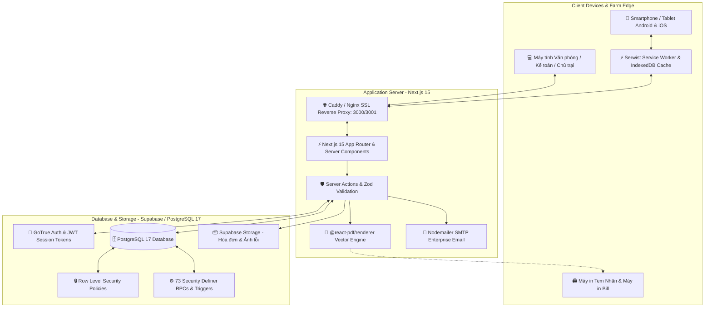
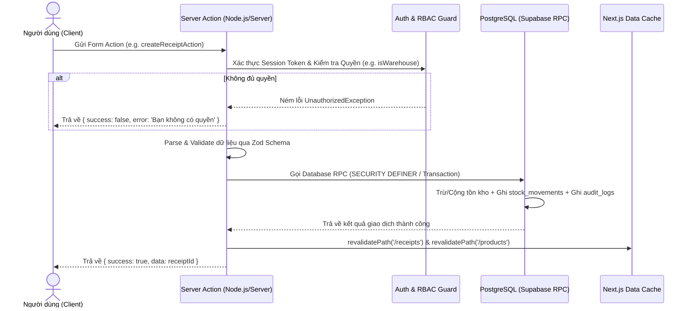

# 🏗️ KIẾN TRÚC TỔNG QUAN HỆ THỐNG — MINH TÂN PHÁT SUPPLY

> Tài liệu kỹ thuật giải thích toàn diện về kiến trúc phần mềm, cấu trúc luồng dữ liệu, các lớp bảo mật, cơ chế ngoại tuyến PWA và công nghệ in ấn của hệ thống **Minh Tân Phát Supply**.

---

## 1. TỔNG QUAN KIẾN TRÚC (HIGH-LEVEL TOPOLOGY)

Hệ thống được thiết kế theo mô hình **Hiện đại (Modern 3-Tier Web Architecture)** tối ưu hóa cho môi trường mạng nông thôn & trang trại chăn nuôi công nghiệp:



---

## 2. NGĂN XẾP CÔNG NGHỆ (TECH STACK & DEPENDENCIES)

| Tầng kiến trúc | Công nghệ sử dụng | Vai trò & Mục đích |
|---|---|---|
| **Framework chính** | **Next.js 15.5+ (App Router)** | Rendering hybrid: Server Components kết hợp Client Components, Server Actions thay thế hoàn toàn REST APIs thủ công. |
| **Ngôn ngữ** | **TypeScript 5.x (Strict)** | Đảm bảo tính an toàn kiểu dữ liệu 100%, tự động suy luận kiểu từ Supabase Database Definitions. |
| **Giao diện & Styling** | **Tailwind CSS v4 + Radix UI + Lucide** | Thiết kế tối ưu cho màn hình cảm ứng điện thoại (Touch-friendly), hỗ trợ Dark/Light theme (`next-themes`), Sonner toast notification. |
| **Cơ sở dữ liệu** | **Supabase (PostgreSQL 17)** | Lưu trữ dữ liệu quan hệ, ACID transactions, 38 Performance Indexes, JSONB đa thuộc tính, triggers chống gian lận. |
| **Bảo mật & Auth** | **GoTrue + Row Level Security (RLS)** | Đăng nhập Username/Password, mã hóa phiên làm việc qua HTTP-only cookies (`@supabase/ssr`), phân quyền chi tiết 7 vai trò. |
| **Ngoại tuyến & PWA** | **Serwist + IndexedDB** | Service worker cache tĩnh các trang web và bảng dữ liệu sản phẩm, cho phép thao tác ở góc chuồng mất sóng. |
| **In ấn & Tem nhãn** | **@react-pdf/renderer + QRCode** | Xuất phiếu kho chuẩn A4/A5 và tem QR vector độ nét cao, nhúng font tiếng Việt UTF-8 `Be Vietnam Pro`. |
| **Báo cáo & Xuất liệu** | **ExcelJS + XLSX** | Xuất dữ liệu kế toán, sổ cái kho, báo cáo tiêu hao xe cơ giới định dạng Excel có công thức và định dạng chuẩn. |

---

## 3. CẤU TRÚC MÃ NGUỒN (FEATURE-DRIVEN ARCHITECTURE)

Mã nguồn được phân tách theo từng **Phân hệ Nghiệp vụ (Feature Modules)** độc lập, tránh sự phụ thuộc chéo rối rắm:

```
src/
├── app/                              # Định tuyến App Router & Layouts
│   ├── (app)/                        # Nhóm trang yêu cầu xác thực (Authenticated Dashboard)
│   │   ├── admin/                    # Phân hệ quản trị (Users, Zones, Vehicles, Suppliers, Categories)
│   │   ├── products/                 # Phân hệ tra cứu danh mục & tồn kho
│   │   ├── requisitions/             # Phân hệ phiếu yêu cầu vật tư chuồng
│   │   ├── receipts/                 # Phân hệ phiếu nhập kho NCC & hóa đơn
│   │   ├── issues/                   # Phân hệ phiếu xuất kho & cấp phát
│   │   ├── defects/                  # Phân hệ báo hỏng & đổi 1-1 cấp tốc
│   │   ├── repairs/                  # Phân hệ sửa chữa cơ điện
│   │   ├── liquidations/             # Phân hệ thanh lý phế liệu ve chai
│   │   ├── tools/                    # Phân hệ mượn trả dụng cụ đồ nghề
│   │   ├── fuel/                     # Phân hệ trạm bồn dầu Diesel & quét QR xe
│   │   ├── transfers/                # Phân hệ điều chuyển đa kho
│   │   ├── stocktake/                # Phân hệ kiểm kê kho định kỳ
│   │   └── reports/                  # Trung tâm báo cáo & phân tích chi phí
│   ├── (auth)/                       # Nhóm trang xác thực & đăng nhập
│   │   └── login/                    # Màn hình đăng nhập username không cần email
│   └── api/                          # API handlers chuyên dụng (Export Excel, Upload S3)
│
├── features/                         # Lớp Nghiệp vụ chính (Feature Slices)
│   ├── admin/                        # Components & Actions quản trị danh mục
│   ├── auth/                         # Actions đăng nhập, tạo user, phân quyền, đổi mật khẩu
│   ├── products/                     # Actions, Form dialog, Bộ quy đổi đơn vị, Scanner
│   ├── requisitions/                 # Actions duyệt 2 cấp, Cart drawer, Trả hàng thừa
│   ├── receipts/                     # Actions nhập kho, đính kèm hóa đơn, Auto fulfill
│   ├── issues/                       # Actions xuất nội bộ theo Sub-zone & xuất bán
│   ├── defects/                      # Actions đổi 1-1 tức thời, Gom đồ hỏng
│   ├── repairs/                      # Actions đợt sửa chữa, Nghiệm thu nhập kho
│   ├── tools/                        # Actions mượn trả dụng cụ, Tính hạn quá hạn
│   ├── fuel/                         # Actions quét QR camera, Tính định mức L/100km & L/h
│   ├── stocktake/                    # Actions mở phiên kiểm đếm, Cân bằng tồn
│   ├── reports/                      # Truy vấn tài chính, XNT, Chi phí chuồng, Thẻ kho
│   └── pdf/                          # Vector PDF Layouts, Brand Header, QR Print Studio
│
├── lib/                              # Thư viện dùng chung & Helpers
│   ├── supabase/                     # Supabase Client, Server Component & Middleware clients
│   ├── auth.ts                       # Helper kiểm tra phân quyền RBAC trên server
│   ├── cached-metadata.ts            # RAM Cache tối ưu tốc độ danh mục và khu vực
│   ├── format.ts                     # Format tiền tệ VNĐ, ngày tháng, định mức dầu
│   └── email.ts                      # Helper gửi email thông báo qua SMTP
│
└── types/                            # Type Definitions
    └── database.types.ts             # TypeScript definitions tự động tạo từ PostgreSQL
```

---

## 4. LUỒNG DỮ LIỆU & GIAO DỊCH SERVER ACTIONS

Hệ thống loại bỏ hoàn toàn các API REST thủ công dễ bị tấn công CSRF. Mọi thao tác ghi dữ liệu đều đi qua **Next.js Server Actions** với 5 bước kiểm soát an toàn nghiêm ngặt:



---

## 5. CƠ CHẾ NGOẠI TUYẾN PWA (OFFLINE SERVICE WORKER)

Trong điều kiện trang trại rộng lớn (hàng chục hecta) thường có những góc chuồng hoặc kho xa mất sóng di động:
1. **Pre-caching Giao diện:** Toàn bộ bundle giao diện HTML/CSS/JS được service worker cache sẵn trên điện thoại.
2. **IndexedDB Local Data:** Danh mục sản phẩm, danh sách xe và danh bạ khu vực được lưu cục bộ để người dùng tra cứu tức thì.
3. **Tự động nhận diện mạng:** Thanh thông báo màu vàng xuất hiện khi mất mạng và tự động biến mất khi có mạng trở lại.

---

## 6. KIẾN TRÚC IN ẤN VECTOR & NHÃN MÃ QR

Hệ thống nhúng trực tiếp bộ thư viện in ấn vector `@react-pdf/renderer`:
* **Độ sắc nét tuyệt đối:** In chuẩn vector không bị vỡ hạt như chụp ảnh màn hình.
* **Mẫu in chuẩn nhận diện thương hiệu:** Mọi phiếu in (Phiếu nhập, Phiếu xuất, Phiếu cấp dầu, Phiếu yêu cầu) đều mang logo Trang trại Lê Văn Dương, địa chỉ, số điện thoại và 4 ô ký tên trách nhiệm (Người lập, Thủ kho, Người nhận, Kế toán).
* **Mã QR tra cứu tức thời:** Trên mỗi phiếu in đều có mã QR chứa URL tra cứu trực tiếp lịch sử của phiếu trên phần mềm.