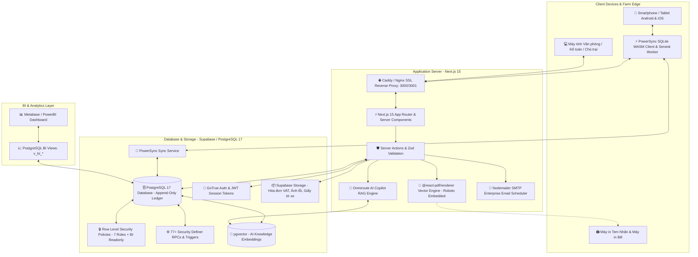

# 🏗️ KIẾN TRÚC TỔNG QUAN HỆ THỐNG — MINH TÂN PHÁT SUPPLY

> Tài liệu kỹ thuật giải thích toàn diện về kiến trúc phần mềm, cấu trúc luồng dữ liệu, các lớp bảo mật, AI Copilot, cơ chế ngoại tuyến PowerSync / Serwist PWA, phân tích Metabase BI và công nghệ in ấn của hệ thống **Minh Tân Phát Supply**.
>
> **Trạng thái schema:** Hệ thống đồng bộ trạng thái deployment từ YAML manifest chính thức. Xem `docs/operations/current-deployment-status.yaml` để biết trạng thái cutover hiện tại.

---

## 1. TỔNG QUAN KIẾN TRÚC (HIGH-LEVEL TOPOLOGY)

Hệ thống được thiết kế theo mô hình **Modern 3-Tier Web Architecture + Offline Sync** tối ưu hóa cho môi trường mạng nông thôn & trang trại chăn nuôi công nghiệp:



---

## 2. NGĂN XẾP CÔNG NGHỆ (TECH STACK & DEPENDENCIES)

| Tầng kiến trúc | Công nghệ sử dụng | Vai trò & Mục đích |
|---|---|---|
| **Framework chính** | **Next.js 15.x (App Router + Turbopack)** | Rendering hybrid: Server Components kết hợp Client Components, Server Actions thay thế hoàn toàn REST APIs thủ công. |
| **Ngôn ngữ** | **TypeScript 5.x (Strict)** | Đảm bảo tính an toàn kiểu dữ liệu 100%, tự động suy luận kiểu từ Supabase Database Definitions. |
| **Giao diện & Styling** | **Tailwind CSS v4 + Radix UI + Lucide** | Thiết kế tối ưu cho màn hình cảm ứng điện thoại (Touch-friendly), hỗ trợ Dark/Light theme (`next-themes`), Sonner toast notification. |
| **Cơ sở dữ liệu** | **PostgreSQL 17 (Supabase Managed)** | Lưu trữ dữ liệu quan hệ, ACID transactions, Sổ cái Append-only, Triggers chống sửa đổi gian lận, `pgvector` cho AI, 101 Migrations. |
| **Bảo mật & Auth** | **GoTrue + Row Level Security (RLS)** | Đăng nhập Username/Mật khẩu (không email), mã hóa phiên làm việc qua HTTP-only cookies (`@supabase/ssr`), phân quyền chi tiết 7 vai trò + vai trò `metabase_readonly`. |
| **Ngoại tuyến & Đồng bộ** | **PowerSync + SQLite WASM + Serwist PWA** | Kiến trúc Offline-First: Lưu trữ bản sao SQLite cục bộ trong trình duyệt WebAssembly, tự động đồng bộ hai chiều ngay khi có mạng. |
| **In ấn & Tem nhãn** | **@react-pdf/renderer + QRCode** | Xuất phiếu kho chuẩn A4/A5 và tem QR vector độ nét cao, nhúng font tiếng Việt UTF-8 `Roboto-Regular` & `Roboto-Bold`. |
| **Báo cáo & Phân tích BI** | **Reports Hub + Metabase BI + ExcelJS** | Báo cáo Quản trị, Sổ cái XNT, Thẻ kho, Chi phí Dãy trại, Hiệu suất Đội xe, Metabase Views (`v_bi_*`), Xuất Excel kế toán. |
| **AI Copilot** | **Vercel AI SDK + Omniroute + OpenAI** | Trợ lý AI RAG nội bộ — chat với dữ liệu vận hành trại, quản lý và chunking tài liệu tri thức. |
| **Hệ thống Email** | **Nodemailer SMTP + Background Cron Worker** | Tự động gửi email thông báo phê duyệt phiếu, tiến trình đặt hàng, cảnh báo tồn kho an toàn và nhắc mượn đồ quá hạn. |
| **Kiểm thử (Testing)** | **Vitest 5.x + Testing Library** | **626 tests / 117 test suites (100% pass)**, kiểm soát toàn diện luồng nghiệp vụ. |

---

## 3. CẤU TRÚC MÃ NGUỒN (FEATURE-DRIVEN ARCHITECTURE)

Mã nguồn được phân tách theo từng **Phân hệ Nghiệp vụ (Feature Slices)** độc lập, tránh sự phụ thuộc chéo:

```
src/
├── app/                              # Định tuyến Next.js App Router
│   ├── (app)/                        # Nhóm trang yêu cầu xác thực (Authenticated Dashboard)
│   │   ├── dashboard/                # Dashboard may đo theo 7 vai trò
│   │   ├── admin/                    # Phân hệ quản trị (Users, Zones, Vehicles, Suppliers, Categories, AI Copilot, Documents)
│   │   ├── products/                 # Phân hệ tra cứu danh mục & tồn kho SKU
│   │   ├── requisitions/             # Phân hệ phiếu yêu cầu vật tư trại (tiến trình 5 bước & upload hóa đơn)
│   │   ├── receipts/                 # Phân hệ phiếu nhập kho NCC, hóa đơn VAT & auto-fulfill
│   │   ├── issues/                   # Phân hệ phiếu xuất kho nội bộ (theo Sub-zone) & xuất bán
│   │   ├── defects/                  # Phân hệ báo hỏng & đổi 1-1 cấp tốc 30s
│   │   ├── repairs/                  # Phân hệ sửa chữa cơ điện & nghiệm thu
│   │   ├── liquidations/             # Phân hệ thanh lý phế liệu ve chai
│   │   ├── tools/                    # Phân hệ mượn trả dụng cụ đồ nghề
│   │   ├── fuel/                     # Phân hệ trạm bồn dầu Diesel, cấp dầu toàn khu & quét QR xe
│   │   ├── transfers/                # Phân hệ điều chuyển đa kho
│   │   ├── stocktake/                # Phân hệ kiểm kê kho định kỳ & cân bằng
│   │   └── reports/                  # Trung tâm báo cáo quản trị, vận hành & phân tích BI
│   ├── (auth)/                       # Nhóm trang xác thực & đăng nhập
│   │   └── login/                    # Màn hình đăng nhập username không cần email
│   └── api/                          # API handlers chuyên dụng (Export Excel, PDF, QR, AI, Upload, Cron Notifications)
│
├── components/                       # Giao diện dùng chung & UI Primitives
│   ├── ai/                           # AI Copilot drawer & floating draggable trigger
│   ├── dashboard/                    # Role-tailored dashboard views (Owner, Warehouse, Accountant...)
│   ├── layout/                       # AppShell, Sidebar, Topbar, SubnavTabs, MobileInstallPrompt
│   ├── offline/                      # OfflineSyncProvider & OfflineStatusBar
│   ├── slip-detail/                  # SlipDetailModal, SlipInvoices, SlipItemsTable
│   └── ui/                           # Radix UI + Tailwind Primitives (Button, Dialog, Sonner...)
│
├── features/                         # Lớp Nghiệp vụ chính (Domain Logic & Components)
│   ├── admin/                        # Actions & Components quản lý danh mục, khu vực, nhà cung cấp, master document control
│   ├── ai-admin/                     # Quản trị tài liệu tri thức, chunking, embeddings, prompt presets
│   ├── auth/                         # Actions đăng nhập, tạo user, phân quyền 7 roles, đổi mật khẩu
│   ├── catalog/                      # SKU Catalog domain layer (Product -> SKU -> Multi-UOM -> BOM)
│   ├── dashboard/                    # Server queries & actions trích xuất KPI theo vai trò
│   ├── defects/                      # Actions báo hỏng, upload ảnh hiện trường, xử lý staging
│   ├── exchanges/                    # Actions đổi 1-1 cấp tốc 30s (Exchange Notes)
│   ├── fuel/                         # Actions bơm dầu, camera QR scanner, tính định mức tiêu hao, cấp dầu toàn khu
│   ├── notifications/                # Role-based notification queue & SMTP email scheduler
│   ├── pdf/                          # Vector PDF generation & High-res QR renderer
│   ├── receipts/                     # Actions nhập kho, hóa đơn VAT lightbox, auto-fulfill FIFO
│   ├── reports/                      # Báo cáo tổng hợp, sổ cái XNT, thẻ kho Stock Card, sub-zone costing, Metabase BI integration
│   ├── requisitions/                 # Actions lập phiếu, tiến trình 5 cột mốc, upload hóa đơn mua gấp
│   ├── stocktake/                    # Actions mở đợt kiểm kê, đối soát thừa thiếu, duyệt cân bằng
│   ├── tools/                        # Actions mượn trả dụng cụ, đôn đốc quá hạn
│   └── vehicles/                     # Quản lý đội xe, định mức tiêu hao, hồ sơ giấy tờ xe (đăng kiểm, bảo hiểm)
│
├── lib/                              # Thư viện & Tiện ích dùng chung
│   ├── ai/                           # AI Copilot client, RAG orchestrator & vector tools
│   ├── email/                        # SMTP transporter, email templates theo vai trò
│   ├── powersync/                    # PowerSync Database Schema, Connector & Web Worker
│   ├── supabase/                     # Supabase client, server actions client, middleware client
│   └── utils.ts                      # Formatters tiền tệ VND, ngày tháng, định dạng mã phiếu
│
├── stores/                           # Zustand Stores
│   ├── cart-store.ts                 # Giỏ hàng xin cấp vật tư trên điện thoại
│   ├── offline-queue-store.ts        # Hàng đợi ngoại tuyến chờ đồng bộ
│   └── ui-store.ts                   # Trạng thái đóng/mở Sidebar, Modals, Theme
│
└── types/                            # TypeScript Type Definitions
    ├── database.types.ts             # Kiểu dữ liệu sinh tự động từ PostgreSQL 17
    └── domain.types.ts               # Kiểu dữ liệu nghiệp vụ chuẩn hóa
```
