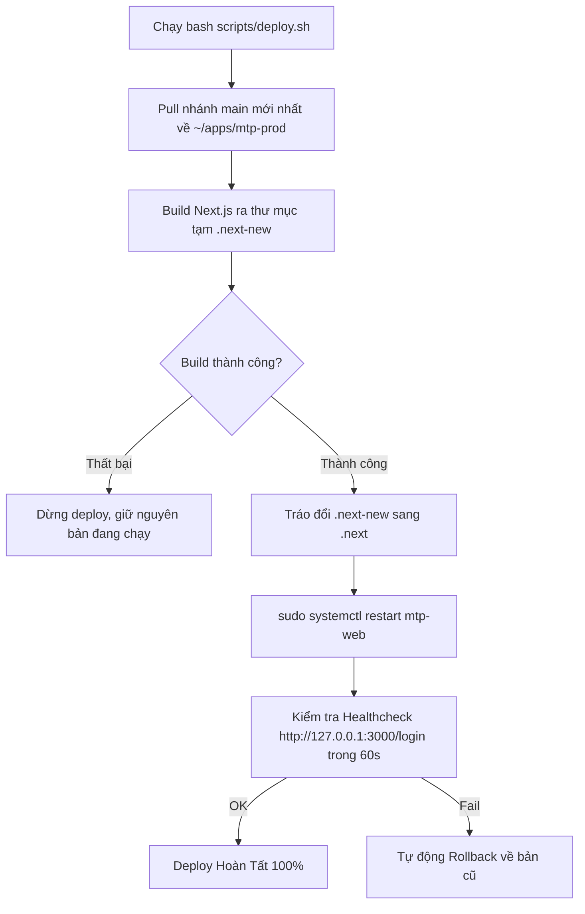

# ⚙️ HƯỚNG DẪN TRIỂN KHAI PRODUCTION (DEPLOYMENT RUNBOOK)

> Tài liệu hướng dẫn kỹ thuật dành cho Kỹ sư DevOps, Quản trị viên hệ thống để cài đặt, thiết lập môi trường, cấu hình dịch vụ Systemd / Docker, Reverse Proxy và quy trình triển khai không gián đoạn (Zero-Downtime Deployment) cho hệ thống **Minh Tân Phát Supply**.

---

## 1. YÊU CẦU HỆ THỐNG & MÔI TRƯỜNG (PREREQUISITES)

* **Máy chủ:** VPS Linux (Ubuntu 22.04 LTS / Debian 12) hoặc máy chủ Mini PC đặt trực tiếp tại trang trại.
* **Cấu hình tối thiểu:** 2 vCPU, 4GB RAM, 30GB SSD.
* **Runtime & Công cụ:**
  * Node.js v20.x hoặc v24.x LTS.
  * `pnpm` (khuyên dùng `pnpm@10+`).
  * Docker & Docker Compose v2+ (phục vụ Supabase self-host).
  * Caddy Server (Reverse Proxy tự động cấp phát SSL HTTPS miễn phí).

---

## 2. KIẾN TRÚC MÔI TRƯỜNG (DEV VS PRODUCTION TOPOLOGY)

Hệ thống thiết lập 2 môi trường chạy song song độc lập trên cùng máy chủ để đảm bảo việc sửa code và kiểm thử không bao giờ làm gián đoạn hệ thống đang hoạt động:

| Môi trường | Thư mục mã nguồn | Cổng | Quản lý tiến trình | Thư mục Build |
|---|---|:---:|---|---|
| **Phát triển (Dev)** | `~/minh-tan-phat-supply` (repo dev) | **3001** | `bash scripts/dev-up.sh` | `.next-dev` |
| **Chính thức (Production)** | `~/apps/mtp-prod` (nhánh `main`) | **3000** | Systemd `mtp-web.service` | `.next` |

---

## 3. THIẾT LẬP HỆ THỐNG LẦN ĐẦU (FIRST-TIME SETUP)

### Bước 1: Khởi tạo thư mục Production & Cài đặt Systemd Service
```bash
# Chạy script tự động clone nhánh main ra ~/apps/mtp-prod và build lần đầu
bash scripts/setup-prod.sh

# Cài đặt file cấu hình Systemd unit
sudo cp scripts/systemd/mtp-web.service /etc/systemd/system/
sudo systemctl daemon-reload
sudo systemctl enable --now mtp-web
```

### Bước 2: Cấu hình Biến môi trường (`.env.production`)
Tạo file `~/apps/mtp-prod/.env.production` (hoặc `.env`) với các tham số:

```env
# URL & Khóa kết nối Supabase
NEXT_PUBLIC_SUPABASE_URL=https://api.kho.minhtanphat.io.vn
NEXT_PUBLIC_SUPABASE_ANON_KEY=eyJhbGciOiJIUzI1Ni...
SUPABASE_SERVICE_ROLE_KEY=eyJhbGciOiJIUzI1Ni...   # Server-only, không bake vào client
NEXT_PUBLIC_SITE_URL=https://kho.minhtanphat.io.vn

# Cấu hình gửi Email Thông báo (SMTP)
SMTP_HOST=smtp.tino.vn
SMTP_PORT=587
SMTP_SECURE=false
SMTP_USER=admin@minhtanphat.io.vn
SMTP_PASS=your_secure_password
SMTP_FROM="Minh Tân Phát - Quản Lý Kho" <admin@minhtanphat.io.vn>
```

---

## 4. QUY TRÌNH DEPLOY TỰ ĐỘNG KHÔNG GIÁN ĐOẠN (ZERO-DOWNTIME DEPLOY)

Khi có bản cập nhật mới trên nhánh `main`, kỹ sư chỉ cần chạy 1 câu lệnh duy nhất từ repo dev:

```bash
pnpm deploy:prod
# Hoặc:
bash scripts/deploy.sh
```



---

## 5. CẤU HÌNH REVERSE PROXY VÀ SSL HTTPS (CADDY / NGINX)

### Sử dụng Caddy (Khuyến nghị):
Caddy tự động đăng ký và gia hạn chứng chỉ SSL Let's Encrypt hoàn toàn miễn phí.  
Sửa file `/etc/caddy/Caddyfile`:

```caddy
kho.minhtanphat.io.vn {
    reverse_proxy 127.0.0.1:3000
}

api.kho.minhtanphat.io.vn {
    reverse_proxy 127.0.0.1:8000
}
```

Khởi động lại Caddy:
```bash
sudo systemctl restart caddy
```

---

## 6. KIỂM TRA TRẠNG THÁI & GIÁM SÁT DỊCH VỤ

```bash
# Xem trạng thái service web
sudo systemctl status mtp-web

# Xem log hoạt động theo thời gian thực
sudo journalctl -u mtp-web -f -n 100

# Khởi động lại khi cần thiết
sudo systemctl restart mtp-web
```
