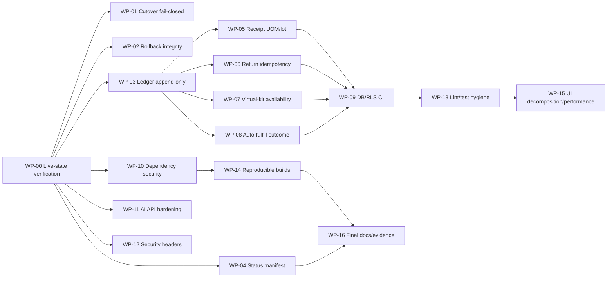

# Kế hoạch phân công agent khắc phục hậu kiểm catalog cutover

**Ngày lập:** 2026-09-18  
**Trạng thái:** Sẵn sàng phân công trên source/local; mọi thao tác production và persistent-state vẫn bị khóa bởi approval gate.  
**Mục tiêu:** Chuyển các phát hiện của audit repository thành các work package độc lập, có owner, phạm vi file, thứ tự phụ thuộc, cách sửa cụ thể, kiểm thử bắt buộc và điều kiện nghiệm thu rõ ràng để nhiều agent có thể thực thi mà không giẫm chân nhau.

**Kiến trúc đích:** Product là danh tính catalog; SKU là dòng hàng giao dịch; UOM giao dịch được snapshot và quy đổi về Base UOM; mọi biến động tồn đi qua một PostgreSQL posting kernel append-only có idempotency, allocation và reversal; cutover phải là một quy trình fail-closed gắn đúng schema version với đúng app artifact.

**Tech stack:** Next.js 15 App Router, React 19, TypeScript strict, Supabase/PostgreSQL 17, PostgreSQL RPC/RLS, Zod, Zustand, Vitest/Testing Library, pnpm, Docker/systemd.

**Baseline/authority bắt buộc đọc trước khi sửa:**

- `CONTEXT.md` — thuật ngữ và invariant Product/SKU/UOM/Stock Ledger.
- `docs/superpowers/specs/2026-09-16-unified-product-variant-workflow-design.md` — thiết kế đã duyệt.
- `docs/superpowers/plans/2026-09-16-full-material-catalog-replacement.md` — parent plan và cutover/retirement gates.
- `docs/superpowers/evidence/20260918_005243_production_cutover_evidence.txt` — evidence hiện tại, gồm cả mâu thuẫn append-only/cutover.
- `docs/architecture/rbac-and-roles.md` — quyền bảy role.
- `docs/operations/deployment-runbook.md` và `docs/operations/backup-and-recovery.md` — quy trình vận hành hiện tại.

**Compatibility boundary:** Giữ nguyên UUID Product/SKU và liên kết chứng từ lịch sử; không giả lập dữ liệu lịch sử chưa từng được lưu; không sửa migration đã áp dụng; sửa database bằng migration mới; không giữ hai mutation owner hoạt động song song; không restore toàn DB sau khi hệ thống đã mở lại và có giao dịch mới.

**TDD Route:**

- Mode: off.
- Decision: skipped; không bắt buộc nghi lễ RED/GREEN.
- Test posture: mọi sửa lỗi phải có focused regression test hoặc SQL oracle tái hiện đúng bug ở call-site, sau đó chạy regression liên quan.
- Verification tổng: `pnpm lint`, `pnpm typecheck`, `pnpm test`, `pnpm build`, `pnpm audit --prod --audit-level=high`, SQL/RLS oracles trên database disposable và cutover/restore rehearsal trên clone.

---

## 1. Kết luận điều phối

### 1.1. Trạng thái không được phép tuyên bố

Cho đến khi Wave 0–2 hoàn tất và evidence mới được review, không agent nào được tuyên bố:

- production cutover an toàn;
- Stock Ledger đã append-only;
- retirement legacy đã hoàn tất;
- rollback đã được chứng minh;
- repository release-ready.

### 1.2. Trạng thái workspace hiện tại

Tại thời điểm audit, working tree có **155 tracked files modified/deleted và 54 untracked entries**. Vì vậy:

1. Coordinator phải chụp `git status --short` và `git diff --stat` trước khi giao việc.
2. Mỗi agent chỉ được sửa file được giao.
3. Không dùng `git add -A`, `git reset --hard`, `git clean`, hoặc checkout đè thay đổi người khác.
4. Nên dùng worktree/branch riêng cho từng package nếu coordinator có thể tạo isolated checkout từ cùng baseline.
5. Nếu không thể tạo worktree do thay đổi hiện tại chưa commit, thực thi tuần tự theo file ownership matrix bên dưới.
6. Coordinator là người duy nhất tích hợp, đổi số migration, cập nhật lockfile chung và chạy full gate.

### 1.3. Quy tắc migration

- Không chỉnh nội dung migration `0078`–`0087` đã có thể đã áp dụng.
- Số dự kiến trong tài liệu này là reservation, coordinator phải xác nhận số migration chưa bị chiếm trước khi agent bắt đầu.
- Mỗi migration mới phải idempotent về deployment semantics, nhưng không che lỗi bằng `IF EXISTS` khi object bắt buộc phải có.
- Không migration nào trong các package sửa lỗi được DROP dữ liệu nguồn sự thật.
- Mọi DROP/retirement data-bearing nằm ở **HOLD-RETIREMENT** và cần scoped human confirmation riêng.

---

## 2. Dependency graph và wave thực thi



### Wave 0 — Read-only, chạy trước mọi code change

- **WP-00:** xác minh live state và khóa lại tuyên bố cutover.

### Wave 1 — Safety boundary, ưu tiên cao nhất

- **WP-01:** cutover fail-closed.
- **WP-02:** rollback fail-closed và verification đầy đủ.
- **WP-03:** append-only ledger và thu hồi mutation owner cũ.
- **WP-04:** status manifest làm nguồn trạng thái duy nhất.

WP-01, WP-02 và WP-04 có thể chạy song song nếu file ownership không giao nhau. WP-03 phải dùng database disposable; production execution không nằm trong scope agent.

### Wave 2 — Correctness của nghiệp vụ tồn kho

- **WP-05:** receipt UOM + lot allocation.
- **WP-06:** requisition-return idempotency.
- **WP-07:** virtual-kit availability khi thiếu balance row.
- **WP-08:** auto-fulfill không nuốt lỗi.

Bốn package có thể phát triển song song trên migration/file riêng, nhưng coordinator phải tích hợp theo đúng số migration và chạy chung SQL regression.

### Wave 3 — CI và security

- **WP-09:** database/RLS/kernel CI.
- **WP-10:** dependency vulnerabilities.
- **WP-11:** AI API validation/rate-limit/tool authorization.
- **WP-12:** security headers.

### Wave 4–5 — Hygiene, maintainability và closeout

- **WP-13:** zero-warning lint và stable React tests.
- **WP-14:** reproducible package/deploy/container builds.
- **WP-15:** tách god components và giảm bundle.
- **WP-16:** đồng bộ documentation/evidence cuối.

---

## 3. File ownership matrix

| Package | Owner files chính                                                             | Không được sửa                 |
| ------- | ----------------------------------------------------------------------------- | ------------------------------ |
| WP-00   | evidence mới dưới `docs/superpowers/evidence/`                                | migrations, production DB      |
| WP-01   | `scripts/cutover-catalog.sh`, helper test mới                                 | rollback script, DB migrations |
| WP-02   | `scripts/rollback-catalog-preopen.sh`, helper test mới                        | cutover script, DB migrations  |
| WP-03   | migration mới dự kiến `0088_*`, SQL oracle mới                                | migration 0071/0078/0084 cũ    |
| WP-04   | status manifest mới, `CONTEXT.md`, README/status docs                         | business code                  |
| WP-05   | migration mới dự kiến `0089_*`, receipt verifier/test                         | migration 0080 cũ              |
| WP-06   | migration mới dự kiến `0090_*`, requisition action/types/tests                | migration 0081 cũ              |
| WP-07   | migration mới dự kiến `0091_*`, virtual-kit verifier                          | migration 0084 cũ              |
| WP-08   | migration mới dự kiến `0092_*`, receipt outcome test                          | migration 0080 cũ              |
| WP-09   | `.github/workflows/ci.yml`, DB test harness                                   | package versions/lockfile      |
| WP-10   | `package.json`, canonical lockfile                                            | CI workflow, app behavior      |
| WP-11   | `src/app/api/ai/chat/route.ts`, AI auth/rate-limit helper/tests, tool context | unrelated routes               |
| WP-12   | `next.config.ts` hoặc reverse-proxy doc/config, header test                   | AI route                       |
| WP-13   | lint-warning files và affected tests                                          | migrations/deploy scripts      |
| WP-14   | `Dockerfile`, `docker-compose.app.yml`, `scripts/deploy.sh`                   | cutover/rollback scripts       |
| WP-15   | từng component được coordinator chia nhỏ riêng                                | schema/migrations              |
| WP-16   | README/CONTEXT/architecture/operations/evidence index                         | runtime logic                  |

Nếu một agent cần file ngoài owner list, agent phải dừng và gửi ripple request cho coordinator; không tự mở rộng scope.

---

# 4. Work packages chi tiết

## WP-00 — Xác minh live state và tạo Source-of-Truth Snapshot

**Severity:** Critical  
**Loại:** Read-only discovery; bắt buộc hoàn tất trước mọi production claim.  
**Mục tiêu:** Xác định production hiện đang ở schema/app/runtime nào thay vì suy từ tài liệu mâu thuẫn.

### Bằng chứng lỗi

- `CONTEXT.md:74-80` nói pre-cutover và Variant runtime còn chính.
- `docs/superpowers/evidence/20260918_005243_production_cutover_evidence.txt:356-362` tuyên bố cutover hoàn thành và ACTIVE.
- Cùng evidence tại dòng 29–42 nói append-only enforcement chưa được attach.
- Migration `0087` tồn tại nhưng nhiều tài liệu chỉ nhắc đến `0086`.

### Công việc cụ thể

1. Chỉ đọc production sau khi operator cho phép kết nối read-only.
2. Thu thập:
   - app commit/artifact đang chạy;
   - danh sách migration đã áp dụng;
   - trigger gắn trên `stock_movements`;
   - EXECUTE grants của posting/reversal/legacy RPC;
   - bảng/view thực tế: `variants`, `skus`, `variant_stock`, `stock_balances`;
   - checksum và row counts tối thiểu của Product/SKU/balance/movement;
   - trạng thái service và timestamp.
3. Không sửa DB, không attach trigger, không revoke/drop.
4. Ghi artifact `docs/superpowers/evidence/YYYY-MM-DD-live-state-snapshot.md`; redacted secrets, ghi command/query và output summary.
5. Phân loại kết quả: `pre-cutover`, `partial-cutover`, `cutover-not-retired`, hoặc `verified-cutover`.

### Acceptance gate

- Snapshot chứa app commit, schema version, append-only status và RPC grant state.
- Mỗi kết luận có query/evidence cụ thể.
- Không có write query hoặc thay đổi live state.
- Nếu không truy cập được production, status là `needs-verification`, không tự suy luận.

### Output cho coordinator

- Một evidence artifact.
- Một bảng “expected vs observed”.
- Một đề xuất go/no-go cho các package production-facing; đây chỉ là tư vấn, không phải quyền triển khai.

---

## WP-01 — Làm cutover fail-closed

**Severity:** Critical  
**Root cause:** Script mô tả freeze/migrate/reopen nhưng implementation chỉ backup, audit, test, rsync/build và HTTP health check.  
**Canonical owner:** `scripts/cutover-catalog.sh` là orchestrator; database migration tooling và service maintenance gate là executable owner, không phải comment.

### Bằng chứng lỗi

- Comment freeze tại `scripts/cutover-catalog.sh:7-15`.
- Bước thực tế bắt đầu backup tại dòng 40–60.
- Không có migration apply hoặc schema-version assertion trong dòng 40–139.
- Hoàn thành chỉ dựa trên login health check tại dòng 142–164.
- Parent plan yêu cầu sequence nghiêm ngặt tại `docs/superpowers/plans/2026-09-16-full-material-catalog-replacement.md:495-501`.

### Cách khắc phục

1. Thêm preflight bắt buộc:
   - working tree/artifact identity đã pin;
   - expected app commit và expected schema version;
   - operator cung cấp maintenance window và backup target;
   - không chạy nếu biến môi trường xác nhận scoped approval thiếu.
2. Thêm maintenance/write gate thật trước final backup.
3. Kiểm tra không còn active write sessions hoặc dùng application-level write rejection đã thiết kế.
4. Tạo backup, checksum và **restore-verify trên isolated target** trước migration.
5. Apply đúng migration set; fail nếu schema version khác expected.
6. Chạy audit/kernel oracles trên schema mới.
7. Deploy artifact đã pin; không rsync source bẩn.
8. Smoke test theo role/workflow tối thiểu, không chỉ `GET /login`.
9. Ghi manifest gồm app commit, migration version, artifact hash, backup hash và opening timestamp.
10. Chỉ sau tất cả gate mới tắt maintenance/write gate.

### Files

- Modify: `scripts/cutover-catalog.sh`.
- Create: `scripts/lib/cutover-common.sh` nếu cần tách helper thuần, không tạo fallback orchestration thứ hai.
- Create: `scripts/tests/cutover-catalog.test.sh` hoặc test harness tương đương.
- Update sau cùng: deployment runbook, nhưng WP-16 là owner docs chính.

### Verification

- Static/shell test chứng minh script dừng khi thiếu approval, dirty source, backup verify fail, migration fail, smoke fail.
- Failure injection phải chứng minh write gate không bị mở lại khi cutover chưa hoàn tất.
- Dry-run trên disposable clone; lưu measured duration và evidence.
- Không chạy production trong package này.

### Stop conditions

- Không có application write gate rõ ràng.
- Không xác định được canonical migration command/schema-version table.
- Không có isolated restore target.
- Bất kỳ bước nào cần persistent-state mutation trên production: dừng và xin scoped approval.

---

## WP-02 — Rollback phải xác minh database, không chỉ web health

**Severity:** Critical  
**Root cause:** `pg_restore` bị che lỗi bằng `|| true`; script khởi động app rồi xem HTTP 200 là rollback thành công.  
**Canonical owner:** restore process + post-restore invariant checks.

### Bằng chứng lỗi

- `scripts/rollback-catalog-preopen.sh:39`: bỏ qua exit code restore.
- `scripts/rollback-catalog-preopen.sh:49-58`: chỉ kiểm tra login HTTP.

### Cách khắc phục

1. Bỏ suppression của `pg_restore`; capture log và fail ngay trên lỗi.
2. Restore vào database/cluster sạch hoặc quy trình được chứng minh không tạo partial mixed schema.
3. Trước khi start app cũ, xác minh:
   - expected pre-cutover migration version;
   - expected app artifact hash;
   - catalog row counts/checksum;
   - balance/movement invariants;
   - không orphan document references;
   - các old-runtime RPC cần thiết tồn tại đúng signature.
4. Chỉ start app khi DB gate pass.
5. Smoke test workflow đọc/ghi trên clone, không chỉ login.
6. Phân biệt rõ:
   - **pre-open rollback:** có thể restore snapshot;
   - **post-open recovery:** không được full restore; chuyển maintenance + forward-fix/reversal.

### Files

- Modify: `scripts/rollback-catalog-preopen.sh`.
- Create: `scripts/verify-restored-catalog-state.ts` hoặc SQL verifier rõ input expected version/hash.
- Create: test harness mô phỏng restore failure và invariant failure.

### Acceptance gate

- Inject restore error → script exit non-zero, app không start.
- Restore thành công nhưng checksum sai → script exit non-zero, app không start.
- Verified clone restore → app cũ start và workflow smoke pass.
- Không dùng `|| true` trên restore hoặc invariant gate.

---

## WP-03 — Gắn append-only enforcement và thu hồi mutation owner cũ

**Severity:** Critical  
**Root cause:** function enforcement đã tồn tại nhưng trigger chưa attach; legacy revert/purge path có thể còn quyền thay đổi movement.  
**Canonical owner:** posting kernel + reversal RPC.  
**Old owner phải retire:** direct UPDATE/DELETE và helper `_revert_movements`/RPC legacy có mutation responsibility.

### Bằng chứng lỗi

- Evidence dòng 29 và 42 xác nhận enforcement chưa attach.
- `CONTEXT.md:21,70` yêu cầu ledger append-only.
- Parent plan task cutover yêu cầu revoke old signatures rồi attach enforcement.
- Legacy implementation xuất hiện trong `supabase/migrations/0071_admin_doc_delete_and_reopen.sql:18-36`.

### Cách khắc phục

1. Tạo migration mới dự kiến `0088_enforce_append_only_ledger.sql`; không chỉnh 0071/0078/0084.
2. Inventory đầy đủ trigger/function/RPC/grant hiện tại trên clone.
3. Thu hồi EXECUTE hoặc thay implementation của legacy callable paths để chúng gọi canonical reversal, không delete/update movement.
4. Attach append-only trigger bảo vệ UPDATE và DELETE trên `stock_movements`.
5. Đảm bảo canonical reversal vẫn có thể tạo movement đối ứng bằng INSERT.
6. Nếu service-role cần bypass để migration/maintenance, bypass phải explicit, narrow và không callable từ app runtime.
7. Viết SQL negative oracles:
   - UPDATE bị reject;
   - DELETE bị reject;
   - old RPC bị reject hoặc chỉ gọi reversal;
   - original movement còn nguyên;
   - balance quay đúng về trước;
   - double reversal/idempotent replay không nhân đôi.

### Files

- Create: `supabase/migrations/0088_enforce_append_only_ledger.sql` — số phải được coordinator xác nhận.
- Create: `scripts/verify-ledger-append-only.ts` hoặc `supabase/tests/ledger_append_only.sql`.
- Update generated types chỉ khi schema signature thực sự thay đổi.

### Acceptance gate

- Toàn bộ negative/positive oracle pass trên fresh reset và upgraded clone.
- Grep main path không còn caller dựa vào destructive mutation.
- Không DROP bảng/cột/data-bearing object.
- Production apply không nằm trong scope; cần approval riêng sau rehearsal.

---

## WP-04 — Tạo machine-readable deployment/status manifest

**Severity:** High  
**Root cause:** README, CONTEXT và evidence đưa ba trạng thái khác nhau.  
**Canonical owner:** một manifest versioned; docs chỉ render/tham chiếu manifest, không tự tuyên bố trạng thái.

### Cách khắc phục

1. Tạo `docs/operations/current-deployment-status.yaml` với schema cố định:
   - `environment`;
   - `observed_at`;
   - `app_commit`;
   - `artifact_sha256`;
   - `schema_version`;
   - `catalog_runtime`;
   - `ledger_append_only`;
   - `legacy_contract_state`;
   - `backup_artifact_sha256`;
   - `opening_timestamp`;
   - `evidence_refs`.
2. Thêm validator script; không cho giá trị `verified` nếu evidence refs thiếu.
3. Sửa `CONTEXT.md`, `README.md`, `docs/architecture/system-overview.md` và `docs/superpowers/README.md` để không mâu thuẫn.
4. WP-16 điền trạng thái cuối; WP-04 chỉ tạo format/validator và sửa authority wording.

### Acceptance gate

- Validator fail khi thiếu app commit/schema/evidence.
- Mọi status doc liên kết đến manifest.
- Không hard-code “cutover complete” ở nhiều nơi.

---

## WP-05 — Sửa receipt allocation theo Base UOM cho lot tracking

**Severity:** High  
**Root cause:** receipt line được convert sang Base UOM trong kernel nhưng allocation vẫn dùng entered quantity.  
**Canonical owner:** posting command phải gửi allocation quantity ở Base UOM hoặc kernel phải resolve allocation theo cùng unit contract một cách duy nhất.

### Bằng chứng lỗi

- `supabase/migrations/0080_task7_receipt_rpcs.sql:151-165`: allocation dùng `coalesce(entered_quantity, quantity)`.
- `supabase/migrations/0078_sku_posting_rpcs.sql:335-341`: kernel resolve transaction quantity thành base quantity.

### Cách khắc phục

1. Chọn một contract duy nhất: allocation payload là Base UOM.
2. Tạo migration mới dự kiến `0089_fix_receipt_lot_base_quantity.sql` thay function hiệu lực; không chỉnh 0080.
3. Resolve factor snapshot và base quantity trước khi dựng allocations.
4. Không dùng current master factor để diễn giải lại chứng từ đã snapshot.
5. Thêm regression cases:
   - base unit factor 1;
   - 2 thùng × 12 = movement/allocation 24;
   - decimal factor;
   - nhiều lot tổng bằng base quantity;
   - allocation thiếu/thừa → rollback toàn command;
   - replay cùng idempotency key → không duplicate.

### Acceptance gate

- Movement, allocation, balance và document snapshot đều khớp base quantity.
- Không partial row khi validation fail.
- Existing no-lot receipt flow vẫn pass.

---

## WP-06 — Idempotency cho requisition return

**Severity:** High  
**Root cause:** mỗi RPC call tạo return header mới và random idempotency key.  
**Canonical owner:** caller-generated stable operation key, enforced tại DB document boundary và posting kernel.

### Bằng chứng lỗi

- `supabase/migrations/0081_task8_requisition_rpcs.sql:215-216`: insert header mỗi call.
- Dòng 250–256 dùng `gen_random_uuid()` trong idempotency key.
- Caller hiện không cung cấp operation key trong `src/features/requisitions/actions.ts` quanh return action.

### Cách khắc phục

1. Tạo operation key ở client/action trước lần gọi đầu; giữ nguyên key khi retry.
2. Tạo migration mới dự kiến `0090_requisition_return_idempotency.sql`:
   - thêm `operation_key` và `payload_hash` phù hợp;
   - unique constraint ở scope đúng;
   - RPC nhận key bắt buộc;
   - same key + same payload trả lại return hiện có;
   - same key + khác payload reject.
3. Posting idempotency key derive từ operation key, không random.
4. Offline/network retry phải reuse key.
5. Cân nhắc concurrent duplicate calls bằng lock/unique conflict handling.

### Files

- Create migration `0090_*`.
- Modify `src/features/requisitions/actions.ts`.
- Modify schema/types/offline payload nếu return flow có offline support.
- Add focused tests cho action và SQL concurrency/replay.

### Acceptance gate

- Hai call tuần tự cùng key/payload chỉ có một header, một item set, một movement.
- Hai call đồng thời cùng key/payload có cùng kết quả logic.
- Same key/different payload bị reject rõ ràng.
- Retry sau simulated timeout không cộng tồn lần hai.

---

## WP-07 — Virtual-kit availability phải coi missing balance là zero

**Severity:** High  
**Root cause:** inner join làm component không có balance row biến mất khỏi phép MIN.  
**Canonical owner:** availability projection từ toàn bộ active BOM lines, left join balances.

### Cách khắc phục

1. Tạo migration mới dự kiến `0091_fix_virtual_kit_availability.sql` thay view/function hiệu lực.
2. Bắt đầu từ active BOM version và toàn bộ component lines.
3. `LEFT JOIN` balance theo location; `COALESCE` component availability về 0.
4. Tính floor theo base quantity/component quantity chính xác.
5. Giữ behavior cho assembled kit riêng với virtual kit.
6. Kiểm thử:
   - mọi component có balance;
   - một component không có row → kit = 0;
   - một component balance 0;
   - nhiều location;
   - component reserved stock;
   - decimal BOM quantity.

### Acceptance gate

- UI/query/report cùng nhận một availability contract.
- Không còn duplicate availability calculation khác semantics.
- SQL oracle pass trên fresh và upgraded clone.

---

## WP-08 — Auto-fulfill receipt phải có outcome bền vững

**Severity:** Medium–High  
**Root cause:** `exception when others then null` biến mọi lỗi thành silent partial success.  
**Canonical owner:** receipt posting transaction + explicit per-requisition outcome/outbox.

### Cách khắc phục

1. Tạo migration mới dự kiến `0092_receipt_auto_fulfill_outcomes.sql`.
2. Phân loại lỗi expected business rejection với unexpected infrastructure/data error.
3. Chỉ expected error được tiếp tục; phải ghi outcome có code/reason.
4. Unexpected error phải rollback receipt hoặc tạo durable retry item theo decision của spec; không được bỏ qua.
5. Trả danh sách linked/failed/skipped cho caller.
6. Thêm audit/event đủ để operator retry có kiểm soát.
7. Test:
   - approved requisition được fulfill;
   - shortage/không matching được ghi skipped với reason;
   - unexpected error không tạo trạng thái receipt “posted sạch” giả;
   - retry không duplicate fulfill.

### Acceptance gate

- Không còn `exception when others then null` trên main path.
- Mỗi requisition candidate có outcome quan sát được.
- Receipt status và linked IDs nhất quán với outcome.

---

## WP-09 — Đưa database/RLS/kernel gates vào CI

**Severity:** High  
**Root cause:** CI chỉ chạy lint/typecheck/Vitest; không build, audit, DB reset hay SQL/RLS tests.  
**Canonical owner:** `.github/workflows/ci.yml` và một database test harness duy nhất.

### Cách khắc phục

1. Chọn pnpm canonical, dùng version pin và frozen lockfile.
2. Tách jobs có dependency rõ:
   - static: install, lint zero warnings, typecheck;
   - unit: Vitest;
   - build: production build;
   - security: production dependency audit;
   - database: Supabase/Postgres disposable, apply migrations từ đầu, SQL/RLS/kernel tests.
3. Chuyển các verify script quan trọng thành deterministic fixtures tự setup/cleanup.
4. CI database phải test cả fresh migration chain và upgrade path từ snapshot phù hợp nếu fixture có sẵn.
5. Lưu log/artifact khi failure nhưng không chứa secret/data thật.

### Files

- Modify `.github/workflows/ci.yml`.
- Create `supabase/tests/` hoặc canonical DB test directory.
- Create scripts khởi tạo fixture nếu cần.
- Không sửa package version; WP-10/WP-14 quản lý package/runtime pin.

### Acceptance gate

- CI fail trên migration error, RLS regression, ledger UPDATE/DELETE, duplicate return replay hoặc production audit High.
- Full pipeline chạy được từ clean checkout.
- Không dùng production credentials.

---

## WP-10 — Vá dependency High mà không phá compatibility

**Severity:** High  
**Bằng chứng:** audit hiện báo 9 vulnerabilities, gồm PostCSS advisories và `jsondiffpatch@0.6.0` prototype pollution.

### Cách khắc phục

1. Chạy `pnpm why postcss jsondiffpatch` và lưu dependency paths.
2. Ưu tiên nâng direct owner package; chỉ dùng `pnpm.overrides` khi package upstream compatible và có test chứng minh.
3. Không dùng force upgrade mù.
4. Chỉ sửa `package.json` và canonical `pnpm-lock.yaml`.
5. Chạy:
   - `pnpm install --frozen-lockfile` sau khi lock được cập nhật đúng;
   - `pnpm audit --prod --audit-level=high`;
   - `pnpm typecheck`;
   - `pnpm test`;
   - `pnpm build`.
6. Kiểm tra AI SDK flows vì `jsondiffpatch` đi qua `ai`.

### Acceptance gate

- Không còn High/Critical trong production dependency audit, hoặc có documented exception với reachability, owner và expiry; mặc định không chấp nhận exception.
- AI chat/tool integration tests pass.
- Lockfile chỉ có thay đổi giải thích được.

---

## WP-11 — Harden AI chat API và service-role tool boundary

**Severity:** High  
**Root cause:** route authenticate user nhưng cast body trực tiếp, không rate limit/request budget; tools dùng service role và dựa chủ yếu vào registry role filtering.

### Bằng chứng lỗi

- `src/app/api/ai/chat/route.ts:50-60`: auth có mặt.
- Dòng 92 nhận `messages` bằng cast, chưa có schema/budget.
- Dòng 145–152 cho tối đa 10 steps và configurable tokens.
- `src/lib/ai/registry/tools/inventory-tools.ts`, `fuel-tools.ts`, `report-tools.ts`, `sop-tools.ts` tạo admin client.

### Cách khắc phục

1. Tạo Zod request schema:
   - chỉ role hợp lệ;
   - giới hạn số messages;
   - giới hạn từng content và tổng content;
   - reject malformed tool payload từ client.
2. Thêm per-user rate limit và concurrent request cap; chọn store phù hợp deployment, không dùng in-memory nếu multi-process.
3. Clamp max tokens/model/steps bằng server policy; DB setting không được vượt hard maximum.
4. Truyền immutable tool execution context gồm `userId`, role, request ID.
5. Mỗi service-role tool tự kiểm tra authorization/data scope tại execution boundary; registry filtering chỉ là defense layer đầu.
6. Audit log không được lưu secret hoặc payload vượt retention/size policy.
7. Thêm tests: unauthenticated, malformed body, oversized history, quota exceeded, role escalation attempt, tool unauthorized, happy path.

### Acceptance gate

- Request invalid trả 400; unauthenticated 401; quota 429.
- Requester không thể gọi/report tool đặc quyền dù cố giả tool invocation.
- Service-role data access có explicit tool-level authorization.
- Streaming happy path và audit logging vẫn hoạt động.

---

## WP-12 — Security headers và response policy

**Severity:** Medium  
**Root cause:** không tìm thấy CSP/HSTS/frame/referrer/permissions policy trong app config.

### Cách khắc phục

1. Xác định headers owner là reverse proxy hay Next; chỉ một owner chính.
2. Thêm tối thiểu:
   - CSP với `frame-ancestors`;
   - HSTS chỉ ở HTTPS production;
   - `X-Content-Type-Options: nosniff`;
   - `Referrer-Policy`;
   - `Permissions-Policy` cho camera theo QR use case;
   - clickjacking protection.
3. CSP phải tương thích Supabase, AI streaming, images và QR camera; không mặc định mở `*`.
4. Thêm response-header test cho public và authenticated route.

### Acceptance gate

- Headers xuất hiện đúng environment.
- Login, images, AI streaming và QR camera smoke pass.
- Không duplicate/conflicting headers giữa proxy và Next.

---

## WP-13 — Zero-warning lint và ổn định async React tests

**Severity:** Medium  
**Root cause:** lint pass với 72 warnings; một hook thiếu dependency; test pass nhưng có `act(...)` warnings.

### Cách khắc phục

1. Dọn unused imports/props/variables, đặc biệt legacy `variantLabel`, `variantOptions`, `variants`.
2. Với `src/features/fuel/components/fuel-quick-scan.tsx:87-110`:
   - làm `handleScan` ổn định bằng `useCallback`, hoặc tách param-trigger effect khỏi mutable callback;
   - chống duplicate scan khi search params/vehicle state đổi;
   - thêm test chỉ gọi lookup một lần.
3. Sửa catalog/product tests dùng `await userEvent`, `findBy*`, `waitFor` đúng seam.
4. Test setup fail khi có unexpected `console.error/warn` từ React.
5. CI lint dùng `--max-warnings=0` sau khi baseline sạch.

### Acceptance gate

- `pnpm lint -- --max-warnings=0` hoặc script tương đương exit 0.
- `pnpm test` không có React act/suspended-resource warning.
- Không xóa assertion hoặc disable rule để làm sạch giả.

---

## WP-14 — Reproducible build/deploy/container

**Severity:** Medium–High  
**Root cause:** deploy và Docker install không frozen; deploy có thể rsync dirty source; runtime image chỉ pin major.

### Bằng chứng lỗi

- `scripts/deploy.sh:52-60`: install không frozen và fallback qua nhiều package manager.
- `Dockerfile:8,27`: `oven/bun:1`.
- `Dockerfile:11-12`: copy nhiều lockfile rồi `bun install` không frozen.

### Cách khắc phục

1. Chọn pnpm canonical cho local, CI, deploy và Docker; nếu giữ Bun runtime phải pin exact digest/version và không dùng Bun làm lock owner song song.
2. Install bằng frozen lockfile.
3. Build từ clean commit hoặc immutable artifact; từ chối dirty/untracked source trừ explicit development mode.
4. Ghi app commit/artifact hash vào build output/status manifest.
5. Container dùng non-root user, healthcheck và minimal runtime artifact nếu khả thi.
6. Không copy service-role secret vào build layer.

### Acceptance gate

- Hai clean builds cùng commit/lock cho dependency graph giống nhau.
- Deploy script từ chối dirty source.
- Container start và healthcheck pass với runtime-only secret.
- Full build/test gate pass.

---

## WP-15 — Tách god components và giảm bundle theo từng slice

**Severity:** Medium; làm sau correctness/safety.  
**Không giao một agent sửa tất cả.** Coordinator tạo một sub-package cho từng component để giảm conflict.

### Candidates

- `src/features/ai-admin/components/ai-copilot-manager.tsx` — 1.221 dòng.
- `src/features/defects/components/defects-list.tsx` — 1.075 dòng.
- `src/features/products/components/product-detail-dialog.tsx` — hơn 1.000 dòng.
- `src/features/auth/components/users-manager.tsx` — hơn 1.000 dòng.
- `src/components/slip-detail-modal.tsx` — hơn 1.000 dòng.

### Cách thực thi mỗi slice

1. Chụp behavior tests hiện tại.
2. Tách theo owner thực, ví dụ query/model hook, permission/action layer, table, detail panel, dialogs; không chỉ chuyển JSX nguyên khối.
3. Giữ public props và route behavior.
4. Lazy-load QR scanner, PDF/Excel, AI admin hoặc dialog nặng chỉ khi bundle evidence chỉ ra lợi ích.
5. Dùng bundle analyzer và đặt budget cho route lớn; audit thấy `/admin/vehicles` khoảng 435 kB và shared first-load khoảng 189 kB.
6. Mỗi component là một commit/review riêng.

### Acceptance gate

- Existing behavior tests pass; thêm focused tests cho extracted owner.
- Không tăng route bundle ngoài budget đã ghi.
- Không tạo duplicate state owner hoặc compatibility wrapper không có retirement trigger.

---

## WP-16 — Đồng bộ docs và tạo evidence closeout

**Severity:** High về governance  
**Chỉ bắt đầu khi các package được chọn đã merge và full gate có output mới.**

### Công việc

1. Điền `current-deployment-status.yaml` từ evidence thực, không từ ý định.
2. Đồng bộ:
   - `README.md`;
   - `CONTEXT.md`;
   - `docs/architecture/system-overview.md`;
   - `docs/architecture/database-schema.md`;
   - `docs/operations/deployment-runbook.md`;
   - `docs/operations/backup-and-recovery.md`;
   - `docs/superpowers/README.md`.
3. Tạo evidence index liên kết mỗi acceptance gate với command/output/artifact.
4. Ghi residual risk và các package deferred.
5. Không ghi “complete”, “safe”, “active & healthy” nếu append-only, restore rehearsal, security audit hoặc schema/app identity chưa có bằng chứng.

### Acceptance gate

- Không còn mâu thuẫn trạng thái giữa README/CONTEXT/manifest/evidence.
- Mọi claim có evidence ref.
- Full gate mới:
  - lint zero warnings;
  - typecheck pass;
  - tests pass không console warning;
  - production build pass;
  - dependency audit không High/Critical;
  - DB/RLS/kernel suite pass;
  - clone cutover/restore rehearsal pass.

---

# 5. HOLD-RETIREMENT — Không tự động giao thực thi

## Mục tiêu bị khóa

Drop legacy tables/columns/views/RPC hoặc xóa backup/source-of-truth data.

## Data Destruction Guard

- **Target class:** persistent-state / contract-carrying schema.
- **Exact targets:** phải được tạo từ live-state inventory; không lấy nguyên danh sách cũ làm sự thật.
- **Environment:** production hoặc production clone.
- **Why irreversible:** có thể mất dữ liệu catalog/history hoặc phá consumer ngoài repo.
- **Backup/rollback:** cần backup checksum, restore drill và pre/post-open recovery boundary.
- **Allowed read-only next steps:** consumer inventory, grant inspection, row counts, checksum, query logs.
- **Blocked destructive steps:** DROP/TRUNCATE/bulk DELETE và revoke có thể làm gián đoạn consumer chưa phân loại.
- **Confirmation required:** có, phải nêu environment + exact target list + backup artifact + maintenance window.

Không agent nào được hiểu “thực thi plan”, “tiếp tục” hoặc “OK” là scoped confirmation cho retirement.

---

# 6. Integration gates của coordinator

## Gate A — Trước khi giao package

- Chụp baseline Git status/diff.
- Xác nhận branch/worktree và file ownership.
- Xác nhận migration number chưa bị chiếm.
- Gửi cho agent baseline refs + package duy nhất.
- Nêu rõ không production mutation.

## Gate B — Khi agent trả bài

Agent phải cung cấp:

1. Root cause đã xác nhận.
2. Files changed.
3. Migration/API/contract delta.
4. Commands đã chạy và exit status.
5. Focused regression evidence.
6. Uncovered scope/residual risk.
7. Không commit ngoài owner files.

Coordinator phải đọc diff, không chỉ tin summary.

## Gate C — Sau mỗi DB package

Chạy trên database disposable:

```bash
pnpm typecheck
pnpm test
# Khởi tạo/reset Supabase local theo runbook của repo
# Chạy focused verifier của package
```

Ngoài ra kiểm tra migration fresh-chain, upgrade-chain và negative oracle phù hợp. Không dùng database production.

## Gate D — Trước integration candidate

```bash
pnpm lint
pnpm typecheck
pnpm test
pnpm build
pnpm audit --prod --audit-level=high
```

Expected cuối chương trình:

- lint 0 errors, 0 warnings;
- typecheck exit 0;
- tests exit 0 và không unexpected console warnings;
- build exit 0 và không unresolved external-package warning;
- audit không High/Critical;
- DB suite pass.

## Gate E — Trước production rehearsal

- Clean, immutable app artifact.
- Status manifest candidate.
- Backup có checksum và restore verify.
- Maintenance/write gate đã test failure injection.
- Schema/app expected versions pinned.
- Pre-open rollback và post-open forward-fix boundary được diễn tập.
- Operator review và scoped approval riêng.

---

# 7. Prompt mẫu giao cho agent

Dùng template dưới đây và thay toàn bộ phần trong ngoặc vuông. Không giao nhiều work package cho cùng một agent nếu chúng dùng chung context lớn hoặc file ownership khác nhau.

```text
Bạn thực thi [WP-ID — TÊN PACKAGE] trong repo:
/root/Code-Base/minh-tan-phat-supply

Đọc trước:
1. CONTEXT.md
2. docs/superpowers/specs/2026-09-16-unified-product-variant-workflow-design.md
3. docs/superpowers/plans/2026-09-16-full-material-catalog-replacement.md
4. docs/superpowers/plans/2026-09-18-post-cutover-remediation-agent-plan.md, riêng mục [WP-ID]

Mục tiêu:
[copy mục tiêu package]

File ownership — chỉ được sửa:
[danh sách file/path]

Không được làm:
- Không sửa migration lịch sử 0078–0087.
- Không chạy mutation trên production.
- Không DROP/TRUNCATE/bulk DELETE.
- Không reset/clean/checkout đè working tree.
- Không mở rộng sang package khác.
- Không che lỗi bằng fallback, catch-all hoặc || true.

Yêu cầu thực thi:
1. Chụp git status/diff trước khi sửa.
2. Xác nhận root cause từ code hiện tại.
3. Thực hiện minimum stable repair tại canonical owner.
4. Thêm focused regression/negative test đúng call-site.
5. Chạy verification được chỉ định trong package.
6. Tự review diff và bảo đảm chỉ chạm owner files.

Báo cáo cuối bắt buộc:
- Root cause:
- Files changed:
- Contract/schema delta:
- Verification commands + exit status:
- Evidence:
- Residual risk/uncovered scope:
- Production action required: yes/no; nếu yes chỉ mô tả approval cần thiết, không tự chạy.
```

---

# 8. Khuyến nghị phân bổ agent

| Agent                           | Package              | Có thể chạy song song với                                    |
| ------------------------------- | -------------------- | ------------------------------------------------------------ |
| Agent A — Ops cutover           | WP-01                | WP-02, WP-04                                                 |
| Agent B — Ops restore           | WP-02                | WP-01, WP-04                                                 |
| Agent C — Ledger DB             | WP-03                | WP-01, WP-02; cần WP-00 evidence trước production decision   |
| Agent D — Status/docs format    | WP-04                | WP-01–03                                                     |
| Agent E — Receipt DB            | WP-05                | WP-06–08 sau WP-03 contract review                           |
| Agent F — Return idempotency    | WP-06                | WP-05, WP-07, WP-08                                          |
| Agent G — Kit availability      | WP-07                | WP-05, WP-06, WP-08                                          |
| Agent H — Auto-fulfill          | WP-08                | WP-05–07; coordinator xử lý overlap migration receipt        |
| Agent I — CI/DB harness         | WP-09                | WP-10–12; bắt đầu harness sau khi WP-03–08 test contracts rõ |
| Agent J — Dependency security   | WP-10                | WP-09, WP-11, WP-12                                          |
| Agent K — AI security           | WP-11                | WP-09, WP-10, WP-12                                          |
| Agent L — Headers               | WP-12                | WP-09–11                                                     |
| Agent M — Hygiene               | WP-13                | Sau merge behavior fixes để tránh churn                      |
| Agent N — Build reproducibility | WP-14                | WP-13; tránh sửa package files của WP-10                     |
| Agent O1…O5 — UI slices         | WP-15 từng component | Sau WP-13; mỗi agent một component                           |
| Agent P — Docs closeout         | WP-16                | Chạy cuối cùng                                               |

### Điểm conflict phải điều phối thủ công

- WP-05 và WP-08 cùng thay effective receipt functions: coordinator phải chọn thứ tự hoặc hợp nhất migration sau review; không cho hai agent sửa cùng migration file.
- WP-10 và WP-14 đều có thể ảnh hưởng package/runtime tooling: WP-10 merge trước, WP-14 rebase sau.
- WP-04 và WP-16 cùng chạm status docs: WP-04 tạo schema/authority; WP-16 điền evidence cuối.
- WP-09 chỉ sửa workflow/harness; không tự đổi package manager version khi WP-10/WP-14 đang chạy.

---

# 9. Definition of Done toàn chương trình

Chương trình remediation chỉ là completion candidate khi:

1. Live-state snapshot xác định rõ schema/app/runtime.
2. Cutover và rollback fail-closed đã pass rehearsal trên isolated clone.
3. Ledger UPDATE/DELETE bị chặn; reversal là mutation owner duy nhất.
4. Receipt UOM/lot, return replay, virtual-kit missing balance và auto-fulfill outcomes đều có regression tests pass.
5. CI dựng database disposable và bắt được RLS/kernel regression.
6. Production dependency audit không còn High/Critical.
7. AI endpoint có validation, budget, rate limit và tool-level authorization.
8. Lint 0 warnings; tests không có React async warning; build sạch.
9. Artifact build reproducible từ clean commit.
10. Status docs thống nhất và mọi claim đều trỏ tới evidence.
11. Không có destructive retirement nào được thực hiện nếu thiếu scoped confirmation.

**Residual boundary:** Hoàn thành source remediation và clone rehearsal không tự cấp quyền triển khai production. Production apply/cutover/retirement vẫn cần operator approval theo environment, exact versions, backup artifact và maintenance window.
