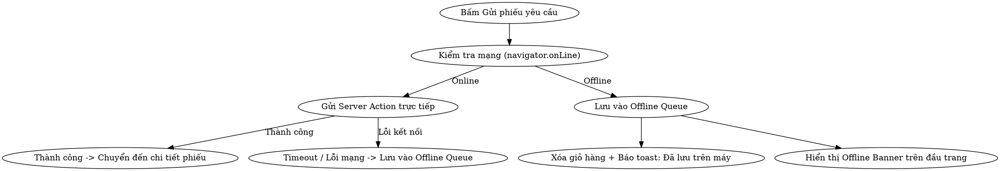

# Đặc tả: Trải nghiệm Thực địa Mobile - PWA, Quét mã QR & Hàng đợi Yêu cầu Ngoại tuyến

Ngày: 2026-09-08 · Trạng thái: Chờ duyệt · Phạm vi: repo `minh-tan-phat-supply`

---

## 1. Bối cảnh & Mục tiêu

Tại Trại gà Minh Tân Phát, nhân viên kỹ thuật và công nhân chuồng trại thường xuyên phải di chuyển giữa các dãy chuồng kín để kiểm tra, bảo trì thiết bị và yêu cầu vật tư thay thế. Quá trình này gặp các rào cản thực tế:
1. **Thiết bị di động khó thao tác bàn phím:** Khi ở hiện trường, nhân viên đeo găng tay hoặc tay dính bụi, việc gõ chữ tìm kiếm tên vật tư (bóng đèn, đui đèn, van nước, rơ le...) trên điện thoại rất chậm và dễ nhầm quy cách.
2. **Sóng 4G/Wifi chập chờn hoặc mất hẳn:** Các dãy chuồng kiên cố thường có sóng yếu. Nếu bấm gửi phiếu mà mất mạng, ứng dụng web thông thường sẽ báo lỗi hoặc mất toàn bộ nội dung vừa soạn.
3. **Thanh địa chỉ trình duyệt chiếm diện tích:** Dùng web trên Safari/Chrome trên mobile dễ bị thanh điều hướng che khuất nút bấm hoặc vô tình vuốt back mất trang.

### Mục tiêu giải pháp (Giai đoạn 1)
1. **Cấu hình PWA (Progressive Web App):** Hỗ trợ cài đặt ứng dụng ra màn hình chính (Standalone App) trên cả Android và iOS, giao diện tràn viền, nhận diện thương hiệu trại gà Minh Tân Phát.
2. **Quét mã QR / Barcode chọn vật tư tức thì:** Tích hợp camera scanner quét mã QR dán trên kệ kho/thiết bị hoặc mã vạch barcode bao bì $\rightarrow$ mở Bottom Sheet chọn nhanh số lượng và thêm vào giỏ.
3. **Hàng đợi lưu nháp ngoại tuyến (Offline Queue):** Khi thiết bị mất kết nối, phiếu yêu cầu được lưu an toàn vào bộ nhớ máy và tự động đồng bộ ngầm lên máy chủ ngay khi bắt lại sóng mạng.

---

## 2. Kiến trúc & Công nghệ

* **Frontend Framework:** Next.js 15 (App Router), TypeScript strict mode, Tailwind CSS 4, shadcn/ui.
* **State Management:**
  * `useCartStore` (Zustand + `persist` qua `localStorage` - khóa `mtp-requisition-cart`): Giỏ hàng chọn vật tư.
  * `useOfflineQueueStore` (Zustand + `persist` qua `localStorage` - khóa `mtp-offline-requisitions-queue`): Hàng đợi các phiếu yêu cầu tạo khi mất mạng.
* **Web APIs:**
  * `BarcodeDetector` API (Web Standard): Nhận diện định dạng `qr_code`, `code_128`, `ean_13`, `ean_8`.
  * `MediaDevices.getUserMedia()`: Điều khiển camera trước/sau và đèn Flash (Torch).
  * `Navigator.vibrate()`: Rung phản hồi haptic khi quét thành công.
  * `window.addEventListener("online")` & `document.addEventListener("visibilitychange")`: Kích hoạt bộ đồng bộ ngầm khi có mạng trở lại.
  * Web App Manifest (`src/app/manifest.ts`) & Apple Meta Tags.

---

## 3. Thiết kế chi tiết các phân hệ

### 3.1. Cấu hình PWA & Tối ưu Standalone Mode

#### 3.1.1. `src/app/manifest.ts`
Tạo file manifest động chuẩn Next.js App Router:
```typescript
import { MetadataRoute } from "next";

export default function manifest(): MetadataRoute.Manifest {
  return {
    name: "Quản lý Kho Trại Gà Minh Tân Phát",
    short_name: "Kho MTP",
    description: "Hệ thống Quản lý Kho & Vật tư Trại Gà Minh Tân Phát",
    start_url: "/dashboard",
    display: "standalone",
    background_color: "#ffffff",
    theme_color: "#16a34a",
    orientation: "portrait",
    icons: [
      {
        src: "/brand/logo.jpg",
        sizes: "192x192",
        type: "image/jpeg",
        purpose: "any",
      },
      {
        src: "/brand/logo.jpg",
        sizes: "512x512",
        type: "image/jpeg",
        purpose: "maskable",
      },
    ],
  };
}
```

#### 3.1.2. Viewport & Apple Meta trong `src/app/layout.tsx`
Cấu hình thẻ meta hỗ trợ iOS Safari Standalone và Dynamic Island:
```typescript
export const viewport: Viewport = {
  themeColor: "#16a34a",
  width: "device-width",
  initialScale: 1,
  maximumScale: 1,
  userScalable: false,
  viewportFit: "cover",
};
```
Bổ sung `apple-mobile-web-app-capable: "yes"` và `apple-touch-icon`.

#### 3.1.3. Hướng dẫn cài đặt (`MobileInstallPrompt`)
* Xuất hiện dưới dạng banner nhỏ, không gây phiền toái trên màn hình mobile.
* Khi người dùng truy cập bằng trình duyệt di động:
  * Trên Android/Chrome: Bắt sự kiện `beforeinstallprompt` $\rightarrow$ Nút "Cài đặt ứng dụng".
  * Trên iOS/Safari: Hướng dẫn nhanh "Bấm biểu tượng Chia sẻ $\rightarrow$ Thêm vào Màn hình chính (Add to Home Screen)".

---

### 3.2. Bộ quét mã QR & Sheet thêm nhanh vào giỏ (`ProductQrScannerDialog`)

#### 3.2.1. Thành phần giao diện & Camera Controls
* **Khung quét trực quan:** Viewfinder hình vuông căn giữa có hiệu ứng laser quét.
* **Đèn Flash (Torch):** Nút bật/tắt đèn pin hỗ trợ khi quét tem trong chuồng tối.
* **Đổi Camera:** Chuyển đổi giữa camera sau (góc rộng/macro) và camera trước.
* **Nhập mã thủ công:** Ô input cho phép gõ mã code hoặc SKU nếu mã tem bị trầy xước.

#### 3.2.2. Nhận diện định dạng mã
Bộ quét nhận diện và bóc tách các định dạng sau:
1. **URL đầy đủ:** Ví dụ `https://domain/products?variant=UUID` hoặc `https://domain/qr/variant/UUID` $\rightarrow$ Trích xuất `UUID`.
2. **Mã Variant UUID trực tiếp:** `47814b7e-9762-42da-91ef-07755efcfa77`.
3. **Mã SKU / Barcode EAN-13:** Tìm kiếm qua bảng `variants` / `products` để tra cứu variant tương ứng.

#### 3.2.3. Sheet xác nhận thêm nhanh (`QuickAddBottomSheet`)
Khi camera phát hiện mã hợp lệ:
1. **Phản hồi haptic:** Rung nhẹ 3 nhịp ngắn (`navigator.vibrate([40, 30, 40])`) + âm thanh *bíp*.
2. Tạm dừng stream camera và bật Bottom Sheet:
   * Ảnh đại diện vật tư + Tên sản phẩm in đậm.
   * Chi tiết quy cách (Attributes) + Đơn vị tính.
   * Huy hiệu số lượng tồn kho thực tế tại Kho chính (`variant_stock`).
   * Bộ chọn số lượng (Nút `-`, `+`, hoặc nhập số trực tiếp). Mặc định là 1.
   * Nút **"Thêm vào giỏ hàng"** (màu xanh lá chính).
3. Sau khi bấm thêm:
   * Cập nhật ngay vào `useCartStore`.
   * Hiển thị toast thông báo: *"Đã thêm [Tên vật tư] (SL: X) vào giỏ"*.
   * Cung cấp 2 lựa chọn tiếp theo:
     * Nút *"Tiếp tục quét"* $\rightarrow$ đóng sheet, mở lại camera để quét món khác.
     * Nút *"Xem giỏ & Gửi phiếu"* $\rightarrow$ chuyển hướng tới trang `/requisitions/new`.

---

### 3.3. Hàng đợi Lưu nháp Ngoại tuyến (`OfflineQueueStore` & Auto-Sync)

#### 3.3.1. Cấu trúc dữ liệu Hàng đợi (`src/stores/offline-queue-store.ts`)
```typescript
export interface OfflineRequisition {
  clientTempId: string; // UUID tạm sinh từ crypto.randomUUID()
  items: {
    variantId: string;
    quantity: number;
    name: string;
    label: string;
    unit: string | null;
  }[];
  zoneId: string;
  purpose: string;
  requesterId: string;
  createdAt: string; // ISO string
  retryCount: number;
  lastError?: string | null;
  status: "pending" | "syncing" | "failed";
}

interface OfflineQueueState {
  queue: OfflineRequisition[];
  enqueue: (item: Omit<OfflineRequisition, "clientTempId" | "createdAt" | "retryCount" | "status">) => string;
  dequeue: (clientTempId: string) => void;
  updateStatus: (clientTempId: string, status: OfflineRequisition["status"], error?: string) => void;
  clearFailed: () => void;
}
```

#### 3.3.2. Quy trình xử lý khi gửi phiếu (`createRequisition`)


#### 3.3.3. Bộ đồng bộ tự động ngầm (`OfflineSyncProvider`)
* Tích hợp vào root của ứng dụng (`src/components/providers.tsx`).
* **Kích hoạt đồng bộ khi:**
  1. Sự kiện `window.addEventListener("online")`.
  2. Người dùng mở lại tab hoặc mở lại app (`visibilitychange` = `visible`).
  3. Người dùng bấm nút *"Đồng bộ ngay"* trên thanh `OfflineStatusBar`.
* **Thuật toán xử lý đồng bộ:**
  1. Lấy danh sách các phiếu có trạng thái `pending` hoặc `failed`.
  2. Đổi trạng thái sang `syncing`.
  3. Lần lượt gọi `createRequisition({ items, zoneId, purpose, requesterId })`.
  4. Nếu thành công:
     * Gọi `dequeue(clientTempId)` để xóa khỏi máy.
     * Bắn thông báo `toast.success("Phiếu yêu cầu lúc [HH:mm] đã được gửi thành công lên hệ thống!")`.
  5. Nếu thất bại do logic (ví dụ vật tư không tồn tại): Đánh dấu `status = 'failed'` và hiển thị thông báo lỗi chi tiết để người dùng chỉnh sửa.

#### 3.3.4. Thanh trạng thái Offline (`OfflineStatusBar`)
* Hiển thị dạng thanh trượt mềm mại (amber/orange bar) ở đầu màn hình dưới header khi:
  * Thiết bị đang ngắt kết nối (`!isOnline`).
  * Hoặc đang có từ 1 phiếu trở lên trong hàng đợi offline.
* Chứa thông tin: Biểu tượng sóng gạch chéo + *"Đang ngoại tuyến — X phiếu chờ đồng bộ"* + Nút *"Đồng bộ ngay"*.

---

## 4. Kế hoạch kiểm thử & Tiêu chí nghiệm thu (Acceptance Criteria)

### 4.1. Tiêu chí PWA & Mobile
- [ ] Mở ứng dụng trên trình duyệt điện thoại (iOS Safari & Android Chrome), có thể bấm "Thêm vào màn hình chính" / "Cài đặt".
- [ ] Ứng dụng mở dưới dạng Standalone độc lập, không có thanh địa chỉ URL.
- [ ] Màu theme hiển thị đúng xanh lá `#16a34a` trên thanh trạng thái thiết bị.

### 4.2. Tiêu chí Quét mã QR / Barcode
- [ ] Mở camera quét mượt mà, hỗ trợ bật/tắt đèn flash và xoay camera.
- [ ] Quét trúng mã QR variant hiển thị đúng tên, quy cách và tồn kho của vật tư.
- [ ] Rung phản hồi haptic và âm thanh bíp khi nhận diện mã.
- [ ] Thêm đúng số lượng vào giỏ hàng (`useCartStore`) và cập nhật số lượng trên icon giỏ hàng.
- [ ] Hỗ trợ nhập mã bằng tay khi camera không đọc được tem.

### 4.3. Tiêu chí Hàng đợi Ngoại tuyến (Offline Queue)
- [ ] Bật chế độ máy bay (Offline) trên trình duyệt $\rightarrow$ Thêm vật tư $\rightarrow$ Bấm gửi phiếu.
- [ ] Ứng dụng không báo lỗi trắng trang, lưu phiếu an toàn vào `localStorage` và làm sạch giỏ hàng.
- [ ] Hiển thị thanh `OfflineStatusBar` thông báo có phiếu chờ.
- [ ] Tắt chế độ máy bay (Online trở lại) $\rightarrow$ Hệ thống tự động gửi phiếu lên máy chủ, tạo phiếu trong database và xóa hàng đợi trên máy.
- [ ] Phiếu xuất hiện đầy đủ trong danh sách `/requisitions`.

---

## 5. Các bước triển khai tiếp theo
Sau khi tài liệu đặc tả này được duyệt, chúng ta sẽ chuyển sang kỹ năng `writing-plans` để chia nhỏ thành các task cụ thể (TDD: unit test cho store/offline queue $\rightarrow$ component $\rightarrow$ tích hợp giao diện).
