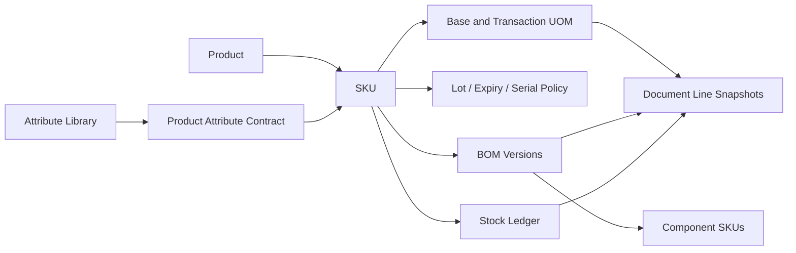

# Thay thế toàn bộ phân hệ Vật tư — Product, SKU, UOM, Tracking, BOM và Stock Ledger

**Dự án:** Minh Tân Phát Supply & Farm ERP  
**Ngày:** 2026-09-16  
**Trạng thái:** Approved Design — Ready for implementation planning  
**Thay thế:** Thiết kế `products.options` + `variants.attributes` và kế hoạch Unified Material Variant Workflow trước đây  
**Phương án được duyệt:** Full replacement với một lần cutover có kiểm soát; không chạy hệ thống cũ và mới song song

## 1. Quyết định kiến trúc

Phân hệ vật tư hiện tại được thay thế hoàn toàn bằng mô hình:

```text
Product → SKU → UOM → Tracking → BOM → Stock Ledger
```

- `Product` là danh tính vật tư chung.
- `SKU` là dòng hàng thực tế có thể giao dịch và giữ tồn.
- Thuộc tính SKU đến từ thư viện thuộc tính dùng chung.
- Đơn vị tồn kho và đơn vị giao dịch là cấu trúc độc lập với thuộc tính.
- Bộ vật tư là SKU có BOM, hỗ trợ cả bộ ảo và bộ ráp sẵn.
- Tồn kho chỉ được sở hữu bởi Stock Ledger theo SKU, vị trí và đơn vị cơ sở.
- URL nghiệp vụ hiện tại được giữ, nhưng implementation cũ bị thay thế.
- Không có trang V2, feature flag dài hạn, fallback JSON hoặc hai nguồn sự thật.



## 2. Bối cảnh và vấn đề cần loại bỏ

Thiết kế hiện tại chia vật tư thành bốn luồng riêng: vật tư lẻ, nhiều quy cách, quy đổi đơn vị và bộ lắp ráp. Các khái niệm này không loại trừ nhau trong thực tế: một SKU có thể vừa có thuộc tính, vừa có nhiều đơn vị giao dịch, vừa là một bộ vật tư. Việc dùng `products.options`, JSON `variants.attributes` và `variant_components` cho nhiều trách nhiệm tạo ra các vấn đề:

1. Form tạo và sửa phải suy luận loại vật tư và mở các nhánh khác nhau.
2. Quy đổi đơn vị bị mô hình hóa như biến thể tồn kho.
3. Bộ vật tư và đơn vị đóng gói dùng chung một carrier nhưng có ngữ nghĩa khác nhau.
4. Thuộc tính tự do khó chuẩn hóa, tìm kiếm và báo cáo.
5. Thay hệ số hoặc BOM có thể làm mất ý nghĩa lịch sử nếu không snapshot.
6. Modal dài không phù hợp với hàng chục hoặc hàng trăm SKU.
7. Logic cũ đã lan tới nhiều consumer: nhập, xuất, yêu cầu, chuyển kho, kiểm kê, hỏng, sửa chữa, thanh lý, báo cáo, QR, PDF, AI và import.

## 3. Mục tiêu

1. Mọi vật tư có ít nhất một SKU; không còn nhánh “vật tư lẻ” riêng.
2. Hỗ trợ mọi tổ hợp giữa thuộc tính, đơn vị giao dịch, lô/serial và BOM.
3. Chuẩn hóa thuộc tính và đơn vị để tìm kiếm, lọc và báo cáo chính xác.
4. Hỗ trợ bộ ảo và bộ ráp sẵn với nghiệp vụ khác nhau rõ ràng.
5. Bảo toàn định danh, chứng từ, movement, tồn và lịch sử hiện hữu qua cutover.
6. Thay thế toàn bộ UI, server contract, RPC và consumer cũ.
7. Không duy trì compatibility path nội bộ sau khi cutover hoàn tất.
8. Mọi biến động kho có nguồn chứng từ, snapshot và khả năng đảo ngược.

## 4. Không thuộc phạm vi

- Không thay đổi phương pháp tính giá vốn kế toán trong đợt này.
- Không xây module mua hàng hoặc sản xuất hoàn chỉnh ngoài nghiệp vụ lắp/tháo bộ.
- Không tự động gộp các thuộc tính hoặc SKU mơ hồ mà không có review.
- Không xóa dữ liệu source-of-truth trước khi audit và xác nhận phá hủy riêng.
- Không hỗ trợ hai catalog runtime song song.

## 5. Thuật ngữ chuẩn

| Thuật ngữ | Định nghĩa |
|---|---|
| Product / Vật tư | Danh tính chung, không trực tiếp giữ tồn |
| SKU | Dòng hàng nhỏ nhất có thể nhập, xuất, chuyển, kiểm kê hoặc theo dõi |
| Thuộc tính | Đặc trưng kỹ thuật hoặc chiều phân biệt SKU |
| Đơn vị cơ sở | Đơn vị duy nhất dùng để ghi tồn của SKU |
| Đơn vị giao dịch | Đơn vị nhập/xuất có hệ số quy đổi về đơn vị cơ sở |
| Bộ ảo | SKU có BOM nhưng không giữ tồn riêng; xuất bộ trừ linh kiện |
| Bộ ráp sẵn | SKU có BOM và giữ tồn riêng; tồn tăng qua lắp ráp |
| BOM | Cấu tạo có phiên bản của một SKU từ các SKU thành phần |
| Snapshot | Giá trị lịch sử được đóng băng tại thời điểm giao dịch |

Không dùng “biến thể” như chủ thể tồn kho mới. Thuật ngữ đích trong schema và code là `SKU`.

## 6. Mô hình Product và SKU

### 6.1. Product

Product chứa:

- ID bất biến.
- Tên.
- Danh mục.
- Mô tả.
- Ảnh chung.
- Từ khóa tìm kiếm.
- Ghi chú nội bộ.
- Trạng thái `draft | active | archived`.

Product không sở hữu trực tiếp tồn, giá, barcode, đơn vị hoặc BOM.

### 6.2. SKU

SKU chứa:

- ID bất biến.
- `product_id`.
- Mã SKU duy nhất.
- Tên/nhãn hiển thị được sinh từ Product và thuộc tính.
- Đơn vị tồn kho cơ sở.
- Giá tham khảo có basis rõ ràng.
- Tồn tối thiểu.
- Chính sách theo dõi.
- Chính sách tồn `normal | virtual_kit | stocked_assembly`.
- Barcode/QR và alias.
- Ảnh riêng.
- Trạng thái `draft | active | inactive`.

Mọi chứng từ và movement tham chiếu SKU, không tham chiếu Product chung.

### 6.3. Vòng đời và xóa

- Product/SKU nháp chưa được tham chiếu có thể xóa.
- SKU đã có movement hoặc chứng từ chỉ được chuyển sang `inactive`.
- SKU inactive không xuất hiện trong lựa chọn mới nhưng vẫn hiển thị trong lịch sử.
- Không đổi ID SKU.

## 7. Thư viện thuộc tính dùng chung

### 7.1. Attribute definition

Mỗi thuộc tính được định nghĩa một lần với:

- `code` ổn định.
- Tên hiển thị có thể đổi.
- Kiểu `option | number | measurement | text | boolean`.
- Đại lượng đo nếu có.
- Đơn vị mặc định nếu có.
- Quyền cho phép giá trị tùy biến.
- Phạm vi danh mục.
- Trạng thái.

Ví dụ: Hãng, Model, Công suất, Điện áp, Số pha, Kích thước, Đường kính, Chiều dài, Màu, Vật liệu, Nồng độ, Dung tích và Khối lượng.

### 7.2. Hợp đồng thuộc tính của Product

Mỗi Product chọn các thuộc tính cần dùng. Mỗi liên kết xác định:

- Bắt buộc hay tùy chọn.
- Có tham gia phân biệt SKU hay chỉ là thông số kỹ thuật.
- Thứ tự hiển thị.

Không phải mọi thông số kỹ thuật đều tạo SKU mới.

### 7.3. Giá trị thuộc tính SKU

Giá trị được lưu có kiểu, không lưu JSON tự do làm nguồn sự thật:

- `option_value_id`.
- `text_value`.
- `numeric_value`.
- `boolean_value`.
- `unit_id`.

Ràng buộc:

- Một SKU chỉ có một giá trị cho mỗi thuộc tính.
- Tập thuộc tính phân biệt SKU tạo thành tổ hợp duy nhất trong Product.
- Giá trị đo lường lưu số và đơn vị riêng, ví dụ `380` + `V`, không lưu `"380V"`.

## 8. Thư viện đơn vị và quy đổi

### 8.1. Units

Đơn vị được phân loại theo đại lượng:

- `count`: cái, bộ.
- `mass`: mg, g, kg, tấn.
- `volume`: ml, lít, m³.
- `length`: mm, cm, mét.
- `area`: cm², m².
- Các đại lượng kỹ thuật: W/kW, V/kV, A, giờ/ngày.

Chỉ chuyển đổi tự động giữa các đơn vị cùng đại lượng.

### 8.2. Đơn vị cơ sở

Mỗi SKU có đúng một đơn vị cơ sở. Tồn kho, reservation và movement luôn dùng đơn vị này.

### 8.3. Đơn vị giao dịch

Mỗi SKU có thể có nhiều đơn vị giao dịch:

- Tên và mã đơn vị.
- Hệ số dương về đơn vị cơ sở.
- Được dùng khi nhập và/hoặc xuất.
- Có cho phép số lẻ không.
- Barcode riêng.
- Giá mua/bán mặc định và basis.
- Trạng thái.

Đóng gói được chuẩn hóa trực tiếp về đơn vị cơ sở. Ví dụ thùng 24 chai 500 ml được lưu là 12.000 ml/thùng, không tạo chuỗi phụ thuộc Thùng → Chai → ml.

## 9. Theo dõi lô, hạn dùng và serial

Mỗi SKU dùng một chính sách:

- `none`.
- `lot`.
- `lot_expiry`.
- `serial`.

Quy tắc:

- SKU theo lô bắt buộc thông tin lô trong giao dịch liên quan.
- SKU theo hạn dùng xuất mặc định FEFO.
- SKU theo serial yêu cầu một serial duy nhất cho mỗi đơn vị cơ sở.
- Không đổi chính sách khi SKU đang có tồn bằng form thường; phải qua tác vụ chuyển đổi riêng.

## 10. BOM và bộ vật tư

### 10.1. Cấu trúc

- `bom_headers`: SKU cha và chính sách tồn.
- `bom_versions`: phiên bản, thời gian hiệu lực, trạng thái và lý do thay đổi.
- `bom_items`: SKU thành phần, số lượng cơ sở, hao hụt và bắt buộc/tùy chọn.

### 10.2. Bộ ảo

- Không giữ tồn riêng.
- Khả dụng bằng số bộ tối thiểu có thể tạo từ linh kiện.
- Xuất bộ mở rộng BOM và trừ linh kiện nguyên tử.
- Không xuất hiện trong kiểm kê vật lý hoặc chuyển kho.
- Hủy xuất dùng đúng BOM version và dòng triển khai của giao dịch gốc.

### 10.3. Bộ ráp sẵn

- Giữ tồn như SKU bình thường.
- Phiếu lắp ráp trừ linh kiện và tăng thành phẩm trong một transaction.
- Phiếu tháo bộ trừ thành phẩm và hoàn linh kiện theo số lượng thu hồi thực tế.
- Có thể ghi nhận hao hụt, mất hoặc chuyển linh kiện hỏng vào kho hỏng.

### 10.4. Ràng buộc

- Không tự tham chiếu.
- Không có vòng lặp gián tiếp.
- Số lượng thành phần phải dương.
- BOM version đã được giao dịch tham chiếu là bất biến.
- Sửa BOM tạo phiên bản mới và ngày hiệu lực mới.
- Chuyển giữa bộ ảo và bộ ráp sẵn là tác vụ chuyển đổi riêng.

## 11. Stock Ledger

### 11.1. Nguồn sự thật

Tồn được sở hữu bởi:

```text
SKU + Location + Base Unit
```

Các lớp số lượng:

- `on_hand`: tồn sổ sách.
- `reserved`: đã giữ cho phiếu được duyệt.
- `available = on_hand - reserved`.
- `incoming`: dự báo đang về, không cộng vào available.

Kho hỏng là vị trí hoặc trạng thái tồn rõ ràng, không phải cờ ẩn trên SKU.

### 11.2. Movement

Mọi biến động ghi movement bất biến gồm:

- SKU và location.
- Loại movement.
- Delta theo đơn vị cơ sở.
- Chứng từ và dòng nguồn.
- Đơn vị người dùng nhập.
- Số lượng người dùng nhập.
- Hệ số snapshot.
- Giá snapshot.
- Lô/serial.
- BOM version nếu có.
- Movement gốc nếu là đảo ngược.
- Idempotency key.

Không sửa movement đã ghi sổ; hủy tạo movement đảo.

## 12. Snapshot chứng từ

Mọi dòng chứng từ lưu tối thiểu:

- `sku_id`.
- Mã, tên và tóm tắt thuộc tính tại thời điểm giao dịch.
- Đơn vị giao dịch và tên snapshot.
- Số lượng nhập bởi người dùng.
- Hệ số snapshot.
- Đơn vị cơ sở và số lượng cơ sở.
- Giá, price basis và thành tiền.
- Lô/serial.
- BOM version nếu áp dụng.

Thay đổi tên, quy đổi hoặc BOM về sau không được làm thay đổi chứng từ cũ.

## 13. Luồng thêm vật tư

`/admin/products/new` là trang toàn màn hình, không phải modal và không phải hệ thống V2. Nó thay thế nút thêm hiện tại.

Thanh bước:

1. Thông tin chung.
2. Thuộc tính và SKU.
3. Đơn vị và theo dõi.
4. Cấu tạo.
5. Rà soát và kích hoạt.

Bản nháp được lưu server-side. Mỗi bước có trạng thái chưa lưu, đang lưu, đã lưu hoặc lỗi lưu.

### 13.1. Thông tin chung

Tên, danh mục, mô tả, từ khóa, ảnh và ghi chú. Hệ thống gợi ý Product gần giống nhưng không tự chặn tên giống.

### 13.2. Thuộc tính và SKU

Người dùng có thể bắt đầu bằng một SKU, nhiều SKU hoặc import Excel. Đây chỉ là cách nhập ban đầu, không phải loại vật tư bất biến.

Bảng SKU hỗ trợ:

- Thêm từng tổ hợp thực tế.
- Nhân bản dòng.
- Dán từ Excel.
- Công cụ sinh tổ hợp có review; không tự tạo tích Descartes mặc định.
- Áp dụng hàng loạt đơn vị, tồn tối thiểu và tracking.
- Sinh mã SKU có thể sửa.
- Báo lỗi trực tiếp từng dòng.

### 13.3. Đơn vị và theo dõi

Mỗi SKU chọn đơn vị cơ sở, độ chính xác, đơn vị giao dịch, barcode, chính sách lô/serial và tồn tối thiểu.

### 13.4. Cấu tạo

Mỗi SKU chọn một trong `normal | virtual_kit | stocked_assembly`. SKU bộ khai BOM và xem ngay số bộ khả dụng hoặc chính sách lắp/tháo.

### 13.5. Rà soát

Kiểm tra tên, danh mục, SKU, mã duy nhất, tổ hợp duy nhất, UOM, barcode, tracking, BOM và vòng lặp. Lỗi liên kết trực tiếp về trường nguồn. Chỉ dữ liệu hợp lệ mới được kích hoạt.

## 14. Luồng quản lý và sửa vật tư

`/admin/products/[productId]` thay thế modal sửa hiện tại, gồm các tab:

1. Tổng quan.
2. SKU và thuộc tính.
3. Đơn vị và quy đổi.
4. Cấu tạo.
5. Tồn kho.
6. Nhật ký thay đổi.

Drawer SKU quản lý nhận dạng, thuộc tính, UOM, tracking, giá, barcode, ảnh và trạng thái.

### 14.1. Sửa trực tiếp

- Tên hiển thị.
- Mô tả, ảnh, từ khóa.
- Giá tham khảo.
- Tồn tối thiểu.

### 14.2. Sửa có lịch sử và cảnh báo

- Giá trị thuộc tính SKU.
- Barcode.
- Mã SKU khi chưa có phụ thuộc ngoài.
- Quyền sử dụng đơn vị giao dịch.

### 14.3. Tác vụ chuyển đổi riêng

- Đổi đơn vị cơ sở.
- Đổi tracking policy.
- Đổi virtual kit ↔ stocked assembly.
- Gộp hoặc tách SKU.
- Thay SKU trong BOM có hiệu lực.

Không cho xóa SKU có lịch sử, đổi ID, sửa snapshot cũ hoặc sửa BOM version đã dùng.

## 15. Chọn SKU dùng chung

Mọi chứng từ dùng một selector chung, tìm theo tên Product, mã SKU, thuộc tính, barcode, alias, từ khóa hoặc serial khi phù hợp.

Kết quả hiển thị Product, mã SKU, thuộc tính và tồn khả dụng. Sau khi chọn SKU mới chọn đơn vị giao dịch. Không dùng dropdown ghép chuỗi Product + JSON attributes.

## 16. Luồng nghiệp vụ kho

### 16.1. Nhập kho

- Chọn Product/SKU/UOM hoặc quét barcode.
- Tính base quantity từ snapshot factor.
- SKU theo lô/serial bắt buộc dữ liệu theo policy.
- Duyệt phiếu tăng tồn theo base quantity.

### 16.2. Yêu cầu và reservation

- Phiếu yêu cầu không giảm on-hand.
- Khi duyệt giữ tồn, tăng reserved theo base quantity.
- Cho phép cấp một phần theo từng dòng và ghi rõ yêu cầu/đã cấp/còn thiếu.
- Không tự thay SKU khác.

### 16.3. Xuất kho

- Kiểm tra available, location, lot/serial và policy.
- FEFO cho expiry; FIFO cho lot nếu không có hạn dùng.
- Ghi movement theo base quantity và giảm reservation tương ứng.

### 16.4. Xuất bộ ảo

- Chốt BOM version.
- Mở rộng BOM.
- Kiểm tra mọi linh kiện.
- Ghi các movement linh kiện nguyên tử.
- Lưu dòng bộ người dùng và dòng triển khai để audit.
- Thiếu một linh kiện thì không ghi movement nào.

### 16.5. Lắp ráp bộ có tồn

Phiếu lắp ráp trừ linh kiện và tăng SKU bộ trong một transaction; giữ định mức, thực tế, chênh lệch và lý do hao hụt.

### 16.6. Tháo bộ

Trừ SKU bộ và hoàn linh kiện theo thu hồi thực tế. Linh kiện hỏng vào kho hỏng hoặc liên kết phiếu báo hỏng.

### 16.7. Chuyển kho

Chuyển SKU theo base quantity; lot/serial đi cùng hàng. Bộ ảo không được chuyển; bộ ráp sẵn chuyển như SKU bình thường.

### 16.8. Kiểm kê

Kiểm kê theo SKU + location + lot/serial. Barcode đơn vị giao dịch được quy về base quantity với snapshot factor. Bộ ảo không được kiểm đếm.

### 16.9. Hỏng, sửa chữa, thanh lý và đổi 1-1

- Mọi tác vụ tham chiếu SKU thật và lot/serial khi có.
- Bộ ảo chỉ báo sự cố và chọn thành phần hỏng, không báo hỏng tồn bộ.
- Bộ ráp sẵn có thể báo hỏng trực tiếp, sửa nguyên bộ, tháo hoặc thanh lý.
- Đổi 1-1 liên kết SKU/serial cũ và mới; SKU thay thế khác Product cần lý do và người duyệt.

## 17. Import Excel

Workbook chuẩn gồm:

- Products.
- SKUs.
- Transaction Units.
- BOM.

Quy trình: upload → map cột → preview → lỗi từng dòng → chọn create/update/skip → xác nhận → ghi nguyên tử theo Product → xuất kết quả.

Import không được âm thầm ghi đè cấu trúc SKU, UOM hoặc BOM đang được sử dụng.

## 18. Quyền hạn

- Xem Product/SKU: người dùng được cấp quyền.
- Tạo nháp: quản kho hoặc quản lý.
- Kích hoạt: quản kho hoặc cấp duyệt cấu hình.
- Đổi cấu trúc thuộc tính: quyền quản trị danh mục.
- Đổi đơn vị cơ sở hoặc tracking: quyền cao và tác vụ chuyển đổi.
- Sửa BOM: quản kho/kỹ thuật được phân quyền.
- Kích hoạt BOM: người duyệt.
- Ngừng SKU: quản lý.
- Gộp/tách SKU: quyền đặc biệt và biên bản chuyển đổi.

## 19. Trạng thái lỗi và phục hồi

- Bản nháp lưu server-side và có revision để phát hiện xung đột.
- Mất mạng giữ dữ liệu cục bộ nhưng không báo đã lưu.
- Nếu server đã đổi, hiển thị so sánh; không tự merge cấu trúc SKU/BOM.
- Validation xuất hiện tại trường và ở trang rà soát.
- Ghi sổ dùng transaction và idempotency để chống partial write và double submit.

## 20. Chiến lược chuyển đổi dữ liệu

### 20.1. Định danh

Mỗi `variant` hiện tại ánh xạ thành một SKU và giữ nguyên UUID. Mục tiêu cuối là schema/code dùng `skus` và `sku_id`; không duy trì tên cũ như compatibility layer lâu dài.

### 20.2. Thuộc tính

- Product không có options tạo một SKU không có variant-axis values.
- Options/attributes hợp lệ được ánh xạ sang attribute definitions và typed SKU values.
- Các tên gần giống chỉ được gợi ý gộp; trường hợp mơ hồ phải review.
- Parser measurement chỉ tự chuyển dữ liệu có độ tin cậy cao.

### 20.3. Quy đổi và BOM

- `variant_components` loại unit conversion chuyển sang transaction UOM.
- Loại assembly chuyển sang BOM version 1.
- Composite có tồn vật lý là ứng viên stocked assembly.
- Composite chỉ tính từ linh kiện là virtual kit.
- Dòng không phân loại chắc chắn dừng cutover cho Product đó.

### 20.4. Audit bắt buộc

- Số Product và SKU trước/sau.
- 100% UUID SKU có ánh xạ.
- 100% FK chứng từ có SKU đích.
- Tồn theo SKU/location không đổi.
- Movement, lot, serial, ảnh và barcode không mất.
- Không SKU thiếu base UOM.
- Không tổ hợp thuộc tính trùng.
- Không BOM vòng lặp.
- Mọi component cũ được phân loại UOM hoặc BOM.

## 21. Cutover một lần

### 21.1. Trước triển khai

- Đóng băng thay đổi catalog.
- Backup database.
- Chạy migration trên bản sao production.
- Xử lý mọi dòng mơ hồ.
- Chạy audit, test và diễn tập rollback.

### 21.2. Triển khai

1. Bật maintenance mode.
2. Backup cuối.
3. Chạy schema/data migration.
4. Chạy audit bắt buộc.
5. Deploy ứng dụng mới.
6. Smoke test tất cả consumer.
7. Chỉ mở hệ thống khi toàn bộ gate đạt.

### 21.3. Rollback

Nếu migration, audit hoặc smoke test thất bại: không mở hệ thống; khôi phục ứng dụng và database từ snapshot. Không chạy app cũ trên schema chuyển dở và không sửa trực tiếp production trong lúc cutover.

## 22. Thay thế giao diện và consumer

Giữ URL nghiệp vụ:

- `/products`.
- `/admin/products`.

Thay implementation và bổ sung route nội bộ chính thức:

- `/admin/products/new`.
- `/admin/products/[productId]`.
- `/admin/products/[productId]/skus/[skuId]` khi cần deep link.

Trong cùng chương trình cutover phải chuyển:

- Danh mục và selector vật tư.
- Yêu cầu.
- Nhập, xuất và chuyển kho.
- Kiểm kê.
- Hỏng, đổi 1-1, sửa chữa và thanh lý.
- Báo cáo, PDF và Excel.
- QR/barcode.
- AI Copilot.
- Import, seed, cache và type generation.

## 23. Retirement bắt buộc

### 23.1. Xóa code sau cutover

- ProductFormDialog và ProductVariantsDialog cũ.
- Free-form key/value attribute editors.
- Logic `products.options` và `variants.attributes`.
- Nhánh `isComposite` và `componentType`.
- Helper suy luận quy đổi/BOM.
- Selector variant cũ.
- Action/RPC/import/test/tài liệu cũ.

### 23.2. Xóa schema sau audit và xác nhận riêng

- Cột JSON cũ.
- RPC, trigger và index cũ.
- `variant_components` sau khi UOM/BOM được chứng minh đầy đủ.
- View compatibility cũ.

Đây là persistent-state deletion. Việc duyệt thiết kế không tự động cấp quyền DROP. Trước khi xóa phải có backup/rollback, danh sách exact targets, bằng chứng không còn consumer và xác nhận phá hủy có phạm vi.

## 24. Tương thích và giới hạn bảo toàn

Bắt buộc bảo toàn:

- UUID Product/SKU có lịch sử.
- Foreign key chứng từ.
- Movement và tồn.
- Lot/serial.
- Ảnh và barcode hợp lệ.
- URL nghiệp vụ người dùng.

Không bảo toàn:

- Component API nội bộ cũ.
- Server action/RPC catalog cũ.
- JSON contract cũ.
- Thuật ngữ variant trong code đích.
- Fallback hoặc adapter nội bộ không có external consumer được chứng minh.

## 25. Tiêu chí nghiệm thu

### Catalog

1. Tạo Product một SKU không dùng nhánh vật tư lẻ.
2. Tạo Product nhiều SKU bằng thuộc tính chuẩn.
3. Chặn tổ hợp và mã SKU trùng.
4. Thêm SKU sau kích hoạt.
5. SKU có lịch sử chỉ được inactive.

### UOM và tracking

6. Một SKU có nhiều đơn vị nhập/xuất.
7. Tồn luôn đúng theo base UOM.
8. Đổi factor không làm sai chứng từ cũ.
9. Barcode UOM chọn đúng SKU/factor.
10. Lot, FEFO và serial hoạt động đúng.

### BOM

11. Bộ ảo tính đúng khả dụng.
12. Xuất bộ ảo trừ đủ linh kiện, nguyên tử và đảo đúng.
13. Lắp ráp trừ linh kiện, tăng thành phẩm.
14. Tháo bộ ghi đúng thu hồi và hỏng/mất.
15. BOM version bất biến và không vòng lặp.

### Stock ledger

16. Nhập, xuất, chuyển, kiểm kê đều dùng SKU và base quantity.
17. Reservation không làm giảm on-hand.
18. Hủy dùng reversal movement.
19. Không movement mồ côi hoặc double-post.
20. Chứng từ cũ giữ snapshot đúng.

### Cutover và retirement

21. 100% SKU cũ có ánh xạ.
22. Không mất FK, tồn, movement, ảnh, barcode, lot hoặc serial.
23. Mọi consumer đọc owner mới.
24. Không còn UI/action cũ có thể truy cập.
25. Không còn main-path reference tới owner cũ.
26. Test, typecheck, lint, build, migration rehearsal, audit và browser smoke đều đạt.
27. Schema cũ chỉ bị xóa sau xác nhận phá hủy riêng.

## 26. Rủi ro và biện pháp

| Rủi ro | Biện pháp |
|---|---|
| Ánh xạ sai JSON thuộc tính | Typed parser + confidence report + manual review |
| Nhầm unit conversion với BOM | Phân loại bắt buộc và dừng trên dòng mơ hồ |
| Tồn chênh lệch | Audit trước/sau theo SKU/location |
| Consumer chưa chuyển | Lingering-reference scan + full consumer matrix |
| Partial cutover | Maintenance window + transaction + rollback snapshot |
| Chứng từ cũ đổi nghĩa | Snapshot UOM, giá, tên và BOM version |
| Hai owner cùng tồn tại | Không fallback; retirement task bắt buộc |
| Xóa schema quá sớm | Data Destruction Guard và xác nhận riêng |

## 27. Quyết định thay thế tài liệu cũ

Đặc tả này supersede toàn bộ mục tiêu và kiến trúc của tài liệu Unified Material Variant Workflow trước đây. Kế hoạch triển khai cũ không còn là authority để thực thi vì vẫn giữ `products.options`, `variants.attributes` và mô hình composite. Kế hoạch mới phải được viết từ đặc tả này và phải bao gồm cả implementation track lẫn retirement track.

## 28. Phụ lục quyết định kiến trúc bắt buộc

Phụ lục này đóng các điểm còn mơ hồ trước khi lập kế hoạch implementation chi tiết. Nếu profiling production chứng minh một giả định dưới đây sai, dừng ở preflight và sửa đặc tả trước khi viết migration/runtime code.

### 28.1. Chiến lược schema và định danh

- Đích cuối là bảng `skus` và khóa `sku_id`.
- Migration dùng **rename-in-place** cho `variants → skus` để giữ nguyên UUID, object identity và row lineage; không copy sang bảng SKU mới rồi duy trì hai bảng runtime.
- Các FK `variant_id` được đổi tên thành `sku_id` trong maintenance cutover sau khi mọi consumer đã được chuẩn bị trên clone/rehearsal.
- Schema mới cho thuộc tính, UOM, tracking, BOM, reservation và snapshot được tạo trước trên bản sao/rehearsal. Việc có schema expand-only trước cutover không phải dual runtime: production app cũ không đọc/ghi owner mới và production app mới không chạy trước cutover.
- Không tạo view alias `variants` hoặc cột alias `variant_id` sau cutover trừ khi profiling chứng minh external consumer đang hoạt động; external dependency phải có owner, telemetry và retirement date.

### 28.2. Kiểu số, precision và làm tròn

- Tất cả số lượng tồn, movement, reservation, document base quantity và BOM quantity dùng `numeric(20,6)`.
- UOM factor dùng `numeric(20,9)` và phải lớn hơn 0.
- Tiền giữ `numeric(18,2)`, base unit cost có thể dùng `numeric(20,6)` để tránh mất precision khi quy đổi.
- Mỗi unit có `decimal_scale` từ 0 đến 6; validation từ chối quantity có nhiều chữ số thập phân hơn policy, không âm thầm làm tròn khi posting.
- Kết quả nhân `entered_quantity × factor` được lượng hóa theo base-unit scale bằng `round(..., decimal_scale)`; nếu sai số khác 0 sau round thì posting bị từ chối và yêu cầu sửa quantity/factor.
- SKU theo serial và các base unit không cho phép lẻ có scale 0.

### 28.3. Đơn vị vật lý và đơn vị đóng gói

- Global units có dimension và factor chuẩn chỉ cho chuyển đổi vật lý cùng dimension, ví dụ kg ↔ g hoặc lít ↔ ml.
- Transaction UOM là alias đóng gói **riêng của SKU** và được phép quy trực tiếp về base UOM của SKU dù nhãn đóng gói thuộc dimension `package/count`. Ví dụ “thùng 24 chai 500 ml” có factor 12.000 ml/thùng.
- Package factor không được dùng giữa các SKU và không tham gia global physical conversion.
- Barcode có namespace duy nhất toàn hệ thống trên cả SKU barcode và transaction-UOM barcode; một barcode chỉ resolve về một target đang active.

### 28.4. Grain của tồn có tracking

- `stock_balances` tổng hợp theo `sku_id + location_id` để đọc nhanh.
- Nguồn chi tiết với SKU theo lot/expiry là `lot_stock_balances(sku_id, location_id, lot_id)`.
- Nguồn chi tiết với SKU theo serial là từng `serial_items(sku_id, serial_code, status, location_id, lot_id?)`; tổng serial khả dụng phải đối chiếu bằng stock balance.
- Một movement có thể có nhiều allocation rows trong `stock_movement_allocations`, mỗi row tham chiếu lot hoặc serial và có base quantity dương.
- Tổng allocation của movement tracking phải bằng trị tuyệt đối base quantity của movement.
- Lot có trạng thái `active | quarantined | expired | exhausted`; serial có `available | reserved | issued | defect | repair | liquidated`.
- Chuyển kho giữ nguyên lot/serial identity. Không tạo lot/serial mới ở kho đích.
- Lot number hiện đang lưu dạng text trên receipt item chỉ được backfill thành lot entity khi source row xác định được SKU và location; dữ liệu thiếu được đánh dấu `legacy_unresolved` và không được giả lập.

### 28.5. Ledger mới, reversal và dữ liệu lịch sử

- Runtime mới dùng movement append-only. Movement đã post không được update/delete.
- Reversal tạo movement mới với `reversal_of_movement_id`, delta ngược và cùng allocation/snapshot của movement gốc.
- Mọi posting command có `idempotency_key` unique theo loại chứng từ và hành động; retry trả lại kết quả đã ghi thay vì tạo movement mới.
- Các helper hiện tại xóa movement khi revert phải bị thay thế trước cutover.
- Không thể phục hồi những movement lịch sử đã bị logic cũ xóa. Chúng được ghi trong migration report là `legacy-history-not-recoverable`; không dựng dữ liệu giả.
- Movement lịch sử còn tồn tại được backfill snapshot chỉ từ nguồn xác định: SKU/Product hiện tại, dòng chứng từ nguồn, UOM mapping được chứng minh và BOM/component row có thời điểm phù hợp. Trường không thể chứng minh được để null kèm `snapshot_quality = 'legacy_unknown'`.
- Tiêu chí “không mất lịch sử” nghĩa là không làm mất thêm các row và quan hệ hiện có tại thời điểm backup; không tuyên bố khôi phục dữ liệu chưa từng được lưu.

### 28.6. Reservation lifecycle

- Reservation có owner riêng: `stock_reservations` và `stock_reservation_allocations`.
- Trạng thái: `active | partially_consumed | consumed | released | expired`.
- Tạo reservation khi requisition được duyệt ở cấp có quyền xuất kho; draft/pending không giữ tồn.
- Partial issue giảm reservation và giữ phần còn lại active. Reject/cancel/reopen hợp lệ phải release reservation nguyên tử.
- Reservation mặc định không tự hết hạn; nếu nghiệp vụ sau này cần expiry phải có ngày và job rõ ràng, không thêm ngầm trong đợt này.
- Với virtual kit, reservation được explode và giữ từng SKU linh kiện theo BOM version được chốt tại thời điểm approval. Posting dùng đúng reservation allocations và BOM version đó.
- Mỗi source document line chỉ có tối đa một reservation active; command phải idempotent và khóa balance/reservation rows để tránh oversubscription.

### 28.7. BOM nesting, optional component và version selection

- Đợt này BOM chỉ hỗ trợ **một cấp**: component SKU không được là virtual kit hoặc stocked assembly có BOM active. Nested BOM bị từ chối.
- BOM item tùy chọn không thuộc phạm vi cutover đầu tiên; mọi component trong BOM active là bắt buộc. Cột optional không được tạo cho đến khi có thiết kế lựa chọn/thay thế cụ thể.
- Mỗi SKU chỉ có tối đa một BOM version effective tại một thời điểm; khoảng hiệu lực không được overlap và dùng timestamptz UTC.
- Virtual-kit requisition chốt BOM version lúc tạo reservation/approval. Xuất trực tiếp không reservation chốt version lúc posting bắt đầu.
- Assembly order chốt BOM version khi order chuyển từ draft sang released; posting dùng version đã chốt.
- Future BOM version được phép ở trạng thái scheduled; thay đổi active BOM không tác động reservation/order đã chốt version cũ.

### 28.8. Thuộc tính Product và mutation

- Attribute contract thuộc Product; giá trị của variant-axis và technical attribute đều lưu theo SKU. Giá trị kỹ thuật chung có thể áp dụng hàng loạt nhưng vẫn được materialize theo SKU để truy vấn nhất quán.
- Product không có variant axis chỉ được có một active SKU. Muốn thêm SKU thứ hai phải thực hiện tác vụ thay đổi attribute contract, bổ sung ít nhất một axis và backfill SKU hiện hữu trước.
- Đổi giá trị axis trên SKU đã có lịch sử chỉ đổi metadata hiển thị, không đổi ID; action bắt buộc reason và audit log. Nếu thay đổi làm trùng tổ hợp thì bị từ chối.
- Xóa một attribute khỏi contract khi có SKU active là conversion task riêng; không thực hiện trong form thường.

### 28.9. Thay đổi base UOM, tracking, kit policy, merge và split

Các thao tác này **không nằm trong implementation cutover đầu tiên**. Runtime mới khóa chúng và trả thông báo cần quy trình chuyển đổi chuyên biệt. Cutover chỉ ánh xạ trạng thái hiện có đã được audit. Thiết kế và triển khai merge/split SKU, đổi base UOM khi có tồn, đổi tracking khi có tồn và normal ↔ kit sau go-live là các initiative riêng.

### 28.10. Giá và giá vốn

- Phương pháp giá vốn hiện hành được bảo toàn; đợt này không thay thuật toán định giá.
- Giá mua trên document line được snapshot theo transaction UOM và quy ra base unit cost.
- Giá bán/tham khảo mặc định thuộc SKU hoặc transaction UOM với price basis rõ ràng.
- Việc `post_receipt` hiện cập nhật giá trên variant phải được chuyển sang canonical SKU price owner mà không thay đổi hành vi kinh doanh đã được kiểm chứng.

### 28.11. RBAC cụ thể

- Xem catalog/tồn: mọi vai trò đã đăng nhập theo matrix hiện hành.
- Tạo/sửa Product, SKU, attribute contract và transaction UOM: `superuser | owner | accountant | warehouse`.
- Tạo/sửa BOM draft: `superuser | owner | warehouse | technician`.
- Kích hoạt BOM version: `superuser | owner | warehouse`; technician không tự kích hoạt BOM do mình sửa.
- Post assembly/disassembly: `superuser | owner | warehouse`.
- Ngừng Product/SKU: `superuser | owner | accountant | warehouse` nếu không vi phạm lịch sử/tồn.
- Destructive schema/data operation: chỉ qua deployment operator, backup và scoped human confirmation; role trong app không cấp quyền này.

### 28.12. Cutover và rollback boundary

- Dòng dữ liệu mơ hồ không “bỏ qua theo Product” trong production cutover. Mọi ambiguity phải được xử lý trước maintenance; còn một dòng unresolved thì go/no-go = NO-GO.
- Rehearsal trên clone phải đo thời gian migration, lock và restore. Maintenance budget được đặt sau profiling; chưa có số đo thì không được hứa SLO.
- Trước khi mở lại hệ thống, rollback là restore snapshot database + deploy artifact cũ đã diễn tập.
- Sau khi mở lại và có transaction mới, không restore toàn DB vì sẽ mất giao dịch mới. Khi đó đường phục hồi là đóng hệ thống và forward-fix hoặc migration reversal đã diễn tập, có đối chiếu transaction sau cutover.
- Go-live cần ghi chính xác schema version, app commit, backup artifact, audit output và timestamp mở hệ thống.

### 28.13. Consumer inventory và cache

Consumer matrix bắt buộc phải liệt kê và đóng từng nhóm: catalog UI, selector/cart, receipts, requisitions/returns/reservations, issues, transfers, stocktake, defects/exchange, repairs, liquidations, tool borrowing, reports/Excel/PDF, QR/barcode, AI/RAG, cache metadata, offline queue/IndexedDB, import/seed scripts, generated types, views, RPCs, triggers, indexes, RLS và external integrations.

Offline payload có schema version. Cutover tăng version và từ chối hoặc migrate có chủ đích queue cũ; không replay `variantId` payload cũ âm thầm vào owner mới.

### 28.14. Trạng thái và hiệu lực

- Product: `draft → active → archived`; archived không tạo SKU/giao dịch mới.
- SKU: `draft → active → inactive`; inactive vẫn resolve trên lịch sử nhưng không được chọn mới.
- Draft Product/SKU chỉ xuất hiện trong quản trị.
- Product chỉ active khi có ít nhất một active SKU hợp lệ.
- SKU liên quan draft document/reservation/BOM active không được inactive cho đến khi dependency được đóng hoặc chuyển.
- `incoming` chỉ là projection từ receipt/purchase document đã được xác định trong consumer design; không lưu như balance trong cutover đầu tiên.

### 28.15. Acceptance oracle tối thiểu

Kế hoạch implementation phải chuyển tiêu chí tổng quát thành fixture Given/When/Then và SQL oracle, tối thiểu gồm:

1. Decimal UOM: 2 thùng × 12.000 ml tạo đúng document snapshot và movement +24.000 ml; retry cùng idempotency key không tạo thêm row.
2. Reversal: cancel tạo movement đối ứng, original còn nguyên, balance quay về giá trị trước.
3. Lot FEFO: hai lot khác expiry, issue chọn lot sớm hơn; tổng allocation bằng movement.
4. Serial: quantity 2 cần đúng hai serial; serial trùng hoặc quantity lẻ bị từ chối.
5. Reservation race: hai approval đồng thời không thể reserve vượt available.
6. Virtual kit: reservation và posting explode đúng BOM version; thiếu một component rollback toàn bộ.
7. Stocked assembly: linh kiện giảm và thành phẩm tăng trong một transaction; failure injection không để partial movement.
8. Migration: UUID/FK count, balance totals, movement count hiện hữu, ảnh/barcode và unresolved count có exact zero/non-zero oracle.
9. Offline: payload schema cũ bị chặn với thông báo rõ; không double-post.
10. Cutover rehearsal: thời gian, lock, restore và smoke matrix được lưu thành artifact để quyết định maintenance budget.
