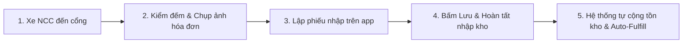

# 📖 HƯỚNG DẪN 03: NHẬP KHO TỪ NHÀ CUNG CẤP & HÓA ĐƠN VAT

> Tài liệu hướng dẫn quy trình nhận hàng từ Nhà Cung Cấp (NCC), lập phiếu nhập kho, chụp ảnh hóa đơn đỏ VAT / phiếu giao hàng, cập nhật giá vốn và cơ chế tự động cấp phát cho các phiếu yêu cầu đã duyệt.

---

## 1. QUY TRÌNH NHẬP KHO TỪNG BƯỚC (Dành cho Quản kho & Kế toán)

### Bước 1: Mở màn hình Tạo phiếu nhập
1. Truy cập Menu **Nhập kho** (`/receipts`).
2. Bấm nút **"+ Tạo phiếu nhập"** ở góc phải màn hình (`/receipts/new`).

### Bước 2: Chọn Nhà cung cấp & Vị trí kho
* **Nhà cung cấp:** Chọn từ danh sách (Ví dụ: `Cửa hàng Điện Nước Tám Hưng`, `Công ty Xăng Dầu Petrolimex`). Nếu là NCC mới chưa có trên hệ thống, Quản lý có thể tạo nhanh trong danh mục `/admin/suppliers`.
* **Kho nhập hàng:** Chọn kho đích nhận hàng (Mặc định: *Kho Tổng*).

### Bước 3: Nhập danh sách vật tư & Đơn giá mua
* Bấm nút **"+ Thêm sản phẩm"**.
* Chọn tên sản phẩm / biến thể cần nhập.
* **Số lượng thực nhận:** Điền số lượng đếm được tại bãi giao hàng.
* **Đơn giá mua (VNĐ):** Nhập giá trước thuế hoặc giá thanh toán thực tế ghi trên hóa đơn.
* **Số lô & Hạn sử dụng (nếu có):** Áp dụng cho các loại thuốc thú y, vắc-xin hoặc hóa chất sát trùng.

### Bước 4: Chụp & Tải lên ảnh Hóa đơn / Chứng từ gốc (Rất quan trọng)
* Bấm vào khung **"Tải ảnh hóa đơn VAT / Phiếu giao hàng"**.
* Trên điện thoại: Chọn **Chụp ảnh trực tiếp** từ camera để chụp hóa đơn đỏ của nhà cung cấp.
* Có thể tải lên nhiều ảnh (Ảnh hóa đơn VAT, ảnh phiếu xuất kho NCC, ảnh kiện hàng thực tế).

### Bước 5: Hoàn tất & Lưu phiếu
* Kiểm tra lại tổng tiền thanh toán.
* Bấm nút **"Lưu & Hoàn tất nhập kho"**.

---

## 2. KẾT QUẢ XỬ LÝ & CƠ CHẾ AUTO-FULFILL TỰ ĐỘNG

Ngay sau khi bấm hoàn tất phiếu nhập kho, hệ thống sẽ thực hiện đồng thời 4 tác vụ ngầm trong 1 transaction an toàn:
1. **Cộng tồn kho tức thời:** Số lượng tồn kho khả dụng của các món hàng tự động tăng lên trong bảng `stock_balances`.
2. **Cập nhật đơn giá mua vốn:** Hệ thống tự động ghi nhận đơn giá mới nhất vào bảng giá vốn để phục vụ tính giá thành sau này.
3. **Ghi sổ cái biến động kho (`stock_movements`):** Lưu vết chi tiết ai nhập, nhập lúc mấy giờ, từ nhà cung cấp nào và số dư tồn kho sau khi nhập.
4. **Tự động xuất cấp phát cho phiếu yêu cầu ĐÃ DUYỆT (Auto-Fulfill FIFO):**
   * Hệ thống tự động quét tìm các Phiếu yêu cầu vật tư từ chuồng trại **ĐÃ ĐƯỢC DUYỆT (`approved`)** trước đó đang chờ hàng.
   * Tự động xuất kho theo thứ tự ưu tiên thời gian lập phiếu cũ nhất trước (FIFO).
   * *Lưu ý quan trọng:* Các phiếu yêu cầu đang ở trạng thái Chờ duyệt (`pending`) sẽ **không** bị tự động xuất hàng mà bắt buộc phải qua bước Quản kho xem xét & phê duyệt trước.