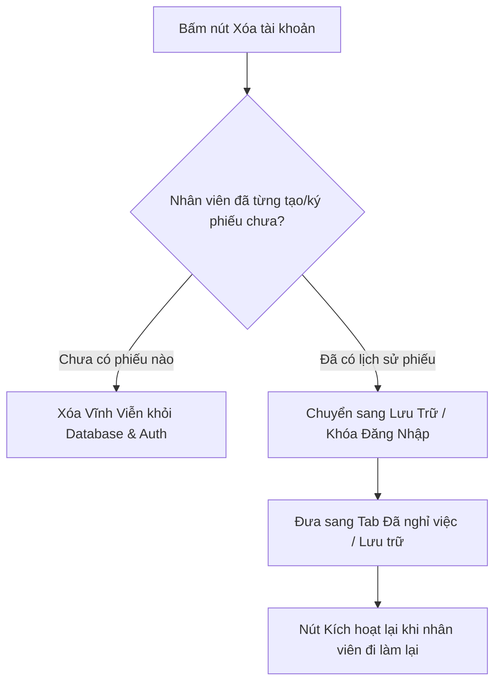

# 📖 HƯỚNG DẪN 14: QUẢN TRỊ NGƯỜI DÙNG, PHÂN QUYỀN & CẤU TRÚC KHU CHUỒNG

> Tài liệu hướng dẫn chi tiết dành cho Quản trị viên hệ thống (Superuser), Chủ trang trại (Owner) và Kế toán (Accountant) về quản lý tài khoản nhân sự, phân cấp 7 vai trò, chính sách bất biến định danh, cơ chế lưu trữ nhân viên nghỉ việc và thiết lập cây không gian Dãy chuồng (Zones & Sub-zones).

---

## 1. QUẢN TRỊ TÀI KHOẢN NHÂN SỰ (`/admin/users`)

### A. Tạo Tài Khoản Mới Cho Nhân Viên
1. Truy cập Menu **Quản trị** ➜ **Người dùng** (`/admin/users`).
2. Bấm nút **"+ Thêm người dùng"** ở góc trên bên phải màn hình để mở hộp thoại Modal.
3. Điền các trường thông tin:
   * **Họ và tên:** Nhập họ tên thật đầy đủ (Ví dụ: `Lê Văn Dương`, `Phạm Thị Trà My`).
   * **Tên đăng nhập (Username):** Viết liền không dấu (Ví dụ: `tramymtp`, `duongmtp`, `ducxuc`).
   * **Mật khẩu khởi tạo:** Tối thiểu 8 ký tự.
   * **Vai trò:** Chọn đúng 1 trong 7 vai trò chuẩn hóa (`superuser`, `owner`, `accountant`, `warehouse`, `technician`, `requester`, `driver`).
   * **Khu vực công tác:** Chọn khu vực mà nhân viên thường trực (Khu A, Khu B, Xưởng Cơ Điện, Trạm Dầu...).
4. Bấm **"Tạo tài khoản"**.

### B. Nguyên Tắc Bất Biến Định Danh (Immutable Identity)
* **Quy định an toàn:** Sau khi tạo thành công, **Họ tên** và **Tên đăng nhập** sẽ bị khóa cố định vĩnh viễn bằng Trigger cơ sở dữ liệu.
* **Lý do:** Đảm bảo toàn vẹn tính pháp lý của sổ cái chứng từ, ngăn ngừa mạo danh hoặc sửa tên để thoái thác trách nhiệm sau khi đã ký xuất/nhập kho.
* *Nếu muốn đổi vai trò, đổi email hoặc chuyển khu vực công tác:* Quản lý bấm nút **Sửa** (icon cây bút) trên dòng nhân viên để cập nhật.

### C. Đổi Mật Khẩu Cho Nhân Viên
* Quản lý bấm vào icon **Chìa khóa / Đổi mật khẩu** (`Key`) trên dòng nhân viên tương ứng.
* Nhập mật khẩu mới (tối thiểu 8 ký tự) trong Modal và bấm **"Cập nhật mật khẩu"**.

---

## 2. CHÍNH SÁCH HYBRID ARCHIVE & XỬ LÝ NHÂN VIÊN NGHỈ VIỆC

Hệ thống tự động phân loại thông minh khi thực hiện thao tác xóa nhân sự:



### 1. Xóa vĩnh viễn (Hard Delete):
* Áp dụng cho tài khoản mới tạo thử nghiệm hoặc tạo nhầm chưa từng phát sinh chứng từ nào.
* Tài khoản sẽ được xóa sạch hoàn toàn khỏi cơ sở dữ liệu.

### 2. Lưu trữ / Khóa tài khoản (Archive):
* Áp dụng cho nhân viên đã từng lập phiếu yêu cầu, duyệt kho, ký nhận hàng trong quá khứ.
* Hệ thống tự động chuyển trạng thái `is_active = false`, khóa quyền đăng nhập nhưng bảo toàn 100% lịch sử chứng từ.
* Nhân sự này được chuyển sang tab **"Đã nghỉ việc / Lưu trữ"**.

### 3. Kích hoạt lại nhân viên thời vụ (Reactivate):
* Khi công nhân thời vụ quay lại trại làm việc: Quản lý chuyển sang tab **"Đã nghỉ việc / Lưu trữ"** ➜ Bấm nút **"Kích hoạt lại"** (`Reactivate`) ➜ Tài khoản mở khóa ngay lập tức mà không cần tạo mới.

### 4. Đặc quyền Xóa sạch toàn bộ (Force Purge - Chỉ dành cho Superuser):
* Dành riêng cho Kỹ sư Quản trị hệ thống (`superuser`) khi cần dọn dẹp triệt để môi trường test thông qua RPC `admin_purge_user_data`.

---

## 3. QUẢN LÝ CẤU TRÚC KHU VỰC & DÃY CHUỒNG (`/admin/zones`)

Hệ thống quản lý không gian trang trại theo mô hình 2 tầng phân cấp rõ ràng:

```
Khu vực lớn (zones)                     Dãy chuồng / Phân xưởng (sub_zones)
├── Khu A (Trại gà đẻ trứng A) --------> Chuồng A1, Chuồng A2, Chuồng A3...
├── Khu B (Trại gà đẻ trứng B) --------> Chuồng B1, Chuồng B2, Chuồng B3...
├── Khu Úm (Gà con hậu bị)   --------> Chuồng Úm 1, Chuồng Úm 2...
├── Xưởng Cơ Điện              --------> Gian quấn motor, Gian hàn tiện...
└── Trạm Bồn Dầu Trung Tâm     --------> Bồn dầu 10.000L, Cột bơm số 1...
```

### A. Thêm mới Khu vực lớn (`zones`):
1. Truy cập Menu **Quản trị** ➜ **Khu vực & Chuồng** (`/admin/zones`).
2. Bấm nút **"+ Thêm khu vực"**.
3. Nhập **Mã khu vực** (VD: `KHU_C`) và **Tên khu vực** (VD: `Khu C - Trại Gà Mới`).
4. Bấm **Lưu**.

### B. Quản lý Dãy chuồng chi tiết (`sub_zones`):
1. Bấm vào nút **"Quản lý dãy chuồng"** tại dòng của khu vực tương ứng.
2. Hộp thoại danh sách Dãy chuồng mở ra:
   * Nhập **Mã chuồng** (VD: `C1`, `C2`).
   * Nhập **Tên dãy chuồng** (VD: `Dãy Chuồng C1`, `Dãy Chuồng C2`).
   * Bấm **"+ Thêm dãy chuồng"**.
3. **Ý nghĩa nghiệp vụ:** Khi nhân viên chuồng xin cấp bóng đèn hoặc béc phun nước, hệ thống bắt buộc chọn chính xác Dãy chuồng (`sub_zone`) để kế toán phân bổ chi phí chuẩn xác 100% đến từng dãy chuồng.
